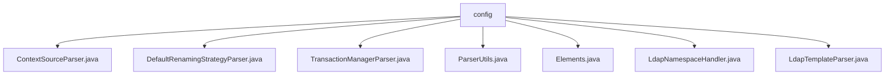

# 基础信息

|      |      |
|------|------|
| 名称 | config |
| 编码语言 | .java |
| 代码路径 | spring-ldap/core/src/main/java/org/springframework/ldap/config |
| 包名 | spring-ldap.core.src.main.java.org.springframework.ldap.config |
| 概述说明 | ContextSourceParser解析LDAP配置，生成BeanDefinition。DefaultRenamingStrategyParser解析XML，生成重命名策略Bean。TransactionManagerParser解析XML，创建事务管理器Bean。ParserUtils提供属性提取方法。Elements定义关键元素常量。LdapNamespaceHandler注册解析器。LdapTemplateParser解析XML，生成LdapTemplate Bean。 |

# 说明

## 概述

该代码模块是一个基于Spring框架的LDAP配置管理模块，主要用于解析和生成与LDAP相关的Bean定义。通过XML配置文件，模块能够解析LDAP连接池、认证策略、事务管理器、重命名策略等关键配置，并将其转换为Spring框架中的Bean定义。模块的核心功能包括配置解析、Bean定义生成以及LDAP模板的管理，旨在提供高效、安全且灵活的LDAP操作支持。

## 主要业务场景

1. **LDAP配置解析与Bean定义生成**  
   - `ContextSourceParser` 负责解析LDAP配置信息，生成适用于LDAP服务的`BeanDefinition`，支持连接池和认证策略的配置，确保LDAP连接的高效性和安全性。
   - `LdapTemplateParser` 通过解析XML元素，生成`LdapTemplate`的Bean定义，为后续的LDAP操作提供支持。

2. **事务管理配置**  
   - `TransactionManagerParser` 解析XML配置文件，创建事务管理器的Bean定义，支持应用程序中的事务管理需求。

3. **重命名策略配置**  
   - `DefaultRenamingStrategyParser` 解析XML元素，生成`DefaultTempEntryRenamingStrategy`的Bean定义，支持通过XML配置灵活定义和管理重命名策略。

4. **配置属性提取与工具支持**  
   - `ParserUtils` 提供静态方法，用于从XML元素中提取布尔、字符串和整型属性值，支持默认值设置，增强代码的健壮性和灵活性。
   - `Elements` 定义了多个静态常量字符串，用于标识上下文源、池化、LDAP模板等关键元素，减少硬编码，提高代码的可读性和可维护性。

5. **LDAP命名空间管理**  
   - `LdapNamespaceHandler` 在初始化过程中注册多个Bean定义解析器，确保系统能够正确解析和处理LDAP相关的配置信息，为LDAP功能的实现提供基础支持。

该模块的设计充分考虑了可扩展性和可维护性，通过XML配置和Bean定义的方式，使得开发者能够灵活地管理和调整LDAP相关功能，同时减少直接编码的依赖，提高系统的整体健壮性。

### 包内部结构视图

该流程图展示了`config`目录下的所有文件层级关系。`config`作为根节点，包含了多个Java文件，如`ContextSourceParser.java`、`DefaultRenamingStrategyParser.java`等。每个文件都直接隶属于`config`目录，没有进一步的子目录结构。这种结构清晰地反映了文件在项目中的组织方式，便于理解和管理。

# 文件列表 File List

| 名称   | 类型  | 说明 |
|-------|------|-------------|
| [LdapTemplateParser.java](LdapTemplateParser.md) | file | LdapTemplateParser解析XML生成LdapTemplate Bean定义。 |
| [ParserUtils.java](ParserUtils.md) | file | ParserUtils类提供静态方法，用于获取元素属性值并支持默认值。 |
| [ContextSourceParser.java](ContextSourceParser.md) | file | ContextSourceParser类解析LDAP配置并生成BeanDefinition，支持连接池和认证策略。 |
| [LdapNamespaceHandler.java](LdapNamespaceHandler.md) | file | LdapNamespaceHandler注册三个Bean解析器。 |
| [Elements.java](Elements.md) | file | Elements类定义关键元素的静态常量字符串，包括上下文源、池化和LDAP模板。 |
| [TransactionManagerParser.java](TransactionManagerParser.md) | file | TransactionManagerParser解析XML配置，创建事务管理器Bean定义。 |
| [DefaultRenamingStrategyParser.java](DefaultRenamingStrategyParser.md) | file | DefaultRenamingStrategyParser类解析XML并生成DefaultTempEntryRenamingStrategy的Bean定义。 |

