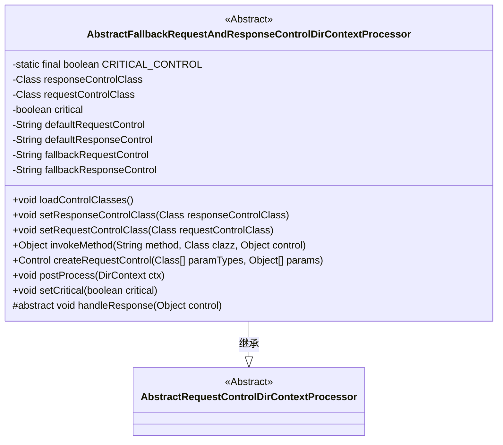

# 基础信息

|      |      |
|------|------|
| 名称 | AbstractFallbackRequestAndResponseControlDirContextProcessor |
| 编码语言 | .java |
| 代码路径 | spring-ldap/core/src/main/java/org/springframework/ldap/control/AbstractFallbackRequestAndResponseControlDirContextProcessor.java |
| 包名 | org.springframework.ldap.control |
| 依赖项 | ['java.lang.reflect.Constructor', 'java.lang.reflect.Method', 'javax.naming.NamingException', 'javax.naming.directory.DirContext', 'javax.naming.ldap.Control', 'javax.naming.ldap.LdapContext', 'org.springframework.ldap.UncategorizedLdapException', 'org.springframework.util.Assert', 'org.springframework.util.ClassUtils', 'org.springframework.util.ReflectionUtils'] |
| 概述说明 | 抽象类处理LDAP请求和响应，支持默认和回退控制类加载。 |

# 说明

抽象类负责处理LDAP请求和响应控制，具备支持默认控制和回退控制类加载的功能。该抽象类通过默认控制类处理常规请求和响应，同时在需要时能够回退到备用控制类以应对特殊情况。这种设计确保了系统的灵活性和稳定性，能够有效处理不同场景下的LDAP操作。

# 类列表 Class Summary

| 名称   | 类型  | 说明 |
|-------|------|-------------|
| AbstractFallbackRequestAndResponseControlDirContextProcessor | class | 抽象类处理LDAP请求和响应控制，支持默认和回退控制类加载。 |

## 类 AbstractFallbackRequestAndResponseControlDirContextProcessor

|      |      |
|------|------|
| 访问范围 | public abstract |
| 类型 | class |
| 名称 | AbstractFallbackRequestAndResponseControlDirContextProcessor |
| 说明 | 抽象类处理LDAP请求和响应控制，支持默认和回退控制类加载。 |

### UML类图

这段代码定义了一个抽象类 `AbstractFallbackRequestAndResponseControlDirContextProcessor`，它继承自 `AbstractRequestControlDirContextProcessor`。该类主要用于处理LDAP请求和响应控制，提供了加载控制类、设置控制类、调用方法、创建请求控制、后处理以及设置控制是否为关键等功能。其中，`loadControlClasses` 方法用于加载默认和备用的控制类，`handleResponse` 是一个抽象方法，需要子类实现以处理响应控制。

### 内部方法调用关系图

```mermaid
graph TD
    A["类AbstractFallbackRequestAndResponseControlDirContextProcessor"]
    B["属性: boolean CRITICAL_CONTROL = true"]
    C["属性: Class<?> responseControlClass"]
    D["属性: Class<?> requestControlClass"]
    E["属性: boolean critical = CRITICAL_CONTROL"]
    F["属性: String defaultRequestControl"]
    G["属性: String defaultResponseControl"]
    H["属性: String fallbackRequestControl"]
    I["属性: String fallbackResponseControl"]
    J["方法: loadControlClasses()"]
    K["方法: setResponseControlClass(Class<?> responseControlClass)"]
    L["方法: setRequestControlClass(Class<?> requestControlClass)"]
    M["方法: invokeMethod(String method, Class<?> clazz, Object control)"]
    N["方法: createRequestControl(Class<?>[] paramTypes, Object[] params)"]
    O["方法: postProcess(DirContext ctx)"]
    P["方法: setCritical(boolean critical)"]
    Q["抽象方法: handleResponse(Object control)"]

    A --> B
    A --> C
    A --> D
    A --> E
    A --> F
    A --> G
    A --> H
    A --> I
    A --> J
    A --> K
    A --> L
    A --> M
    A --> N
    A --> O
    A --> P
    A -.-> Q
```

**描述：**  
`AbstractFallbackRequestAndResponseControlDirContextProcessor` 是一个抽象类，继承自 `AbstractRequestControlDirContextProcessor`。它主要用于处理 LDAP 请求和响应的控制类。类中包含多个属性用于存储请求和响应的控制类名称，以及一个布尔值 `critical` 表示控制是否关键。类中的 `loadControlClasses` 方法用于加载默认和备用控制类，如果默认类不存在则尝试加载备用类。`postProcess` 方法用于处理 LDAP 响应控制，`createRequestControl` 方法用于创建请求控制对象。此外，类中还包含一个抽象方法 `handleResponse`，用于处理具体的响应控制。

### 字段列表 Field List

| 名称  | 类型  | 说明 |
|-------|-------|------|
| defaultRequestControl | String | 保护字符串类型的默认请求控制变量。 |
| responseControlClass | Class<?> | 受保护的响应控制类声明。 |
| critical = CRITICAL_CONTROL | boolean | 保护布尔变量critical设置为关键控制状态。 |
| requestControlClass | Class<?> | 受保护的请求控制类类型变量。 |
| fallbackRequestControl | String | 保护字符串变量fallbackRequestControl。 |
| CRITICAL_CONTROL = true | boolean | 定义了一个私有的静态最终布尔变量CRITICAL_CONTROL，值为true。 |
| defaultResponseControl | String | 定义了一个受保护的字符串变量defaultResponseControl。 |
| fallbackResponseControl | String | 保护字符串变量fallbackResponseControl。 |

### 方法列表 Method List

| 名称  | 类型  | 说明 |
|-------|-------|------|
| invokeMethod | Object | 通过反射调用指定类的方法并返回结果。 |
| handleResponse | void | 处理响应的抽象方法，需子类实现。 |
| setCritical | void | 设置关键状态的方法，参数为布尔值。 |
| setResponseControlClass | void | 设置响应控制类的实例变量。 |
| loadControlClasses | void | 加载控制类，验证非空，默认失败则回退，否则抛出异常。 |
| postProcess | void | 处理LDAP响应控制，匹配类并处理，未匹配则记录日志。 |
| createRequestControl | Control | 方法创建请求控制对象，验证构造器并处理异常。 |
| setRequestControlClass | void | 设置请求控制类的类型。 |

