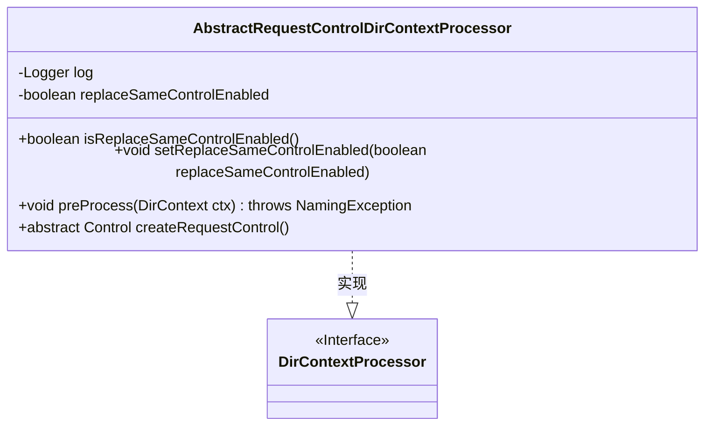
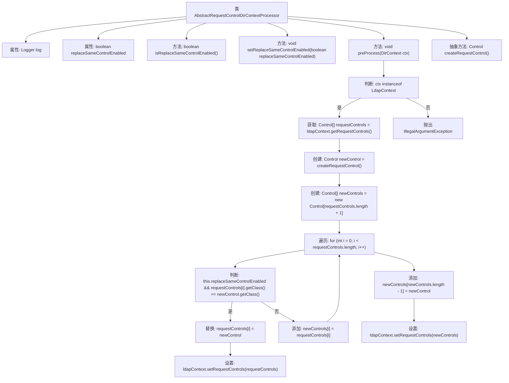

# 基础信息

|      |      |
|------|------|
| 名称 | AbstractRequestControlDirContextProcessor |
| 编码语言 | .java |
| 代码路径 | spring-ldap/core/src/main/java/org/springframework/ldap/control/AbstractRequestControlDirContextProcessor.java |
| 包名 | org.springframework.ldap.control |
| 依赖项 | ['javax.naming.NamingException', 'javax.naming.directory.DirContext', 'javax.naming.ldap.Control', 'javax.naming.ldap.LdapContext', 'org.slf4j.Logger', 'org.slf4j.LoggerFactory', 'org.springframework.ldap.core.DirContextProcessor'] |
| 概述说明 | 处理LDAP请求控制，支持替换或添加相同类型控制。 |

# 说明

AbstractRequestControlDirContextProcessor负责处理LDAP请求控制，其主要功能是支持在请求中替换或添加相同类型的控制。该处理器确保在处理LDAP请求时，能够灵活地管理控制项，从而满足不同的业务需求。

# 类列表 Class Summary

| 名称   | 类型  | 说明 |
|-------|------|-------------|
| AbstractRequestControlDirContextProcessor | class | AbstractRequestControlDirContextProcessor处理LDAP请求控制，支持替换或添加相同类型控制。 |

## 类 AbstractRequestControlDirContextProcessor

|      |      |
|------|------|
| 访问范围 | public abstract |
| 类型 | class |
| 名称 | AbstractRequestControlDirContextProcessor |
| 说明 | AbstractRequestControlDirContextProcessor处理LDAP请求控制，支持替换或添加相同类型控制。 |

### UML类图

**描述：**  
`AbstractRequestControlDirContextProcessor` 是一个抽象类，实现了 `DirContextProcessor` 接口。该类主要用于处理 LDAP 上下文中的请求控制（Request Control）。它包含一个布尔类型的 `replaceSameControlEnabled` 属性，用于控制是否替换已存在的相同类型的请求控制。`preProcess` 方法负责从 `LdapContext` 中获取现有的请求控制，并根据 `replaceSameControlEnabled` 的值决定是否替换或添加新的请求控制。`createRequestControl` 是一个抽象方法，由子类实现以创建具体的请求控制实例。

### 内部方法调用关系图

该流程图描述了`AbstractRequestControlDirContextProcessor`类的主要逻辑流程。首先，`preProcess`方法会检查传入的`DirContext`是否为`LdapContext`，如果不是则抛出异常。接着，获取现有的请求控制数组，并创建一个新的控制实例。然后，遍历现有控制数组，如果启用了替换功能且存在相同类型的控制，则替换现有控制并返回。否则，将新控制添加到数组末尾，并设置到`LdapContext`中。整个过程展示了如何动态管理和更新LDAP请求控制。

### 字段列表 Field List

| 名称  | 类型  | 说明 |
|-------|-------|------|
| replaceSameControlEnabled = true | boolean | 私有布尔变量replaceSameControlEnabled默认值为true。 |
| log = LoggerFactory.getLogger(AbstractRequestControlDirContextProcessor.class) | Logger | 在类中初始化了日志记录器。 |

### 方法列表 Method List

| 名称  | 类型  | 说明 |
|-------|-------|------|
| createRequestControl | Control | 抽象方法用于创建请求控制对象。 |
| isReplaceSameControlEnabled | boolean | 方法返回是否启用替换相同控件功能。 |
| setReplaceSameControlEnabled | void | 设置是否启用替换相同控件功能。 |
| preProcess | void | 预处理LDAP上下文，检查类型，替换或添加控制请求。 |

