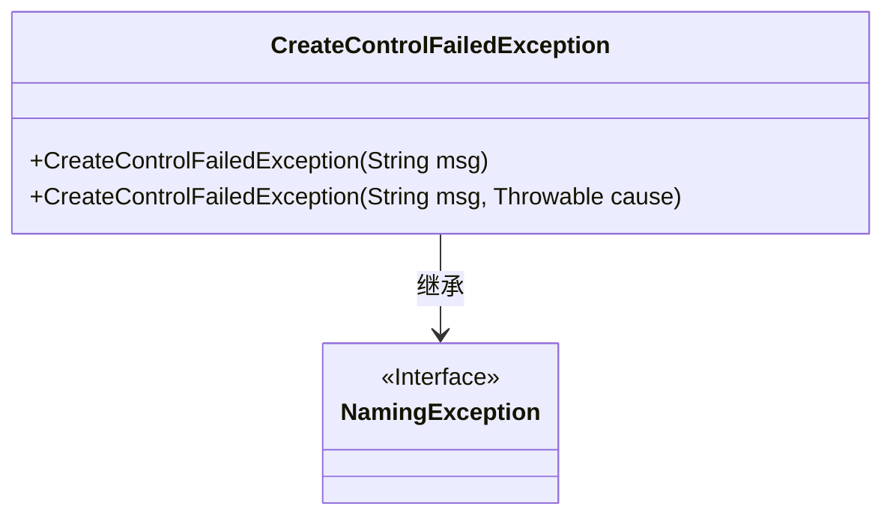
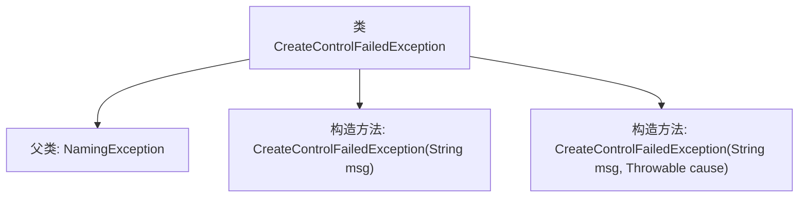

# 基础信息

|      |      |
|------|------|
| 名称 | CreateControlFailedException |
| 编码语言 | .java |
| 代码路径 | spring-ldap/core/src/main/java/org/springframework/ldap/control/CreateControlFailedException.java |
| 包名 | org.springframework.ldap.control |
| 依赖项 | ['org.springframework.ldap.NamingException'] |
| 概述说明 | CreateControlFailedException继承NamingException，支持消息和原因传递。 |

# 说明

CreateControlFailedException是NamingException的子类，提供了两种构造方法，分别支持传递错误消息和异常原因。这种设计使得在创建控制失败时，能够灵活地传递详细的错误信息和引发异常的根本原因，便于开发者进行调试和错误处理。

# 类列表 Class Summary

| 名称   | 类型  | 说明 |
|-------|------|-------------|
| CreateControlFailedException | class | CreateControlFailedException继承NamingException，提供两种构造方法，支持消息和原因传递。 |

## 类 CreateControlFailedException

|      |      |
|------|------|
| 访问范围 | public |
| 类型 | class |
| 名称 | CreateControlFailedException |
| 说明 | CreateControlFailedException继承NamingException，提供两种构造方法，支持消息和原因传递。 |

### UML类图

### 描述：
`CreateControlFailedException` 类继承自 `NamingException` 接口，是一个自定义异常类。它提供了两个构造函数，分别用于初始化异常信息和一个可选的根原因。这个类通常用于处理在创建控制对象时发生的异常情况，帮助开发者更准确地捕获和处理错误。

### 内部方法调用关系图

这段代码定义了一个名为 `CreateControlFailedException` 的异常类，它继承自 `NamingException`。该类提供了两个构造方法：一个接受一个字符串参数 `msg`，用于设置异常的详细信息；另一个接受两个参数 `msg` 和 `cause`，其中 `msg` 是异常信息，`cause` 是导致异常的根原因。这两个构造方法都调用了父类的构造方法来完成初始化。流程图展示了类的继承关系和构造方法的调用路径。

### 字段列表 Field List

| 名称  | 类型  | 说明 |
|-------|-------|------|

### 方法列表 Method List

| 名称  | 类型  | 说明 |
|-------|-------|------|

