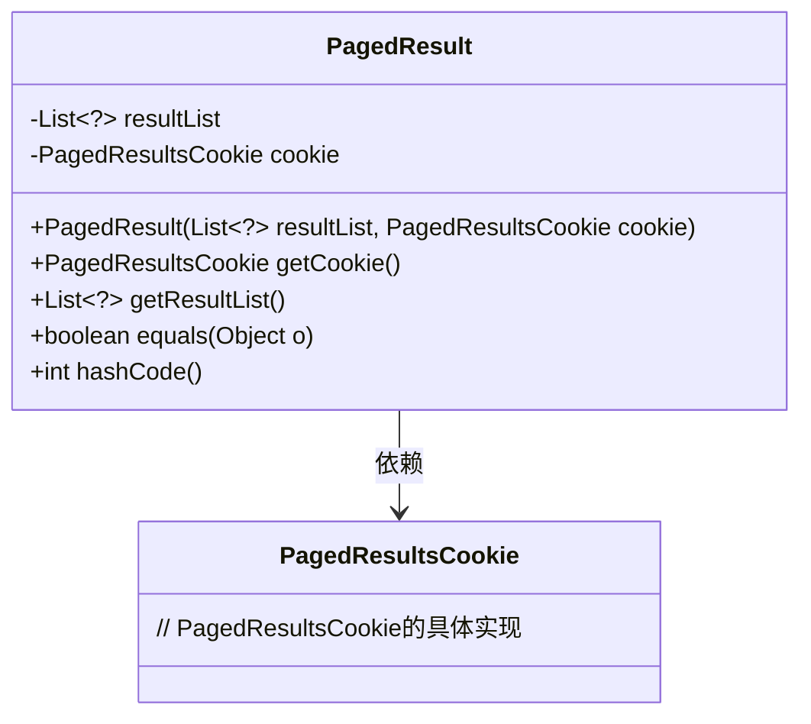
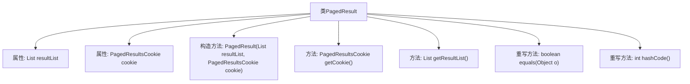

# 基础信息

|      |      |
|------|------|
| 名称 | PagedResult |
| 编码语言 | .java |
| 代码路径 | spring-ldap/core/src/main/java/org/springframework/ldap/control/PagedResult.java |
| 包名 | org.springframework.ldap.control |
| 依赖项 | ['java.util.List'] |
| 概述说明 | PagedResult类包含结果列表和分页Cookie，提供获取方法和equals、hashCode实现。 |

# 说明

PagedResult类是一个包含结果列表和分页Cookie的类，用于处理分页数据。它提供了获取结果列表和分页Cookie的方法，并实现了equals和hashCode方法以确保对象的相等性比较和哈希计算。该类设计用于高效管理和操作分页查询结果，适用于需要分页处理数据的场景。

# 类列表 Class Summary

| 名称   | 类型  | 说明 |
|-------|------|-------------|
| PagedResult | class | PagedResult类包含结果列表和分页Cookie，提供获取方法和equals、hashCode实现。 |

## 类 PagedResult

|      |      |
|------|------|
| 访问范围 | public |
| 类型 | class |
| 名称 | PagedResult |
| 说明 | PagedResult类包含结果列表和分页Cookie，提供获取方法和equals、hashCode实现。 |

### UML类图

这段代码定义了一个 `PagedResult` 类，用于封装分页查询的结果。该类包含两个私有成员：`resultList` 和 `cookie`，分别表示结果列表和分页查询的标识。类中提供了构造函数、获取 `cookie` 和 `resultList` 的方法，以及重写的 `equals` 和 `hashCode` 方法，用于比较两个 `PagedResult` 对象是否相等。`PagedResult` 类依赖于 `PagedResultsCookie` 类，后者用于存储分页查询的标识信息。

### 内部方法调用关系图

这段代码定义了一个名为 `PagedResult` 的类，该类包含两个私有属性：`resultList` 和 `cookie`，分别表示结果列表和分页结果的Cookie。类中提供了构造方法、获取 `cookie` 和 `resultList` 的方法，并重写了 `equals` 和 `hashCode` 方法以实现对象的比较和哈希计算。流程图展示了类的结构及其方法之间的调用关系。

### 字段列表 Field List

| 名称  | 类型  | 说明 |
|-------|-------|------|
| resultList | List<?> | 私有泛型列表变量resultList声明。 |
| cookie | PagedResultsCookie | 定义了一个私有分页结果Cookie变量。 |

### 方法列表 Method List

| 名称  | 类型  | 说明 |
|-------|-------|------|
| getCookie | PagedResultsCookie | 方法返回当前对象的cookie属性。 |
| getResultList | List<?> | 方法返回当前结果列表。 |
| equals | boolean | 重写equals方法，比较对象和属性的相等性。 |
| hashCode | int | 重写hashCode方法，基于resultList和cookie计算哈希值。 |

