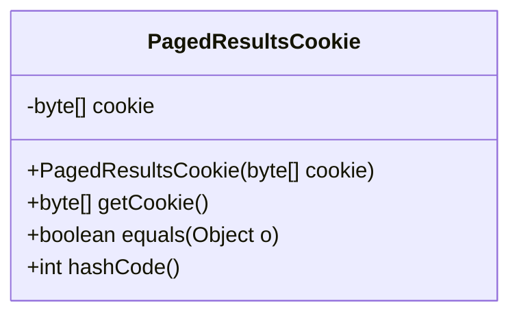
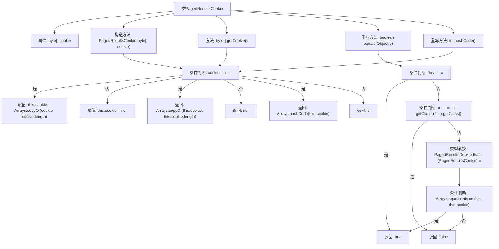

# 基础信息

|      |      |
|------|------|
| 名称 | PagedResultsCookie |
| 编码语言 | .java |
| 代码路径 | spring-ldap/core/src/main/java/org/springframework/ldap/control/PagedResultsCookie.java |
| 包名 | org.springframework.ldap.control |
| 依赖项 | ['java.util.Arrays', 'javax.naming.ldap.PagedResultsControl'] |
| 概述说明 | PagedResultsCookie类存储分页结果，支持构造、获取、比较和哈希操作。 |

# 说明

PagedResultsCookie类用于存储分页结果的cookie，具备构造、获取、比较和哈希等功能。该类通过构造函数初始化，提供方法获取cookie值，支持比较操作以判断两个cookie是否相同，并实现哈希功能以便在数据结构中高效存储和检索。

# 类列表 Class Summary

| 名称   | 类型  | 说明 |
|-------|------|-------------|
| PagedResultsCookie | class | PagedResultsCookie类用于存储分页结果cookie，提供构造、获取、比较和哈希功能。 |

## 类 PagedResultsCookie

|      |      |
|------|------|
| 访问范围 | public |
| 类型 | class |
| 名称 | PagedResultsCookie |
| 说明 | PagedResultsCookie类用于存储分页结果cookie，提供构造、获取、比较和哈希功能。 |

### UML类图

这段代码定义了一个名为 `PagedResultsCookie` 的类，用于管理分页结果的 cookie。该类包含一个私有的 `byte[]` 类型的 `cookie` 成员变量，用于存储 cookie 数据。类中提供了构造函数 `PagedResultsCookie(byte[] cookie)`，用于初始化 `cookie`，并在初始化时对传入的 `cookie` 进行深拷贝以确保数据的安全性。此外，类中还提供了 `getCookie()` 方法，用于获取 `cookie` 的副本，避免直接暴露内部数据。`equals(Object o)` 和 `hashCode()` 方法被重写，以确保对象在比较和哈希计算时能够正确处理 `cookie` 数据。整体设计确保了 `cookie` 数据的安全性和一致性。

### 内部方法调用关系图

这段代码定义了一个`PagedResultsCookie`类，用于处理分页结果中的cookie。类中包含一个`byte[]`类型的属性`cookie`，以及构造方法、获取cookie的方法、重写的`equals`和`hashCode`方法。构造方法通过判断传入的`cookie`是否为`null`来决定是否复制`cookie`，而`getCookie`方法则返回`cookie`的副本。`equals`方法用于比较两个`PagedResultsCookie`对象是否相等，`hashCode`方法则根据`cookie`的值生成哈希码。

### 字段列表 Field List

| 名称  | 类型  | 说明 |
|-------|-------|------|
| cookie | byte[] | 私有字节数组存储cookie信息。 |

### 方法列表 Method List

| 名称  | 类型  | 说明 |
|-------|-------|------|
| getCookie | byte[] | 返回cookie的副本，若不存在则返回null。 |
| hashCode | int | 重写hashCode方法，根据cookie值返回哈希码。 |
| equals | boolean | 重写equals方法，比较对象是否相同或cookie数组是否一致。 |

