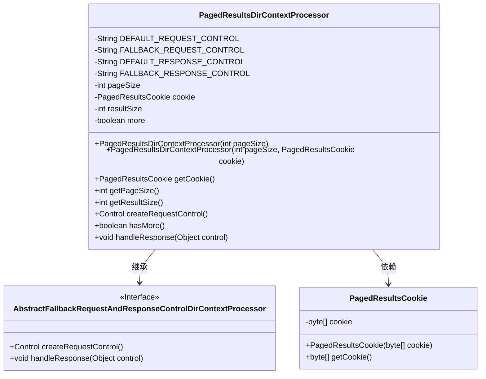

# 基础信息

|      |      |
|------|------|
| 名称 | PagedResultsDirContextProcessor |
| 编码语言 | .java |
| 代码路径 | spring-ldap/core/src/main/java/org/springframework/ldap/control/PagedResultsDirContextProcessor.java |
| 包名 | org.springframework.ldap.control |
| 依赖项 | ['javax.naming.ldap.Control'] |
| 概述说明 | PagedResultsDirContextProcessor管理分页搜索结果，支持默认和备用控制类，调控页面大小和结果状态。 |

# 说明

PagedResultsDirContextProcessor是一个用于处理分页搜索结果的处理器，它支持默认和备用的控制类，能够有效管理页面大小和结果状态。该处理器确保在分页搜索过程中，页面大小和结果状态得到合理控制，从而提升用户体验和系统性能。

# 类列表 Class Summary

| 名称   | 类型  | 说明 |
|-------|------|-------------|
| PagedResultsDirContextProcessor | class | PagedResultsDirContextProcessor处理分页搜索结果，支持默认和备用控制类，管理页面大小和结果状态。 |

## 类 PagedResultsDirContextProcessor

|      |      |
|------|------|
| 访问范围 | public |
| 类型 | class |
| 名称 | PagedResultsDirContextProcessor |
| 说明 | PagedResultsDirContextProcessor处理分页搜索结果，支持默认和备用控制类，管理页面大小和结果状态。 |

### UML类图

### 描述
`PagedResultsDirContextProcessor` 类继承自 `AbstractFallbackRequestAndResponseControlDirContextProcessor`，用于处理分页查询的LDAP请求和响应。它包含默认和备用的请求和响应控制类，以及用于分页查询的页面大小、cookie、结果大小和是否还有更多结果的标志。类中提供了构造方法、获取cookie、页面大小、结果大小的方法，以及创建请求控制和处理响应的方法。`PagedResultsCookie` 类用于存储和获取分页查询的cookie。

### 内部方法调用关系图

```mermaid
graph TD
    A["类PagedResultsDirContextProcessor"]
    B["属性: String DEFAULT_REQUEST_CONTROL"]
    C["属性: String FALLBACK_REQUEST_CONTROL"]
    D["属性: String DEFAULT_RESPONSE_CONTROL"]
    E["属性: String FALLBACK_RESPONSE_CONTROL"]
    F["属性: int pageSize"]
    G["属性: PagedResultsCookie cookie"]
    H["属性: int resultSize"]
    I["属性: boolean more"]
    J["构造方法: PagedResultsDirContextProcessor(int pageSize)"]
    K["构造方法: PagedResultsDirContextProcessor(int pageSize, PagedResultsCookie cookie)"]
    L["方法: PagedResultsCookie getCookie()"]
    M["方法: int getPageSize()"]
    N["方法: int getResultSize()"]
    O["方法: Control createRequestControl()"]
    P["方法: boolean hasMore()"]
    Q["方法: void handleResponse(Object control)"]

    A --> B
    A --> C
    A --> D
    A --> E
    A --> F
    A --> G
    A --> H
    A --> I
    A --> J
    A --> K
    A --> L
    A --> M
    A --> N
    A --> O
    A --> P
    A --> Q
```

这段代码定义了一个名为 `PagedResultsDirContextProcessor` 的类，继承自 `AbstractFallbackRequestAndResponseControlDirContextProcessor`。该类用于处理分页查询的请求和响应控制。它包含多个属性和方法，用于设置和获取分页大小、cookie、结果大小以及判断是否还有更多结果。构造方法允许初始化分页大小和cookie，而 `handleResponse` 方法则用于处理响应并更新内部状态。

### 字段列表 Field List

| 名称  | 类型  | 说明 |
|-------|-------|------|
| cookie | PagedResultsCookie | 定义私有分页结果Cookie变量。 |
| pageSize | int | 定义私有整型变量pageSize。 |
| more = true | boolean | 私有布尔变量`more`初始化为`true`。 |
| DEFAULT_RESPONSE_CONTROL = "javax.naming.ldap.PagedResultsResponseControl" | String | 定义默认响应控制为LDAP分页结果控制。 |
| FALLBACK_REQUEST_CONTROL = "com.sun.jndi.ldap.ctl.PagedResultsControl" | String | FALLBACK_REQUEST_CONTROL定义为JNDI LDAP分页结果控制常量。 |
| DEFAULT_REQUEST_CONTROL = "javax.naming.ldap.PagedResultsControl" | String | 定义默认请求控制为JNDI分页结果控制。 |
| resultSize | int | 定义私有整型变量resultSize。 |
| FALLBACK_RESPONSE_CONTROL = "com.sun.jndi.ldap.ctl.PagedResultsResponseControl" | String | 定义常量FALLBACK_RESPONSE_CONTROL，值为LDAP分页响应控制类路径。 |

### 方法列表 Method List

| 名称  | 类型  | 说明 |
|-------|-------|------|
| getPageSize | int | 该方法返回当前页面的尺寸值。 |
| hasMore | boolean | 检查是否有更多内容，返回布尔值。 |
| createRequestControl | Control | 创建请求控制方法，处理cookie并返回控制对象。 |
| getCookie | PagedResultsCookie | 获取当前页结果的分页标识。 |
| getResultSize | int | 该方法返回结果大小的整数值。 |
| handleResponse | void | 处理响应，获取cookie和结果大小，更新状态。 |

