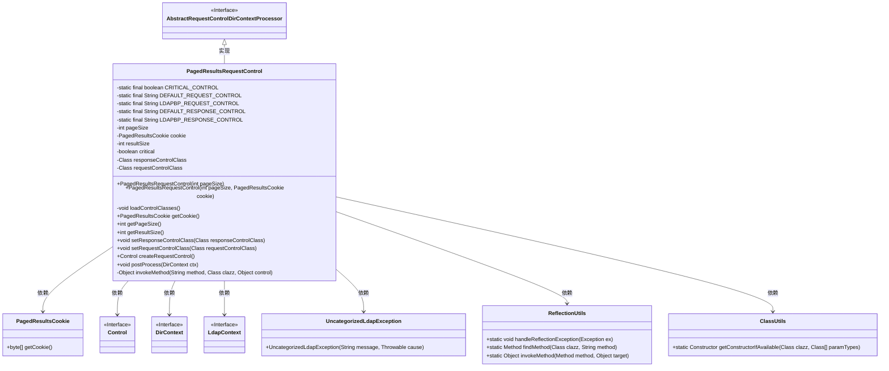

# 基础信息

|      |      |
|------|------|
| 名称 | PagedResultsRequestControl |
| 编码语言 | .java |
| 代码路径 | spring-ldap/core/src/main/java/org/springframework/ldap/control/PagedResultsRequestControl.java |
| 包名 | org.springframework.ldap.control |
| 依赖项 | ['java.lang.reflect.Constructor', 'java.lang.reflect.Method', 'javax.naming.NamingException', 'javax.naming.directory.DirContext', 'javax.naming.ldap.Control', 'javax.naming.ldap.LdapContext', 'org.springframework.ldap.UncategorizedLdapException', 'org.springframework.util.ClassUtils', 'org.springframework.util.ReflectionUtils'] |
| 概述说明 | PagedResultsRequestControl类处理LDAP分页搜索，设置页面大小和Cookie。 |

# 说明

PagedResultsRequestControl类主要用于处理LDAP分页搜索结果，允许用户设置页面大小、Cookie以及响应控制类。通过该类，用户可以有效地管理和控制分页查询的返回结果，确保数据分页处理的灵活性和效率。

# 类列表 Class Summary

| 名称   | 类型  | 说明 |
|-------|------|-------------|
| PagedResultsRequestControl | class | PagedResultsRequestControl类用于处理LDAP分页搜索结果，支持设置页面大小、Cookie及响应控制类。 |

## 类 PagedResultsRequestControl

|      |      |
|------|------|
| 访问范围 | public |
| 类型 | class |
| 名称 | PagedResultsRequestControl |
| 说明 | PagedResultsRequestControl类用于处理LDAP分页搜索结果，支持设置页面大小、Cookie及响应控制类。 |

### UML类图

### 描述
`PagedResultsRequestControl` 类继承自 `AbstractRequestControlDirContextProcessor`，用于处理分页查询请求。它包含多个静态常量，用于定义请求和响应控制的类名。类中有两个构造函数，分别用于初始化分页大小和分页标记（cookie）。`loadControlClasses` 方法用于加载控制类，`createRequestControl` 方法用于创建请求控制对象，`postProcess` 方法用于处理响应控制。此外，类中还定义了多个获取和设置方法，以及与反射相关的工具方法。

### 内部方法调用关系图

```mermaid
graph TD
    A["类PagedResultsRequestControl"]
    B["属性: boolean CRITICAL_CONTROL"]
    C["属性: String DEFAULT_REQUEST_CONTROL"]
    D["属性: String LDAPBP_REQUEST_CONTROL"]
    E["属性: String DEFAULT_RESPONSE_CONTROL"]
    F["属性: String LDAPBP_RESPONSE_CONTROL"]
    G["属性: int pageSize"]
    H["属性: PagedResultsCookie cookie"]
    I["属性: int resultSize"]
    J["属性: boolean critical"]
    K["属性: Class responseControlClass"]
    L["属性: Class requestControlClass"]
    M["构造方法: PagedResultsRequestControl(int pageSize)"]
    N["构造方法: PagedResultsRequestControl(int pageSize, PagedResultsCookie cookie)"]
    O["方法: void loadControlClasses()"]
    P["方法: PagedResultsCookie getCookie()"]
    Q["方法: int getPageSize()"]
    R["方法: int getResultSize()"]
    S["方法: void setResponseControlClass(Class responseControlClass)"]
    T["方法: void setRequestControlClass(Class requestControlClass)"]
    U["方法: Control createRequestControl()"]
    V["方法: void postProcess(DirContext ctx)"]
    W["方法: Object invokeMethod(String method, Class clazz, Object control)"]

    A --> B
    A --> C
    A --> D
    A --> E
    A --> F
    A --> G
    A --> H
    A --> I
    A --> J
    A --> K
    A --> L
    A --> M
    A --> N
    N --> O
    A --> P
    A --> Q
    A --> R
    A --> S
    A --> T
    A --> U
    A --> V
    V --> W
```

该流程图描述了`PagedResultsRequestControl`类的结构及其方法调用关系。类包含多个属性，如`CRITICAL_CONTROL`、`DEFAULT_REQUEST_CONTROL`等，以及构造方法`PagedResultsRequestControl`，用于初始化对象。类中的方法`loadControlClasses`用于加载控制类，`createRequestControl`用于创建请求控制，`postProcess`用于处理响应控制，`invokeMethod`用于反射调用方法。这些方法共同协作，实现了对LDAP分页结果请求的控制和处理。

### 字段列表 Field List

| 名称  | 类型  | 说明 |
|-------|-------|------|
| responseControlClass | Class | 私有类变量responseControlClass。 |
| requestControlClass | Class | 私有类请求控制类定义。 |
| pageSize | int | 定义私有整型变量pageSize。 |
| LDAPBP_REQUEST_CONTROL = "com.sun.jndi.ldap.ctl.PagedResultsControl" | String | 定义LDAP分页查询请求控制的常量字符串。 |
| cookie | PagedResultsCookie | 定义私有分页结果Cookie变量。 |
| LDAPBP_RESPONSE_CONTROL = "com.sun.jndi.ldap.ctl.PagedResultsResponseControl" | String | 定义LDAP分页响应控制的静态常量字符串。 |
| CRITICAL_CONTROL = true | boolean | 定义了一个私有的静态常量布尔变量CRITICAL_CONTROL，值为true。 |
| DEFAULT_REQUEST_CONTROL = "javax.naming.ldap.PagedResultsControl" | String | 默认请求控制为JNDI分页结果控制类。 |
| critical = CRITICAL_CONTROL | boolean | 私有布尔变量critical设置为CRITICAL_CONTROL。 |
| resultSize | int | 私有整型变量resultSize |
| DEFAULT_RESPONSE_CONTROL = "javax.naming.ldap.PagedResultsResponseControl" | String | 默认响应控制为JNDI分页结果控制类。 |

### 方法列表 Method List

| 名称  | 类型  | 说明 |
|-------|-------|------|
| getPageSize | int | 该方法返回当前页面的尺寸。 |
| getResultSize | int | 该方法返回当前对象的resultSize属性值。 |
| setRequestControlClass | void | 设置请求控制类的实例变量。 |
| setResponseControlClass | void | 设置响应控制类的公共方法。 |
| invokeMethod | Object | 通过反射调用指定类中的方法并返回结果。 |
| postProcess | void | 处理LDAP响应控制，匹配并获取分页结果信息。 |
| getCookie | PagedResultsCookie | 获取分页结果中的cookie对象。 |
| loadControlClasses | void | 加载默认控制类失败后尝试回退到备用类。 |
| createRequestControl | Control | 创建请求控制对象，处理cookie和构造函数异常。 |

