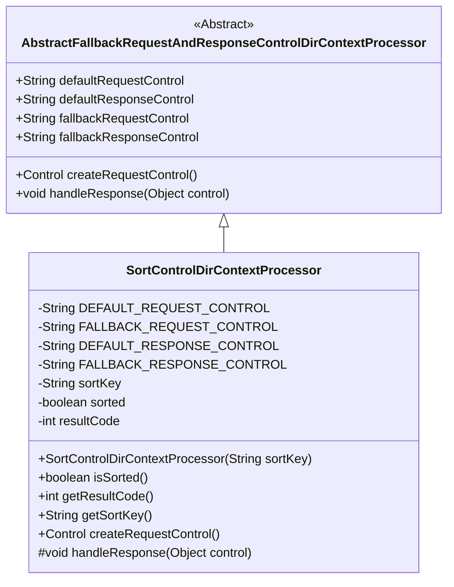
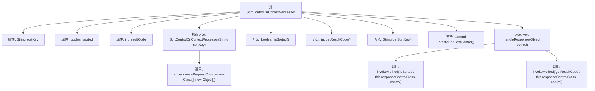

# 基础信息

|      |      |
|------|------|
| 名称 | SortControlDirContextProcessor |
| 编码语言 | .java |
| 代码路径 | spring-ldap/core/src/main/java/org/springframework/ldap/control/SortControlDirContextProcessor.java |
| 包名 | org.springframework.ldap.control |
| 依赖项 | ['javax.naming.ldap.Control'] |
| 概述说明 | SortControlDirContextProcessor类处理LDAP排序控制，包含排序键、结果码和状态。 |

# 说明

SortControlDirContextProcessor类专门用于处理LDAP排序控制，主要功能包括管理排序键、结果码和排序状态。该类确保在LDAP查询中能够有效地进行排序操作，并通过处理相关控制信息来维护排序的准确性和一致性。

# 类列表 Class Summary

| 名称   | 类型  | 说明 |
|-------|------|-------------|
| SortControlDirContextProcessor | class | SortControlDirContextProcessor类用于处理LDAP排序控制，包含排序键、结果码和排序状态。 |

## 类 SortControlDirContextProcessor

|      |      |
|------|------|
| 访问范围 | public |
| 类型 | class |
| 名称 | SortControlDirContextProcessor |
| 说明 | SortControlDirContextProcessor类用于处理LDAP排序控制，包含排序键、结果码和排序状态。 |

### UML类图

### 描述
`SortControlDirContextProcessor` 是一个继承自 `AbstractFallbackRequestAndResponseControlDirContextProcessor` 的类，用于处理LDAP排序控制请求和响应。它包含了默认和备用的请求和响应控制类路径，以及用于排序的键、排序状态和结果代码等属性。该类提供了构造方法、获取排序状态、结果代码和排序键的方法，并重写了父类的 `createRequestControl` 和 `handleResponse` 方法以实现具体的控制逻辑。

### 内部方法调用关系图

这段代码定义了一个`SortControlDirContextProcessor`类，用于处理LDAP搜索结果的排序控制。类中包含了对排序键、排序状态和结果代码的管理，并通过构造方法初始化这些属性。`createRequestControl`方法用于创建请求控制对象，而`handleResponse`方法则处理响应控制对象，更新排序状态和结果代码。

### 字段列表 Field List

| 名称  | 类型  | 说明 |
|-------|-------|------|
| DEFAULT_REQUEST_CONTROL = "javax.naming.ldap.SortControl" | String | 默认请求控制为SortControl。 |
| sortKey | String | 定义一个字符串类型的排序键变量。 |
| resultCode | int | 定义私有整型变量resultCode。 |
| sorted | boolean | 定义了一个私有的布尔变量sorted。 |
| DEFAULT_RESPONSE_CONTROL = "javax.naming.ldap.SortResponseControl" | String | 定义默认响应控制为SortResponseControl。 |
| FALLBACK_RESPONSE_CONTROL = "com.sun.jndi.ldap.ctl.SortResponseControl" | String | 私有常量定义用于LDAP排序响应的控制类。 |
| FALLBACK_REQUEST_CONTROL = "com.sun.jndi.ldap.ctl.SortControl" | String | 私有静态字符串常量FALLBACK_REQUEST_CONTROL定义为"com.sun.jndi.ldap.ctl.SortControl"。 |

### 方法列表 Method List

| 名称  | 类型  | 说明 |
|-------|-------|------|
| handleResponse | void | 处理响应，设置排序状态和结果代码。 |
| getResultCode | int | 该方法返回整型变量resultCode的值。 |
| getSortKey | String | 获取排序键的方法，返回当前对象的排序键。 |
| isSorted | boolean | 该方法返回布尔值，表示对象是否已排序。 |
| createRequestControl | Control | 方法创建请求控制，传入字符串数组和布尔类型参数。 |

