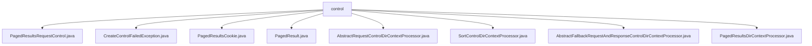

# 基础信息

|      |      |
|------|------|
| 名称 | control |
| 编码语言 | .java |
| 代码路径 | spring-ldap/core/src/main/java/org/springframework/ldap/control |
| 包名 | spring-ldap.core.src.main.java.org.springframework.ldap.control |
| 概述说明 | LDAP分页搜索控制类集合，包括分页请求、结果、Cookie、排序及异常处理，确保高效灵活的数据管理。 |

# 说明

## 概述
该代码模块主要围绕LDAP（轻量级目录访问协议）的分页搜索和排序控制展开，提供了一系列类和处理器来管理和优化分页查询、排序操作以及相关的异常处理。模块中的核心功能包括分页结果的控制、排序键的管理、请求和响应的处理，以及异常情况的捕获和处理。通过抽象类和具体实现类的结合，模块提供了灵活且高效的LDAP操作支持，适用于需要处理大量数据分页和排序的场景。

## 主要业务场景
1. **分页搜索**：通过`PagedResultsRequestControl`、`PagedResultsCookie`、`PagedResult`和`PagedResultsDirContextProcessor`等类，模块支持对LDAP查询结果进行分页处理。用户可以设置页面大小、管理分页Cookie，并高效地获取和处理分页数据。
2. **排序控制**：`SortControlDirContextProcessor`类专门用于处理LDAP查询中的排序操作，管理排序键、结果码和排序状态，确保查询结果按照指定顺序返回。
3. **请求和响应控制**：`AbstractRequestControlDirContextProcessor`和`AbstractFallbackRequestAndResponseControlDirContextProcessor`等抽象类提供了对LDAP请求和响应的控制处理，支持默认控制和备用控制，确保系统在不同场景下的灵活性和稳定性。
4. **异常处理**：`CreateControlFailedException`类用于捕获和处理在创建控制时发生的异常，提供了详细的错误信息和异常原因，便于开发者进行调试和错误处理。

### 包内部结构视图

该流程图展示了`spring-ldap/core/src/main/java/org/springframework/ldap/control`目录下的文件层级关系。所有文件都直接位于`control`目录下，包括`PagedResultsRequestControl.java`、`CreateControlFailedException.java`、`PagedResultsCookie.java`、`PagedResult.java`、`AbstractRequestControlDirContextProcessor.java`、`SortControlDirContextProcessor.java`、`AbstractFallbackRequestAndResponseControlDirContextProcessor.java`和`PagedResultsDirContextProcessor.java`。这些文件共同构成了控制模块的核心功能。

# 文件列表 File List

| 名称   | 类型  | 说明 |
|-------|------|-------------|
| [AbstractFallbackRequestAndResponseControlDirContextProcessor.java](AbstractFallbackRequestAndResponseControlDirContextProcessor.md) | file | 抽象类处理LDAP请求和响应，支持默认和回退控制类加载。 |
| [PagedResult.java](PagedResult.md) | file | PagedResult类包含结果列表和分页Cookie，提供获取方法和equals、hashCode实现。 |
| [PagedResultsRequestControl.java](PagedResultsRequestControl.md) | file | PagedResultsRequestControl类处理LDAP分页搜索，设置页面大小和Cookie。 |
| [PagedResultsDirContextProcessor.java](PagedResultsDirContextProcessor.md) | file | PagedResultsDirContextProcessor管理分页搜索结果，支持默认和备用控制类，调控页面大小和结果状态。 |
| [SortControlDirContextProcessor.java](SortControlDirContextProcessor.md) | file | SortControlDirContextProcessor类处理LDAP排序控制，包含排序键、结果码和状态。 |
| [AbstractRequestControlDirContextProcessor.java](AbstractRequestControlDirContextProcessor.md) | file | 处理LDAP请求控制，支持替换或添加相同类型控制。 |
| [PagedResultsCookie.java](PagedResultsCookie.md) | file | PagedResultsCookie类存储分页结果，支持构造、获取、比较和哈希操作。 |
| [CreateControlFailedException.java](CreateControlFailedException.md) | file | CreateControlFailedException继承NamingException，支持消息和原因传递。 |

