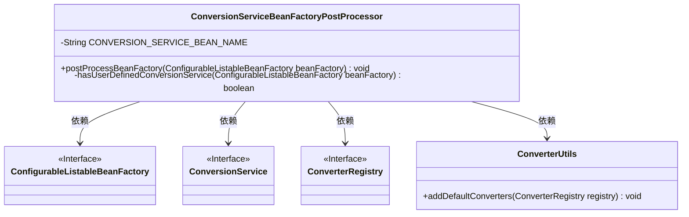
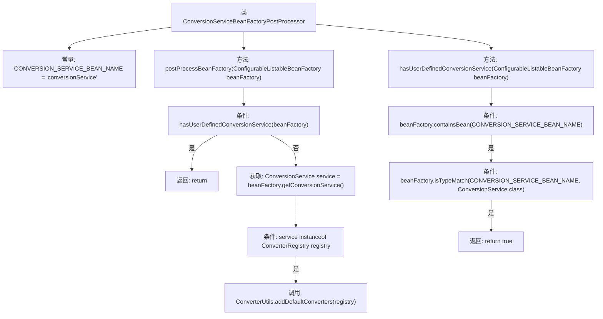

# 基础信息

|      |      |
|------|------|
| 名称 | ConversionServiceBeanFactoryPostProcessor |
| 编码语言 | .java |
| 代码路径 | spring-ldap/core/src/main/java/org/springframework/ldap/convert/ConversionServiceBeanFactoryPostProcessor.java |
| 包名 | org.springframework.ldap.convert |
| 依赖项 | ['org.springframework.beans.BeansException', 'org.springframework.beans.factory.config.BeanFactoryPostProcessor', 'org.springframework.beans.factory.config.ConfigurableListableBeanFactory', 'org.springframework.core.convert.ConversionService', 'org.springframework.core.convert.converter.ConverterRegistry'] |
| 概述说明 | ConversionServiceBeanFactoryPostProcessor自动添加默认转换器到未自定义的ConversionService。 |

# 说明

ConversionServiceBeanFactoryPostProcessor的主要功能是检查并确保未自定义的ConversionService中包含默认的转换器。该处理器在Spring框架中自动执行，确保转换服务具备基本功能，避免因缺失默认转换器而导致的潜在问题。通过这一机制，开发者无需手动配置，系统能够自动维护转换服务的完整性。

# 类列表 Class Summary

| 名称   | 类型  | 说明 |
|-------|------|-------------|
| ConversionServiceBeanFactoryPostProcessor | class | ConversionServiceBeanFactoryPostProcessor检查并添加默认转换器到未自定义的ConversionService。 |

## 类 ConversionServiceBeanFactoryPostProcessor

|      |      |
|------|------|
| 访问范围 | public final |
| 类型 | class |
| 名称 | ConversionServiceBeanFactoryPostProcessor |
| 说明 | ConversionServiceBeanFactoryPostProcessor检查并添加默认转换器到未自定义的ConversionService。 |

### UML类图

**描述：**  
`ConversionServiceBeanFactoryPostProcessor` 是一个实现了 `BeanFactoryPostProcessor` 接口的类，用于在 Spring 容器初始化后对 `BeanFactory` 进行后处理。它检查是否存在用户自定义的 `ConversionService`，如果不存在，则获取默认的 `ConversionService` 并为其添加默认的转换器。该类依赖于 `ConfigurableListableBeanFactory`、`ConversionService`、`ConverterRegistry` 和 `ConverterUtils` 等接口和工具类。

### 内部方法调用关系图

这段代码描述了一个Spring框架中的`BeanFactoryPostProcessor`实现类`ConversionServiceBeanFactoryPostProcessor`，它用于处理`BeanFactory`中的`ConversionService`。首先，检查是否存在用户自定义的`ConversionService`，如果存在则直接返回；否则，获取默认的`ConversionService`并检查其是否为`ConverterRegistry`类型，如果是则添加默认的转换器。流程图清晰地展示了代码的逻辑流程和条件判断。

### 字段列表 Field List

| 名称  | 类型  | 说明 |
|-------|-------|------|
| CONVERSION_SERVICE_BEAN_NAME = "conversionService" | String | 定义常量字符串CONVERSION_SERVICE_BEAN_NAME，值为"conversionService"。 |

### 方法列表 Method List

| 名称  | 类型  | 说明 |
|-------|-------|------|
| hasUserDefinedConversionService | boolean | 检查Bean工厂是否包含并匹配用户定义的转换服务Bean。 |
| postProcessBeanFactory | void | 方法检查并处理BeanFactory中的用户自定义转换服务，若无则添加默认转换器。 |

