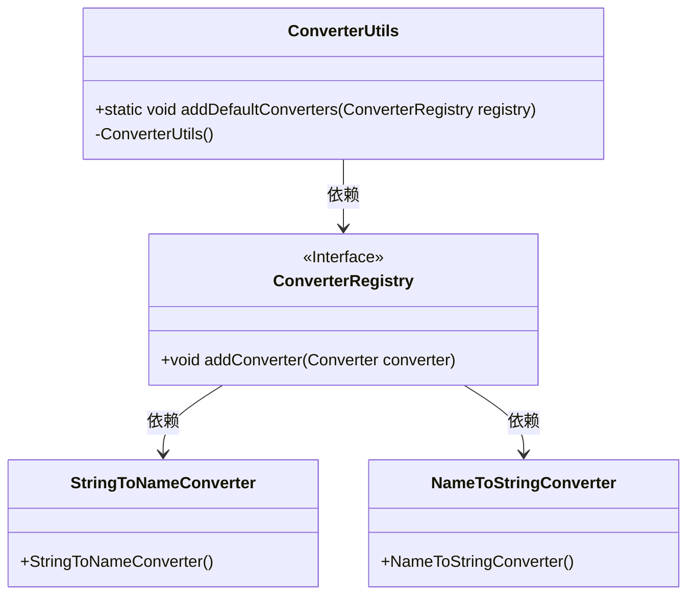
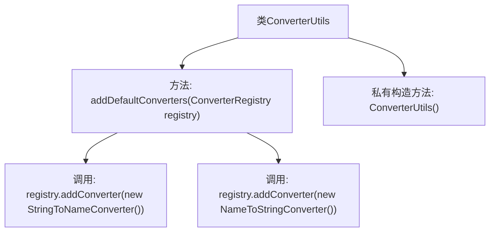

# 基础信息

|      |      |
|------|------|
| 名称 | ConverterUtils |
| 编码语言 | .java |
| 代码路径 | spring-ldap/core/src/main/java/org/springframework/ldap/convert/ConverterUtils.java |
| 包名 | org.springframework.ldap.convert |
| 依赖项 | ['org.springframework.core.convert.converter.ConverterRegistry'] |
| 概述说明 | ConverterUtils类注册Spring LDAP默认转换器到ConverterRegistry。 |

# 说明

ConverterUtils类的主要功能是将Spring LDAP的默认转换器注册到ConverterRegistry中。这一过程确保了在Spring LDAP框架中，默认的转换器能够被正确识别和使用，从而支持数据类型在LDAP和Java对象之间的转换。通过这种方式，开发者可以更方便地处理LDAP数据与应用程序之间的交互。

# 类列表 Class Summary

| 名称   | 类型  | 说明 |
|-------|------|-------------|
| ConverterUtils | class | ConverterUtils类用于注册Spring LDAP的默认转换器到ConverterRegistry。 |

## 类 ConverterUtils

|      |      |
|------|------|
| 访问范围 | public final |
| 类型 | class |
| 名称 | ConverterUtils |
| 说明 | ConverterUtils类用于注册Spring LDAP的默认转换器到ConverterRegistry。 |

### UML类图

### 描述
`ConverterUtils` 是一个工具类，用于向 `ConverterRegistry` 注册默认的转换器。它包含一个静态方法 `addDefaultConverters`，该方法将 `StringToNameConverter` 和 `NameToStringConverter` 添加到 `ConverterRegistry` 中。`ConverterRegistry` 是一个接口，定义了 `addConverter` 方法，用于注册转换器。`StringToNameConverter` 和 `NameToStringConverter` 是具体的转换器实现类。`ConverterUtils` 类通过依赖 `ConverterRegistry` 来管理转换器的注册。

### 内部方法调用关系图

这段代码定义了一个名为 `ConverterUtils` 的工具类，该类包含一个静态方法 `addDefaultConverters`，用于向 `ConverterRegistry` 注册默认的转换器。方法内部调用了 `registry.addConverter` 两次，分别注册了 `StringToNameConverter` 和 `NameToStringConverter` 两个转换器。类还包含一个私有的构造方法，确保该类不能被实例化。整个类的设计目的是提供一种便捷的方式来配置默认的转换器。

### 字段列表 Field List

| 名称  | 类型  | 说明 |
|-------|-------|------|

### 方法列表 Method List

| 名称  | 类型  | 说明 |
|-------|-------|------|
| addDefaultConverters | void | 静态方法添加默认转换器到注册表。 |

