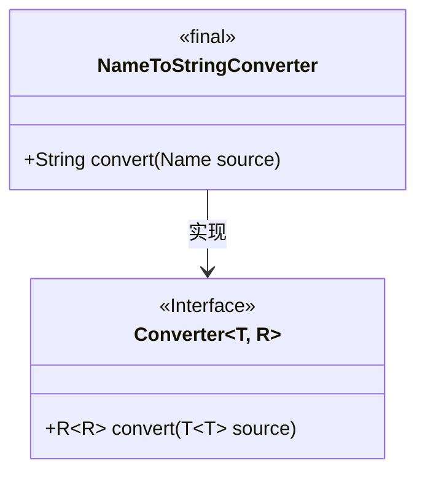
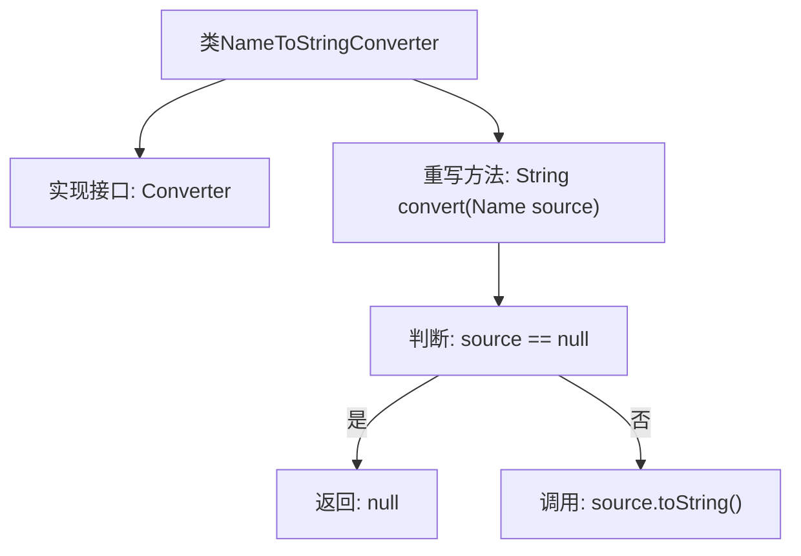

# 基础信息

|      |      |
|------|------|
| 名称 | NameToStringConverter |
| 编码语言 | .java |
| 代码路径 | spring-ldap/core/src/main/java/org/springframework/ldap/convert/NameToStringConverter.java |
| 包名 | org.springframework.ldap.convert |
| 依赖项 | ['javax.naming.Name', 'org.springframework.core.convert.converter.Converter'] |
| 概述说明 | NameToStringConverter类负责将Name转换为String，并处理null值。 |

# 说明

NameToStringConverter类负责将Name对象转换为String类型，并具备处理null值的能力。该类的主要功能是确保在转换过程中，如果Name对象为null，能够进行适当的处理，避免出现空指针异常或其他错误。通过实现这一转换逻辑，NameToStringConverter类为系统提供了稳定且可靠的Name到String的转换机制，增强了代码的健壮性和可维护性。

# 类列表 Class Summary

| 名称   | 类型  | 说明 |
|-------|------|-------------|
| NameToStringConverter | class | NameToStringConverter类实现Name到String的转换，处理null值。 |

## 类 NameToStringConverter

|      |      |
|------|------|
| 访问范围 | public final |
| 类型 | class |
| 名称 | NameToStringConverter |
| 说明 | NameToStringConverter类实现Name到String的转换，处理null值。 |

### UML类图

类图描述：`NameToStringConverter` 是一个实现了 `Converter` 接口的最终类，用于将 `Name` 类型的对象转换为 `String` 类型。`Converter` 接口定义了一个泛型方法 `convert`，`NameToStringConverter` 类实现了该方法，并在 `source` 为 `null` 时返回 `null`，否则返回 `source` 的字符串表示。

### 内部方法调用关系图

这段代码定义了一个名为 `NameToStringConverter` 的类，该类实现了 `Converter<Name, String>` 接口。它重写了 `convert` 方法，该方法接收一个 `Name` 类型的参数 `source`。如果 `source` 为 `null`，则返回 `null`；否则，调用 `source` 的 `toString` 方法并返回其结果。流程图展示了类结构、方法调用以及条件判断的逻辑流程。

### 字段列表 Field List

| 名称  | 类型  | 说明 |
|-------|-------|------|

### 方法列表 Method List

| 名称  | 类型  | 说明 |
|-------|-------|------|
| convert | String | 重写convert方法，若输入为空则返回空，否则返回输入对象的字符串表示。 |

