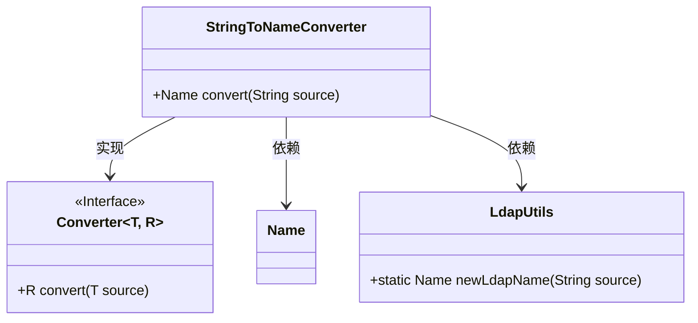
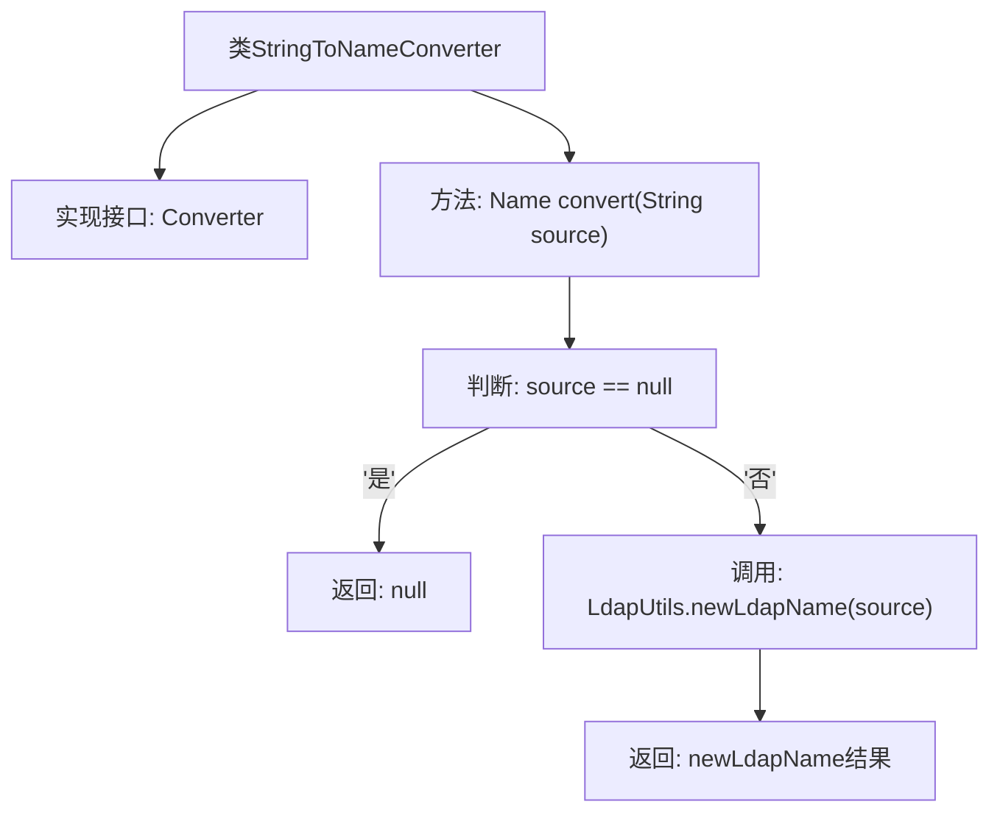

# 基础信息

|      |      |
|------|------|
| 名称 | StringToNameConverter |
| 编码语言 | .java |
| 代码路径 | spring-ldap/core/src/main/java/org/springframework/ldap/convert/StringToNameConverter.java |
| 包名 | org.springframework.ldap.convert |
| 依赖项 | ['javax.naming.Name', 'org.springframework.core.convert.converter.Converter', 'org.springframework.ldap.support.LdapUtils'] |
| 概述说明 | StringToNameConverter类将字符串转为Name对象，支持空值处理。 |

# 说明

StringToNameConverter类的主要功能是将字符串转换为Name对象。该类的设计考虑了空值处理，确保在输入字符串为空或无效时能够妥善处理，避免程序出现异常或错误。通过这一实现，用户能够安全地将字符串数据转换为Name对象，提升了代码的健壮性和可靠性。

# 类列表 Class Summary

| 名称   | 类型  | 说明 |
|-------|------|-------------|
| StringToNameConverter | class | StringToNameConverter类实现将字符串转换为Name对象，支持空值处理。 |

## 类 StringToNameConverter

|      |      |
|------|------|
| 访问范围 | public final |
| 类型 | class |
| 名称 | StringToNameConverter |
| 说明 | StringToNameConverter类实现将字符串转换为Name对象，支持空值处理。 |

### UML类图

**描述：**  
`StringToNameConverter` 类实现了 `Converter` 接口，用于将 `String` 类型转换为 `Name` 类型。在 `convert` 方法中，如果输入字符串为 `null`，则返回 `null`；否则，调用 `LdapUtils.newLdapName` 方法生成 `Name` 对象。`LdapUtils` 类提供了静态方法 `newLdapName` 用于创建 `Name` 对象。

### 内部方法调用关系图

这段代码定义了一个名为 `StringToNameConverter` 的类，该类实现了 `Converter<String, Name>` 接口。`convert` 方法是该类的核心功能，它接受一个 `String` 类型的参数 `source`，并返回一个 `Name` 类型的对象。如果 `source` 为 `null`，则直接返回 `null`；否则，调用 `LdapUtils.newLdapName(source)` 方法生成并返回一个新的 `Name` 对象。流程图清晰地展示了这一逻辑流程。

### 字段列表 Field List

| 名称  | 类型  | 说明 |
|-------|-------|------|

### 方法列表 Method List

| 名称  | 类型  | 说明 |
|-------|-------|------|
| convert | Name | 方法将字符串转换为Name对象，空值返回null。 |

