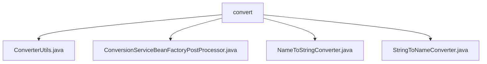

# 基础信息

|      |      |
|------|------|
| 名称 | convert |
| 编码语言 | .java |
| 代码路径 | spring-ldap/core/src/main/java/org/springframework/ldap/convert |
| 包名 | spring-ldap.core.src.main.java.org.springframework.ldap.convert |
| 概述说明 | ConverterUtils注册默认转换器，ConversionServiceBeanFactoryPostProcessor确保默认转换器，NameToStringConverter和StringToNameConverter处理Name与String转换。 |

# 说明

## 概述
该代码模块是Spring LDAP框架中的核心转换器模块，主要负责处理LDAP数据与Java对象之间的类型转换。模块通过一系列转换器类（如`NameToStringConverter`、`StringToNameConverter`）和工具类（如`ConverterUtils`、`ConversionServiceBeanFactoryPostProcessor`）实现了数据类型的安全转换，并确保默认转换器在Spring LDAP框架中的正确注册与使用。模块的设计注重健壮性和可维护性，能够有效处理空值和异常情况，减少了开发者的手动配置需求。

## 主要业务场景
1. **LDAP数据与Java对象之间的转换**：通过`NameToStringConverter`和`StringToNameConverter`等转换器，实现`Name`对象与字符串之间的双向转换，确保数据类型在LDAP和Java应用之间的无缝传递。
2. **默认转换器的注册与维护**：`ConverterUtils`类负责将Spring LDAP的默认转换器注册到`ConverterRegistry`中，确保框架能够正确识别和使用这些转换器。
3. **转换服务的完整性检查**：`ConversionServiceBeanFactoryPostProcessor`在Spring框架启动时自动检查并确保`ConversionService`中包含默认转换器，避免因缺失默认转换器而导致的潜在问题。
4. **空值处理与异常预防**：转换器类在设计时考虑了空值处理，确保在输入为`null`或无效时能够妥善处理，避免程序出现空指针异常或其他错误，提升了代码的健壮性和可靠性。

该模块广泛应用于需要与LDAP进行数据交互的Java应用程序中，简化了开发者的工作流程，并提供了稳定、可靠的转换机制。

### 包内部结构视图

该流程图展示了`spring-ldap/core/src/main/java/org/springframework/ldap/convert`目录下的文件结构。`convert`文件夹包含了四个Java文件：`ConverterUtils.java`、`ConversionServiceBeanFactoryPostProcessor.java`、`NameToStringConverter.java`和`StringToNameConverter.java`。这些文件都与LDAP转换相关，用于处理不同类型的数据转换任务。

# 文件列表 File List

| 名称   | 类型  | 说明 |
|-------|------|-------------|
| [NameToStringConverter.java](NameToStringConverter.md) | file | NameToStringConverter类负责将Name转换为String，并处理null值。 |
| [StringToNameConverter.java](StringToNameConverter.md) | file | StringToNameConverter类将字符串转为Name对象，支持空值处理。 |
| [ConversionServiceBeanFactoryPostProcessor.java](ConversionServiceBeanFactoryPostProcessor.md) | file | ConversionServiceBeanFactoryPostProcessor自动添加默认转换器到未自定义的ConversionService。 |
| [ConverterUtils.java](ConverterUtils.md) | file | ConverterUtils类注册Spring LDAP默认转换器到ConverterRegistry。 |

