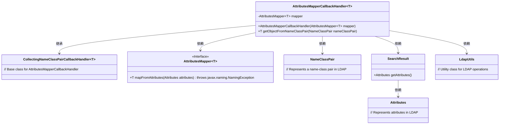
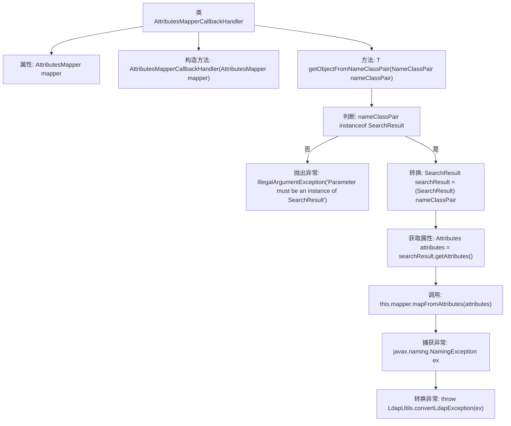

# 基础信息

|      |      |
|------|------|
| 名称 | AttributesMapperCallbackHandler |
| 编码语言 | .java |
| 代码路径 | spring-ldap/core/src/main/java/org/springframework/ldap/core/AttributesMapperCallbackHandler.java |
| 包名 | org.springframework.ldap.core |
| 依赖项 | ['javax.naming.NameClassPair', 'javax.naming.directory.Attributes', 'javax.naming.directory.SearchResult', 'org.springframework.ldap.support.LdapUtils'] |
| 概述说明 | AttributesMapperCallbackHandler类处理SearchResult的属性映射。 |

# 说明

AttributesMapperCallbackHandler类负责处理SearchResult的属性映射，通过使用AttributesMapper来实现这一功能。该类的主要作用是将SearchResult中的属性值映射到目标对象中，确保数据在不同层之间传递时的准确性和一致性。这一过程简化了数据转换的复杂性，提高了代码的可维护性和可读性。

# 类列表 Class Summary

| 名称   | 类型  | 说明 |
|-------|------|-------------|
| AttributesMapperCallbackHandler | class | AttributesMapperCallbackHandler类通过AttributesMapper处理SearchResult的属性映射。 |

## 类 AttributesMapperCallbackHandler

|      |      |
|------|------|
| 访问范围 | public |
| 类型 | class |
| 名称 | AttributesMapperCallbackHandler |
| 说明 | AttributesMapperCallbackHandler类通过AttributesMapper处理SearchResult的属性映射。 |

### UML类图

这段代码描述了一个 `AttributesMapperCallbackHandler` 类，它继承自 `CollectingNameClassPairCallbackHandler` 并依赖于 `AttributesMapper` 接口。该类的主要作用是将 `NameClassPair` 对象转换为 `SearchResult`，并通过 `AttributesMapper` 接口将 `Attributes` 映射为泛型类型 `T` 的对象。代码中还处理了 `NamingException` 异常，并通过 `LdapUtils` 工具类进行转换。

### 内部方法调用关系图

这段代码定义了一个泛型类`AttributesMapperCallbackHandler<T>`，它继承自`CollectingNameClassPairCallbackHandler<T>`。类的主要功能是通过`AttributesMapper`将`NameClassPair`对象转换为目标类型`T`。流程图中展示了从构造方法到处理`NameClassPair`对象的完整流程，包括类型检查、属性提取、映射操作以及异常处理。

### 字段列表 Field List

| 名称  | 类型  | 说明 |
|-------|-------|------|
| mapper | AttributesMapper<T> | 私有属性mapper，类型为AttributesMapper<T>。 |

### 方法列表 Method List

| 名称  | 类型  | 说明 |
|-------|-------|------|
| getObjectFromNameClassPair | T | 方法从NameClassPair获取对象，需为SearchResult实例，否则抛异常。 |

