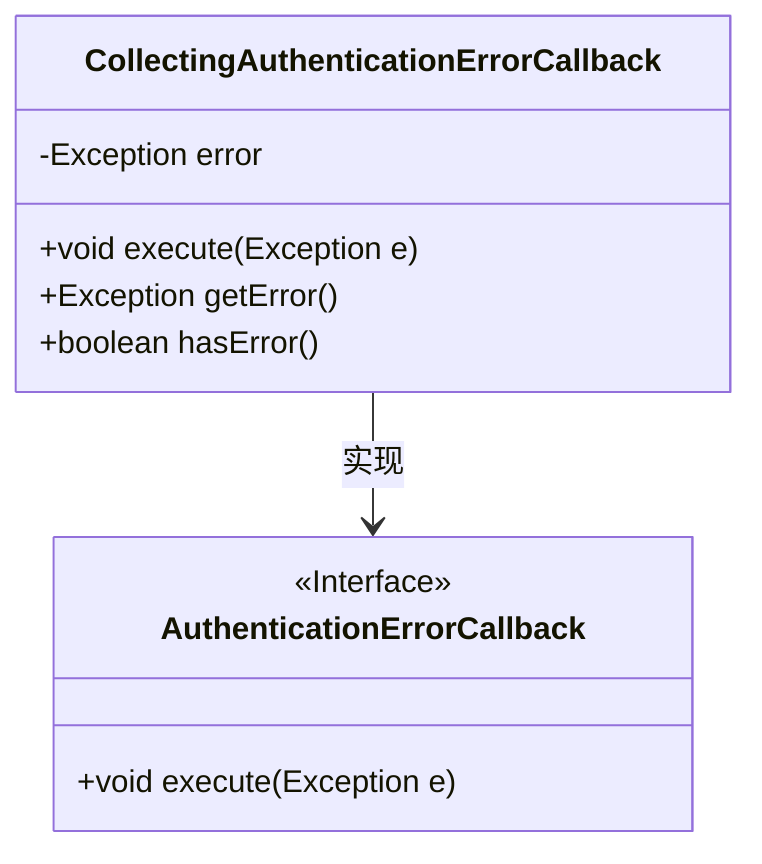
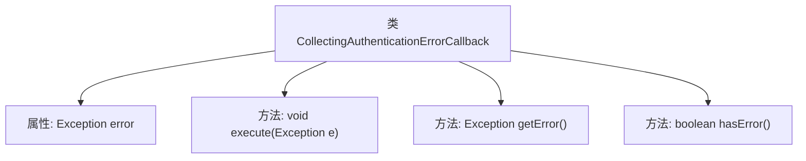

# 基础信息

|      |      |
|------|------|
| 名称 | CollectingAuthenticationErrorCallback |
| 编码语言 | .java |
| 代码路径 | spring-ldap/core/src/main/java/org/springframework/ldap/core/CollectingAuthenticationErrorCallback.java |
| 包名 | org.springframework.ldap.core |
| 依赖项 | [] |
| 概述说明 | 认证错误回调类包含执行、获取和检查错误的方法。 |

# 说明

该回调类主要用于收集和处理认证过程中出现的错误。它包含三个核心方法：执行方法用于启动认证流程并捕获可能出现的错误；获取错误方法用于提取和返回具体的错误信息；检查错误方法用于验证是否存在认证错误。通过这些方法，该类能够有效地管理和处理认证过程中的各种错误情况，确保系统的稳定性和安全性。

# 类列表 Class Summary

| 名称   | 类型  | 说明 |
|-------|------|-------------|
| CollectingAuthenticationErrorCallback | class | 收集认证错误的回调类，包含执行、获取错误和检查错误的方法。 |

## 类 CollectingAuthenticationErrorCallback

|      |      |
|------|------|
| 访问范围 | public final |
| 类型 | class |
| 名称 | CollectingAuthenticationErrorCallback |
| 说明 | 收集认证错误的回调类，包含执行、获取错误和检查错误的方法。 |

### UML类图

这段代码定义了一个名为 `CollectingAuthenticationErrorCallback` 的类，该类实现了 `AuthenticationErrorCallback` 接口。`CollectingAuthenticationErrorCallback` 类用于收集认证过程中发生的异常，并提供了方法来获取异常信息和检查是否发生了异常。类中的 `execute` 方法用于设置异常，`getError` 方法用于获取异常，`hasError` 方法用于检查是否发生了异常。这个类主要用于处理认证错误，并将错误信息存储在类内部以便后续处理。

### 内部方法调用关系图

这段代码定义了一个名为 `CollectingAuthenticationErrorCallback` 的类，实现了 `AuthenticationErrorCallback` 接口。该类包含一个私有属性 `error`，用于存储异常信息。类中定义了三个方法：`execute` 用于设置异常，`getError` 用于获取存储的异常，`hasError` 用于检查是否存储了异常。流程图展示了类与属性、方法之间的关系，清晰地描述了类的结构和功能。

### 字段列表 Field List

| 名称  | 类型  | 说明 |
|-------|-------|------|
| error | Exception | 私有异常变量error声明。 |

### 方法列表 Method List

| 名称  | 类型  | 说明 |
|-------|-------|------|
| hasError | boolean | 检查是否存在错误，返回布尔值。 |
| execute | void | 方法execute接收异常参数并赋值给类成员error。 |
| getError | Exception | 获取当前错误异常的公共方法。 |

