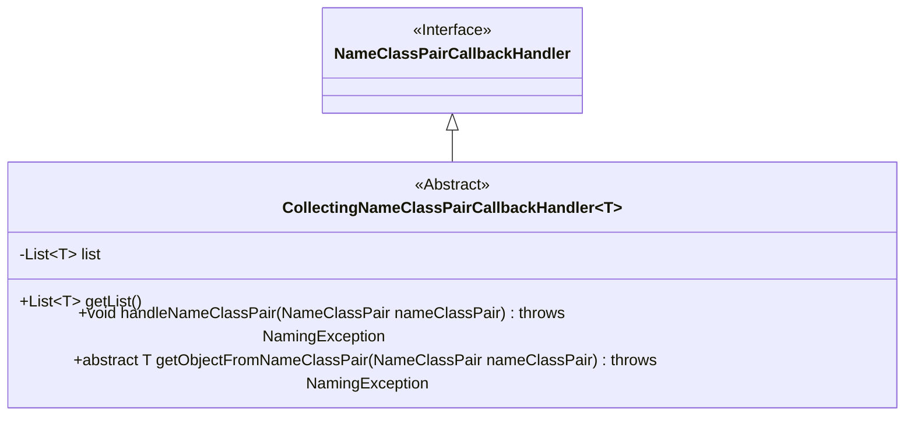
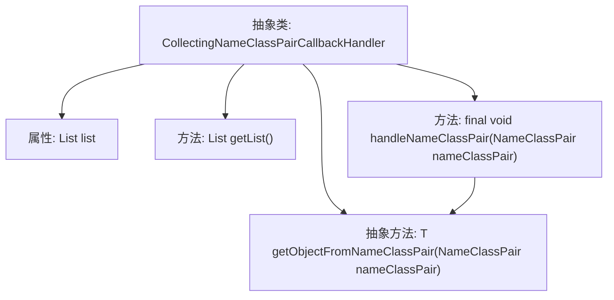

# 基础信息

|      |      |
|------|------|
| 名称 | CollectingNameClassPairCallbackHandler |
| 编码语言 | .java |
| 代码路径 | spring-ldap/core/src/main/java/org/springframework/ldap/core/CollectingNameClassPairCallbackHandler.java |
| 包名 | org.springframework.ldap.core |
| 依赖项 | ['java.util.LinkedList', 'java.util.List', 'javax.naming.NameClassPair', 'javax.naming.NamingException'] |
| 概述说明 | 将NameClassPair收集并转换为目标对象的回调处理类。 |

# 说明

该回调处理类的主要功能是收集NameClassPair数据并将其转换为目标对象。它通过接收NameClassPair信息，执行必要的处理逻辑，最终生成符合要求的目标对象。该类的设计旨在实现数据的高效转换与处理，确保从输入到输出的完整性和准确性。整个过程依赖于回调机制，使得数据处理更加灵活和可扩展。

# 类列表 Class Summary

| 名称   | 类型  | 说明 |
|-------|------|-------------|
| CollectingNameClassPairCallbackHandler | class | 收集NameClassPair并转换为目标对象的回调处理类。 |

## 类 CollectingNameClassPairCallbackHandler

|      |      |
|------|------|
| 访问范围 | public abstract |
| 类型 | class |
| 名称 | CollectingNameClassPairCallbackHandler |
| 说明 | 收集NameClassPair并转换为目标对象的回调处理类。 |

### UML类图

这段代码定义了一个抽象类 `CollectingNameClassPairCallbackHandler`，它实现了 `NameClassPairCallbackHandler` 接口。该类用于处理 `NameClassPair` 对象，并将其转换为指定类型的对象，然后将这些对象存储在一个列表中。`getList` 方法用于获取存储的对象列表，`handleNameClassPair` 方法负责将 `NameClassPair` 转换为对象并添加到列表中，而 `getObjectFromNameClassPair` 是一个抽象方法，需要子类实现具体的转换逻辑。

### 内部方法调用关系图

**描述：**  
该流程图展示了一个抽象类 `CollectingNameClassPairCallbackHandler<T>` 的结构和内部方法调用关系。类中包含一个私有属性 `list`，用于存储对象列表。`getList()` 方法用于返回该列表。`handleNameClassPair` 方法是一个最终方法，它将 `NameClassPair` 对象传递给抽象方法 `getObjectFromNameClassPair`，并将返回的对象添加到 `list` 中。抽象方法 `getObjectFromNameClassPair` 由子类实现，用于将 `NameClassPair` 转换为特定类型的对象。

### 字段列表 Field List

| 名称  | 类型  | 说明 |
|-------|-------|------|
| list = new LinkedList<>() | List<T> | 声明并初始化一个泛型链表。 |

### 方法列表 Method List

| 名称  | 类型  | 说明 |
|-------|-------|------|
| getList | List<T> | 该方法返回当前对象的列表属性。 |
| handleNameClassPair | void | 方法处理NameClassPair对象并将其加入列表。 |
| getObjectFromNameClassPair | T | 从NameClassPair获取对象的抽象方法，可能抛出NamingException。 |

