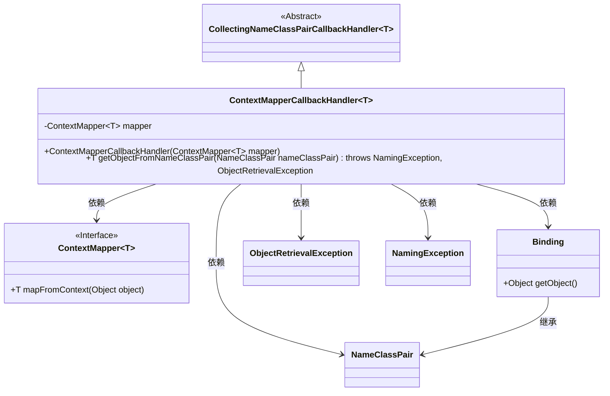
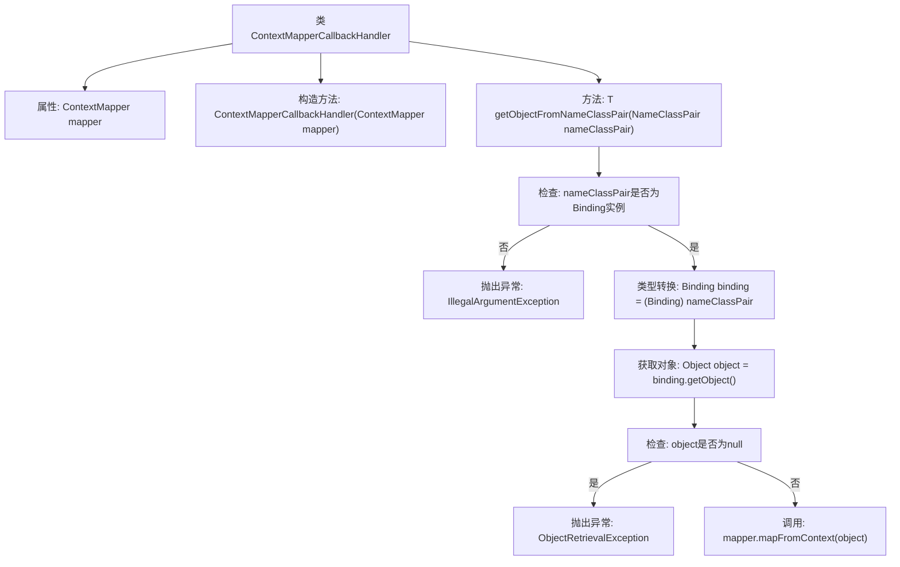

# 基础信息

|      |      |
|------|------|
| 名称 | ContextMapperCallbackHandler |
| 编码语言 | .java |
| 代码路径 | spring-ldap/core/src/main/java/org/springframework/ldap/core/ContextMapperCallbackHandler.java |
| 包名 | org.springframework.ldap.core |
| 依赖项 | ['javax.naming.Binding', 'javax.naming.NameClassPair', 'javax.naming.NamingException', 'org.springframework.util.Assert'] |
| 概述说明 | ContextMapperCallbackHandler处理NameClassPair，通过ContextMapper映射对象。 |

# 说明

ContextMapperCallbackHandler类的主要功能是处理NameClassPair对象，通过ContextMapper进行对象映射。该类负责接收和处理NameClassPair实例，并利用ContextMapper将其映射为相应的目标对象。这一过程确保了对象在不同上下文之间的转换和适配，从而实现了数据的有效传递和处理。ContextMapperCallbackHandler类在对象映射和处理中起到了关键作用，简化了复杂对象之间的转换流程。

# 类列表 Class Summary

| 名称   | 类型  | 说明 |
|-------|------|-------------|
| ContextMapperCallbackHandler | class | ContextMapperCallbackHandler类用于处理NameClassPair，通过ContextMapper映射对象。 |

## 类 ContextMapperCallbackHandler

|      |      |
|------|------|
| 访问范围 | public |
| 类型 | class |
| 名称 | ContextMapperCallbackHandler |
| 说明 | ContextMapperCallbackHandler类用于处理NameClassPair，通过ContextMapper映射对象。 |

### UML类图

### 描述
`ContextMapperCallbackHandler` 是一个泛型类，继承自 `CollectingNameClassPairCallbackHandler`，用于处理 `NameClassPair` 对象并将其转换为特定类型的对象。它依赖于 `ContextMapper` 接口来执行实际的映射操作。`getObjectFromNameClassPair` 方法接收 `NameClassPair` 对象，检查其是否为 `Binding` 类型，并从中提取对象进行映射。如果对象为空或类型不匹配，将抛出 `ObjectRetrievalException` 或 `IllegalArgumentException`。

### 内部方法调用关系图

这段代码定义了一个名为 `ContextMapperCallbackHandler` 的类，它继承自 `CollectingNameClassPairCallbackHandler`。该类的主要功能是通过 `getObjectFromNameClassPair` 方法将 `NameClassPair` 对象转换为 `Binding` 实例，并从中提取对象，最后通过 `ContextMapper` 进行映射。流程图展示了从对象检查到最终映射的完整过程，包括异常处理步骤。

### 字段列表 Field List

| 名称  | 类型  | 说明 |
|-------|-------|------|
| mapper | ContextMapper<T> | 私有成员变量mapper，类型为ContextMapper<T>。 |

### 方法列表 Method List

| 名称  | 类型  | 说明 |
|-------|-------|------|
| getObjectFromNameClassPair | T | 方法从NameClassPair获取对象，若非Binding实例或对象为空则抛出异常，最终返回映射结果。 |

