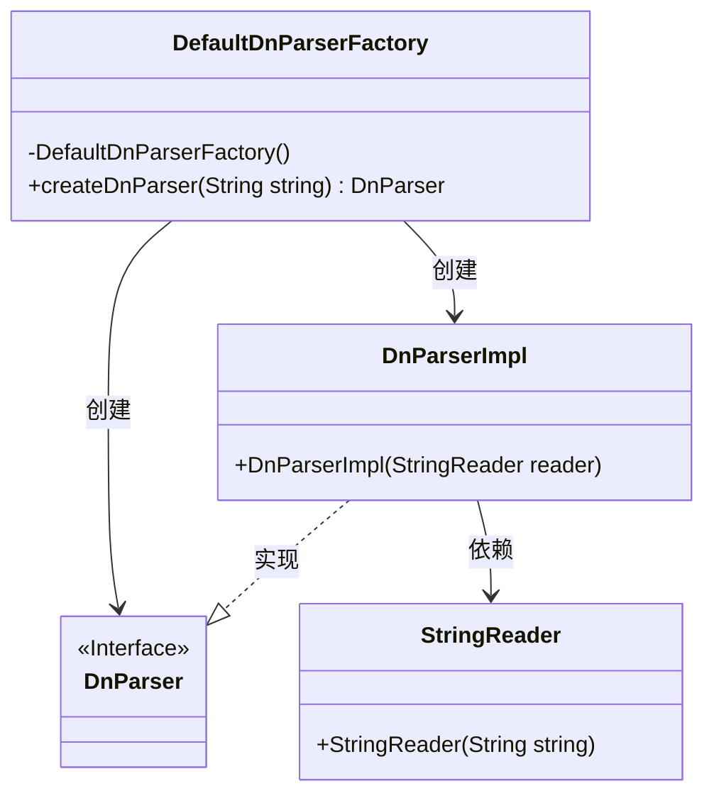
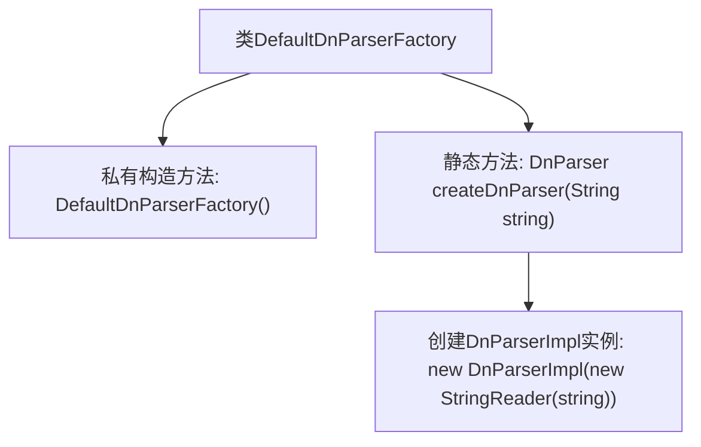

# 基础信息

|      |      |
|------|------|
| 名称 | DefaultDnParserFactory |
| 编码语言 | .java |
| 代码路径 | spring-ldap/core/src/main/java/org/springframework/ldap/core/DefaultDnParserFactory.java |
| 包名 | org.springframework.ldap.core |
| 依赖项 | ['java.io.StringReader'] |
| 概述说明 | DefaultDnParserFactory提供createDnParser方法创建DnParser实例。 |

# 说明

DefaultDnParserFactory类包含一个静态方法createDnParser，该方法用于创建DnParser实例，专门用于解析DN字符串。这一设计使得开发者能够通过工厂方法便捷地获取解析器实例，从而高效处理DN字符串的解析任务。

# 类列表 Class Summary

| 名称   | 类型  | 说明 |
|-------|------|-------------|
| DefaultDnParserFactory | class | DefaultDnParserFactory类提供静态方法createDnParser，用于创建DnParser实例解析DN字符串。 |

## 类 DefaultDnParserFactory

|      |      |
|------|------|
| 访问范围 | public final |
| 类型 | class |
| 名称 | DefaultDnParserFactory |
| 说明 | DefaultDnParserFactory类提供静态方法createDnParser，用于创建DnParser实例解析DN字符串。 |

### UML类图

这段代码定义了一个名为 `DefaultDnParserFactory` 的工厂类，用于创建 `DnParser` 的实例。`DefaultDnParserFactory` 类包含一个私有的构造函数，防止外部实例化，并提供了一个静态方法 `createDnParser`，该方法接受一个字符串参数并返回一个 `DnParser` 实例。`DnParser` 是一个接口，其实现类 `DnParserImpl` 接受一个 `StringReader` 对象作为参数。`StringReader` 类用于将字符串转换为可读取的字符流。通过这种设计，`DefaultDnParserFactory` 提供了创建 `DnParser` 实例的便捷方式，同时隐藏了具体的实现细节。

### 内部方法调用关系图

这段代码定义了一个名为 `DefaultDnParserFactory` 的类，该类包含一个私有构造方法和一个静态方法 `createDnParser`。私有构造方法确保该类不能被实例化，而静态方法 `createDnParser` 用于创建并返回一个 `DnParserImpl` 的实例，该实例通过传入的字符串初始化。流程图展示了类的结构以及方法之间的调用关系。

### 字段列表 Field List

| 名称  | 类型  | 说明 |
|-------|-------|------|

### 方法列表 Method List

| 名称  | 类型  | 说明 |
|-------|-------|------|
| createDnParser | DnParser | 静态方法createDnParser接收字符串参数，返回DnParserImpl实例。 |

