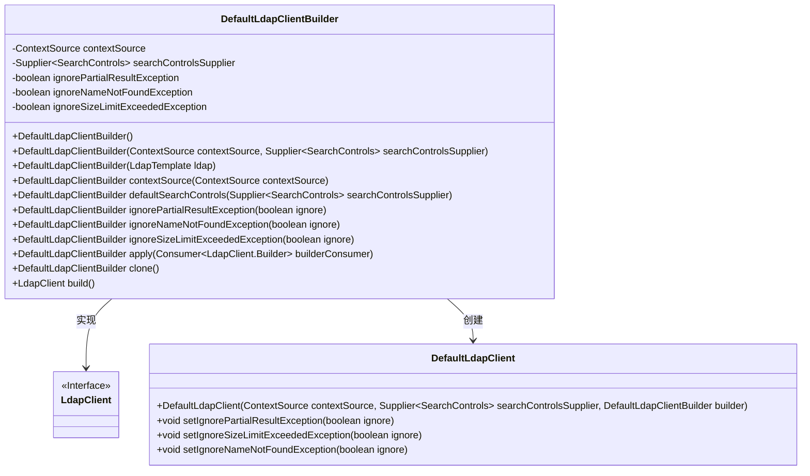

# 基础信息

|      |      |
|------|------|
| 名称 | DefaultLdapClientBuilder |
| 编码语言 | .java |
| 代码路径 | spring-ldap/core/src/main/java/org/springframework/ldap/core/DefaultLdapClientBuilder.java |
| 包名 | org.springframework.ldap.core |
| 依赖项 | ['java.util.function.Consumer', 'java.util.function.Supplier', 'javax.naming.directory.SearchControls'] |
| 概述说明 | DefaultLdapClientBuilder实现LdapClient.Builder接口，配置LDAP搜索控制与异常处理。 |

# 说明

DefaultLdapClientBuilder实现了LdapClient.Builder接口，主要用于配置LDAP搜索控制和异常处理。它提供了一种标准化的方式来构建和配置LDAP客户端，确保在搜索操作中能够有效地处理各种异常情况，并优化搜索控制参数，以提升LDAP查询的效率和可靠性。

# 类列表 Class Summary

| 名称   | 类型  | 说明 |
|-------|------|-------------|
| DefaultLdapClientBuilder | class | DefaultLdapClientBuilder实现LdapClient.Builder，配置LDAP搜索控制和异常处理。 |

## 类 DefaultLdapClientBuilder

|      |      |
|------|------|
| 访问范围 | None |
| 类型 | class |
| 名称 | DefaultLdapClientBuilder |
| 说明 | DefaultLdapClientBuilder实现LdapClient.Builder，配置LDAP搜索控制和异常处理。 |

### UML类图

这段代码描述了一个 `DefaultLdapClientBuilder` 类，它实现了 `LdapClient.Builder` 接口，用于构建 `DefaultLdapClient` 对象。`DefaultLdapClientBuilder` 类包含多个配置方法，用于设置 `ContextSource`、`SearchControls` 以及处理异常的标志。通过 `build` 方法，最终生成一个 `DefaultLdapClient` 实例。类图展示了 `DefaultLdapClientBuilder` 与 `LdapClient` 接口及其实现类 `DefaultLdapClient` 之间的关系。

### 内部方法调用关系图

```mermaid
graph TD
    A["类DefaultLdapClientBuilder"]
    B["属性: ContextSource contextSource"]
    C["属性: Supplier<SearchControls> searchControlsSupplier"]
    D["属性: boolean ignorePartialResultException"]
    E["属性: boolean ignoreNameNotFoundException"]
    F["属性: boolean ignoreSizeLimitExceededException"]
    G["构造方法: DefaultLdapClientBuilder()"]
    H["构造方法: DefaultLdapClientBuilder(ContextSource contextSource, Supplier<SearchControls> searchControlsSupplier)"]
    I["构造方法: DefaultLdapClientBuilder(LdapTemplate ldap)"]
    J["方法: DefaultLdapClientBuilder contextSource(ContextSource contextSource)"]
    K["方法: DefaultLdapClientBuilder defaultSearchControls(Supplier<SearchControls> searchControlsSupplier)"]
    L["方法: DefaultLdapClientBuilder ignorePartialResultException(boolean ignore)"]
    M["方法: DefaultLdapClientBuilder ignoreNameNotFoundException(boolean ignore)"]
    N["方法: DefaultLdapClientBuilder ignoreSizeLimitExceededException(boolean ignore)"]
    O["方法: DefaultLdapClientBuilder apply(Consumer<LdapClient.Builder> builderConsumer)"]
    P["方法: DefaultLdapClientBuilder clone()"]
    Q["方法: LdapClient build()"]

    A --> B
    A --> C
    A --> D
    A --> E
    A --> F
    A --> G
    A --> H
    A --> I
    A --> J
    A --> K
    A --> L
    A --> M
    A --> N
    A --> O
    A --> P
    A --> Q
```

这段代码定义了一个`DefaultLdapClientBuilder`类，用于构建`LdapClient`对象。类中包含多个属性和方法，用于配置LDAP客户端的上下文源、搜索控制参数以及异常处理策略。通过构造方法和链式调用方法，用户可以灵活地设置这些参数，并最终通过`build`方法生成`LdapClient`实例。流程图展示了类的结构及其内部方法之间的调用关系，帮助理解代码的执行流程。

### 字段列表 Field List

| 名称  | 类型  | 说明 |
|-------|-------|------|
| ignoreNameNotFoundException = false | boolean | 忽略名称未找到异常，默认关闭。 |
| contextSource | ContextSource | 声明了一个私有的ContextSource类型变量contextSource。 |
| ignoreSizeLimitExceededException = true | boolean | 忽略大小限制异常设置为真。 |
| ignorePartialResultException = false | boolean | 忽略部分结果异常标志设置为假。 |
| searchControlsSupplier = () -> {		SearchControls controls = new SearchControls();		controls.setSearchScope(SearchControls.SUBTREE_SCOPE);		controls.setCountLimit(0);		controls.setTimeLimit(0);		return controls;	} | Supplier<SearchControls> | 私有方法创建SearchControls对象，设置搜索范围为子树，不限制结果数量和查询时间。 |

### 方法列表 Method List

| 名称  | 类型  | 说明 |
|-------|-------|------|
| ignoreSizeLimitExceededException | DefaultLdapClientBuilder | 忽略大小限制异常设置方法。 |
| defaultSearchControls | DefaultLdapClientBuilder | 重写方法，设置默认搜索控制并返回构建器。 |
| ignorePartialResultException | DefaultLdapClientBuilder | 该方法设置是否忽略部分结果异常，并返回构建器实例。 |
| ignoreNameNotFoundException | DefaultLdapClientBuilder | 重写方法，设置是否忽略名称未找到异常并返回构建器实例。 |
| clone | DefaultLdapClientBuilder | DefaultLdapClientBuilder克隆方法返回新实例。 |
| build | LdapClient | 构建LDAP客户端，设置忽略部分结果、大小限制和名称未找到异常。 |
| contextSource | DefaultLdapClientBuilder | 重写方法以设置并返回上下文源。 |
| apply | DefaultLdapClientBuilder | 该方法允许通过Consumer接口自定义LdapClient.Builder并返回当前对象。 |

