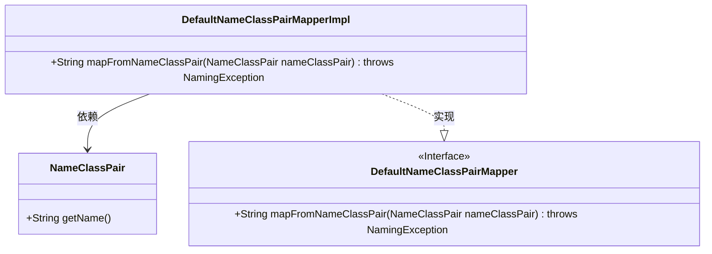
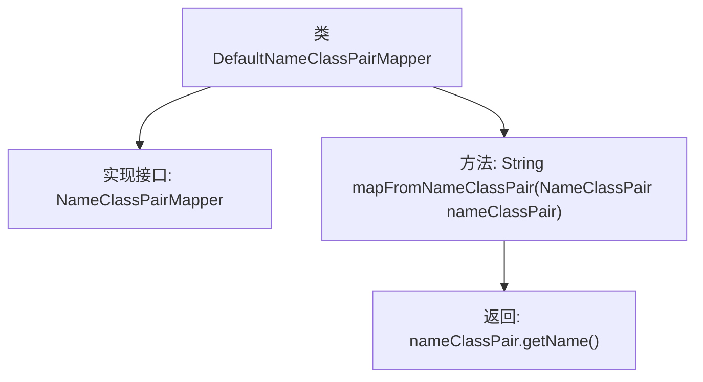

# 基础信息

|      |      |
|------|------|
| 名称 | DefaultNameClassPairMapper |
| 编码语言 | .java |
| 代码路径 | spring-ldap/core/src/main/java/org/springframework/ldap/core/DefaultNameClassPairMapper.java |
| 包名 | org.springframework.ldap.core |
| 依赖项 | ['javax.naming.NameClassPair', 'javax.naming.NamingException'] |
| 概述说明 | DefaultNameClassPairMapper类实现接口，返回Name字符串。 |

# 说明

DefaultNameClassPairMapper类实现了NameClassPairMapper接口，其主要功能是返回NameClassPair对象中的Name字符串。该类通过实现接口方法，确保能够准确提取并返回指定对象的名称信息，从而满足接口定义的要求。

# 类列表 Class Summary

| 名称   | 类型  | 说明 |
|-------|------|-------------|
| DefaultNameClassPairMapper | class | DefaultNameClassPairMapper类实现NameClassPairMapper接口，返回NameClassPair的Name字符串。 |

## 类 DefaultNameClassPairMapper

|      |      |
|------|------|
| 访问范围 | public |
| 类型 | class |
| 名称 | DefaultNameClassPairMapper |
| 说明 | DefaultNameClassPairMapper类实现NameClassPairMapper接口，返回NameClassPair的Name字符串。 |

### UML类图

这段代码定义了一个`DefaultNameClassPairMapper`接口及其实现类`DefaultNameClassPairMapperImpl`，用于将`NameClassPair`对象中的`Name`字符串提取出来。`DefaultNameClassPairMapperImpl`类实现了`DefaultNameClassPairMapper`接口，并依赖于`NameClassPair`类来获取名称。代码的主要功能是通过`mapFromNameClassPair`方法将`NameClassPair`对象中的`Name`字符串返回。

### 内部方法调用关系图

这段代码定义了一个名为 `DefaultNameClassPairMapper` 的类，该类实现了 `NameClassPairMapper<String>` 接口。类中的 `mapFromNameClassPair` 方法接收一个 `NameClassPair` 对象作为参数，并返回该对象的 `getName()` 方法的返回值。流程图展示了类的结构以及方法之间的调用关系，清晰地描述了从输入到输出的处理流程。

### 字段列表 Field List

| 名称  | 类型  | 说明 |
|-------|-------|------|

### 方法列表 Method List

| 名称  | 类型  | 说明 |
|-------|-------|------|
| mapFromNameClassPair | String | 重写方法，返回NameClassPair对象的名称。 |

