# 基础信息

|      |      |
|------|------|
| 名称 | DirContextAdapter |
| 编码语言 | .java |
| 代码路径 | spring-ldap/core/src/main/java/org/springframework/ldap/core/DirContextAdapter.java |
| 包名 | org.springframework.ldap.core |
| 依赖项 | ['java.util.ArrayList', 'java.util.Hashtable', 'java.util.Iterator', 'java.util.LinkedList', 'java.util.List', 'java.util.SortedSet', 'java.util.TreeSet', 'javax.naming.Binding', 'javax.naming.Context', 'javax.naming.InvalidNameException', 'javax.naming.Name', 'javax.naming.NameClassPair', 'javax.naming.NameNotFoundException', 'javax.naming.NameParser', 'javax.naming.NamingEnumeration', 'javax.naming.NamingException', 'javax.naming.directory.Attribute', 'javax.naming.directory.Attributes', 'javax.naming.directory.DirContext', 'javax.naming.directory.ModificationItem', 'javax.naming.directory.SearchControls', 'javax.naming.directory.SearchResult', 'javax.naming.ldap.LdapName', 'org.slf4j.Logger', 'org.slf4j.LoggerFactory', 'org.springframework.ldap.NoSuchAttributeException', 'org.springframework.ldap.support.LdapUtils', 'org.springframework.util.ObjectUtils', 'org.springframework.util.StringUtils'] |
| 概述说明 | DirContextAdapter实现DirContextOperations接口，管理LDAP目录操作，支持属性更新和查询。 |

# 说明

DirContextAdapter实现了DirContextOperations接口，主要用于管理LDAP目录上下文操作。它支持多种功能，包括属性更新、模式控制以及查询等。通过该适配器，用户可以高效地处理LDAP目录中的各种操作，确保数据的准确性和一致性。

# 类列表 Class Summary

| 名称   | 类型  | 说明 |
|-------|------|-------------|
| DirContextAdapter | class | DirContextAdapter实现DirContextOperations接口，用于管理LDAP目录上下文操作，支持属性更新、模式控制和查询等功能。 |

## 类 DirContextAdapter

|      |      |
|------|------|
| 访问范围 | public |
| 类型 | class |
| 名称 | DirContextAdapter |
| 说明 | DirContextAdapter实现DirContextOperations接口，用于管理LDAP目录上下文操作，支持属性更新、模式控制和查询等功能。 |

### UML类图

```mermaid
classDiagram
    class DirContextAdapter {
        -boolean DONT_ADD_IF_DUPLICATE_EXISTS
        -String EMPTY_STRING
        -boolean ORDER_DOESNT_MATTER
        -String NOT_IMPLEMENTED
        -Logger log
        -NameAwareAttributes originalAttrs
        -LdapName dn
        -LdapName base
        -boolean updateMode
        -NameAwareAttributes updatedAttrs
        -String referralUrl
        +DirContextAdapter()
        +DirContextAdapter(String dnString)
        +DirContextAdapter(Name dn)
        +DirContextAdapter(Attributes attrs, Name dn)
        +DirContextAdapter(Attributes attrs, Name dn, Name base)
        +DirContextAdapter(Attributes attrs, Name dn, Name base, String referralUrl)
        +void setUpdateMode(boolean mode)
        +boolean isUpdateMode()
        +String[] getNamesOfModifiedAttributes()
        +ModificationItem[] getModificationItems()
        +void update()
        +String[] getStringAttributes(String name)
        +Object[] getObjectAttributes(String name)
        +SortedSet~String~ getAttributeSortedStringSet(String name)
        +void setAttribute(Attribute attribute)
        +Attributes getAttributes()
        +Attributes getAttributes(Name name) throws NamingException
        +Attributes getAttributes(String name) throws NamingException
        +Attributes getAttributes(Name name, String[] attrIds) throws NamingException
        +Attributes getAttributes(String name, String[] attrIds) throws NamingException
        +void modifyAttributes(Name name, int modOp, Attributes attrs) throws NamingException
        +void modifyAttributes(String name, int modOp, Attributes attrs) throws NamingException
        +void modifyAttributes(Name name, ModificationItem[] mods) throws NamingException
        +void modifyAttributes(String name, ModificationItem[] mods) throws NamingException
        +void bind(Name name, Object obj, Attributes attrs) throws NamingException
        +void bind(String name, Object obj, Attributes attrs) throws NamingException
        +void rebind(Name name, Object obj, Attributes attrs) throws NamingException
        +void rebind(String name, Object obj, Attributes attrs) throws NamingException
        +DirContext createSubcontext(Name name, Attributes attrs) throws NamingException
        +DirContext createSubcontext(String name, Attributes attrs) throws NamingException
        +DirContext getSchema(Name name) throws NamingException
        +DirContext getSchema(String name) throws NamingException
        +DirContext getSchemaClassDefinition(Name name) throws NamingException
        +DirContext getSchemaClassDefinition(String name) throws NamingException
        +NamingEnumeration~SearchResult~ search(Name name, Attributes matchingAttributes, String[] attributesToReturn) throws NamingException
        +NamingEnumeration~SearchResult~ search(String name, Attributes matchingAttributes, String[] attributesToReturn) throws NamingException
        +NamingEnumeration~SearchResult~ search(Name name, Attributes matchingAttributes) throws NamingException
        +NamingEnumeration~SearchResult~ search(String name, Attributes matchingAttributes) throws NamingException
        +NamingEnumeration~SearchResult~ search(Name name, String filter, SearchControls cons) throws NamingException
        +NamingEnumeration~SearchResult~ search(String name, String filter, SearchControls cons) throws NamingException
        +NamingEnumeration~SearchResult~ search(Name name, String filterExpr, Object[] filterArgs, SearchControls cons) throws NamingException
        +NamingEnumeration~SearchResult~ search(String name, String filterExpr, Object[] filterArgs, SearchControls cons) throws NamingException
        +Object lookup(Name name) throws NamingException
        +Object lookup(String name) throws NamingException
        +void bind(Name name, Object obj) throws NamingException
        +void bind(String name, Object obj) throws NamingException
        +void rebind(Name name, Object obj) throws NamingException
        +void rebind(String name, Object obj) throws NamingException
        +void unbind(Name name) throws NamingException
        +void unbind(String name) throws NamingException
        +void rename(Name oldName, Name newName) throws NamingException
        +void rename(String oldName, String newName) throws NamingException
        +NamingEnumeration~NameClassPair~ list(Name name) throws NamingException
        +NamingEnumeration~NameClassPair~ list(String name) throws NamingException
        +NamingEnumeration~Binding~ listBindings(Name name) throws NamingException
        +NamingEnumeration~Binding~ listBindings(String name) throws NamingException
        +void destroySubcontext(Name name) throws NamingException
        +void destroySubcontext(String name) throws NamingException
        +Context createSubcontext(Name name) throws NamingException
        +Context createSubcontext(String name) throws NamingException
        +Object lookupLink(Name name) throws NamingException
        +Object lookupLink(String name) throws NamingException
        +NameParser getNameParser(Name name) throws NamingException
        +NameParser getNameParser(String name) throws NamingException
        +Name composeName(Name name, Name prefix) throws NamingException
        +String composeName(String name, String prefix) throws NamingException
        +Object addToEnvironment(String propName, Object propVal) throws NamingException
        +Object removeFromEnvironment(String propName) throws NamingException
        +Hashtable~?, ?~ getEnvironment() throws NamingException
        +void close() throws NamingException
        +String getNameInNamespace()
        +Name getDn()
        +void setDn(Name dn)
        +boolean equals(Object o)
        +int hashCode()
        +String toString()
        +String getReferralUrl()
        +boolean isReferral()
    }
```

**描述：**  
`DirContextAdapter` 是一个实现了 `DirContextOperations` 接口的类，主要用于处理 LDAP 目录上下文操作。它包含了多个构造函数，支持从不同的参数初始化对象。类中提供了对 LDAP 属性的增删改查操作，并且支持更新模式和修改项的收集。此外，它还处理了 LDAP 目录的搜索、绑定、重命名等操作，但大部分方法未实现，抛出 `UnsupportedOperationException` 异常。

### 内部方法调用关系图

这段代码定义了一个名为 `DirContextAdapter` 的类，该类实现了 `DirContextOperations` 接口。该类主要用于处理 LDAP 目录上下文操作，包括属性的管理、更新模式的控制、修改项的收集等。通过多个构造方法，可以灵活地初始化对象，并且提供了丰富的方法来处理属性的增删改查。此外，类中还包含了一些未实现的方法，这些方法抛出了 `UnsupportedOperationException` 异常。整体上，该类是一个用于管理 LDAP 目录上下文操作的适配器，提供了对属性的高效管理和操作。

### 字段列表 Field List

| 名称  | 类型  | 说明 |
|-------|-------|------|
| DONT_ADD_IF_DUPLICATE_EXISTS = false | boolean | 静态布尔常量，禁止添加重复项。 |
| NOT_IMPLEMENTED = "Not implemented." | String | 定义未实现字符串常量。 |
| EMPTY_STRING = "" | String | 定义空字符串常量EMPTY_STRING。 |
| dn | LdapName | 私有LDAP名称DN变量。 |
| updateMode = false | boolean | 私有布尔变量updateMode初始值为false。 |
| ORDER_DOESNT_MATTER = false | boolean | 静态布尔常量ORDER_DOESNT_MATTER值为false。 |
| originalAttrs | NameAwareAttributes | 私有不可变变量originalAttrs，类型为NameAwareAttributes。 |
| updatedAttrs | NameAwareAttributes | 私有变量`updatedAttrs`类型为`NameAwareAttributes`。 |
| base = LdapUtils.emptyLdapName() | LdapName | 私有变量base初始化为空的LdapName对象。 |
| referralUrl | String | 私有字符串变量referralUrl用于存储推荐链接。 |
| log = LoggerFactory.getLogger(DirContextAdapter.class) | Logger | DirContextAdapter类中定义了静态日志记录器log。 |

### 方法列表 Method List

| 名称  | 类型  | 说明 |
|-------|-------|------|
| search | NamingEnumeration<SearchResult> | 方法未实现，抛出UnsupportedOperationException异常。 |
| rename | void | 重命名方法未实现，抛出不支持操作异常。 |
| getNameParser | NameParser | 方法getNameParser抛出未实现异常。 |
| rebind | void | 方法rebind抛出未实现异常。 |
| closeNamingEnumeration | void | 关闭命名枚举对象，忽略异常。 |
| bind | void | 方法bind抛出未实现操作异常。 |
| setUpdateMode | void | 设置更新模式，若为真则初始化更新属性。 |
| modifyAttributes | void | 该方法未实现，抛出不支持操作异常。 |
| isAttributeUpdated | boolean | 方法检查对象数组值是否更新，考虑顺序和元素匹配。 |
| unbind | void | 方法unbind抛出未实现操作异常。 |
| search | NamingEnumeration<SearchResult> | 重写search方法，抛出未实现异常。 |
| search | NamingEnumeration<SearchResult> | 重写搜索方法，抛出未实现异常。 |
| search | NamingEnumeration<SearchResult> | 重写search方法，抛出未实现异常。 |
| createSubcontext | DirContext | 重写方法抛出未实现异常。 |
| bind | void | 重写bind方法，抛出未实现操作异常。 |
| collectAttributeValuesAsList | List<T> | 私有方法收集属性值并返回列表。 |
| search | NamingEnumeration<SearchResult> | 该方法抛出未实现的操作异常。 |
| close | void | 重写close方法，抛出未实现异常。 |
| rebind | void | 重写rebind方法，抛出未实现异常。 |
| isUpdateMode | boolean | 方法isUpdateMode返回当前对象的updateMode状态。 |
| rebind | void | 重写rebind方法，抛出未实现异常。 |
| setAttributeValues | void | 方法设置属性值，根据模式更新或保存属性。 |
| getAttributes | Attributes | 重写方法获取指定名称和属性ID的属性。 |
| setAttribute | void | 根据更新模式，将属性存入原始或更新集合。 |
| exists | boolean | 该方法检查属性是否存在，调用exists方法验证属性ID。 |
| createSubcontext | Context | 重写方法抛出未实现操作异常。 |
| attributeExists | boolean | 检查LDAP属性是否存在，返回布尔值。 |
| modifyAttributes | void | 方法modifyAttributes未实现，抛出UnsupportedOperationException异常。 |
| setAttributeValues | void | 重写方法以设置属性值，忽略顺序。 |
| removeAttributeValue | void | 移除指定属性值，更新模式与非更新模式处理不同。 |
| list | NamingEnumeration<NameClassPair> | 重写list方法，抛出未实现异常。 |
| getNamesOfModifiedAttributes | String[] | 获取修改属性的名称列表，根据模式返回更新或原始属性ID。 |
| search | NamingEnumeration<SearchResult> | 重写search方法，抛出未实现异常。 |
| createSubcontext | Context | 重写方法抛出未实现异常。 |
| getSchema | DirContext | 重写getSchema方法，抛出未实现异常。 |
| createSubcontext | DirContext | 重写方法抛出未实现异常。 |
| getAttributes | Attributes | 获取原始属性的公共方法。 |
| getAttributes | Attributes | 重写getAttributes方法，调用同名方法处理字符串参数。 |
| addToEnvironment | Object | 重写方法抛出未实现操作异常。 |
| modifyAttributes | void | 方法modifyAttributes未实现，抛出UnsupportedOperationException异常。 |
| search | NamingEnumeration<SearchResult> | 重写搜索方法，抛出未实现异常。 |
| lookup | Object | 重写lookup方法，抛出未实现异常。 |
| exists | boolean | 检查属性ID是否存在，若存在返回true，否则返回false。 |
| removeFromEnvironment | Object | 重写方法抛出未实现操作异常。 |
| unbind | void | 重写unbind方法，抛出未实现异常。 |
| addAttributeValue | void | 方法根据模式更新或添加属性值，处理重复值。 |
| bind | void | 重写bind方法，抛出未实现操作异常。 |
| list | NamingEnumeration<NameClassPair> | 重写list方法，抛出未实现操作异常。 |
| getStringAttribute | String | 重写方法，获取字符串类型属性。 |
| bind | void | 该方法未实现，抛出不支持操作异常。 |
| isChanged | boolean | 判断属性值是否改变，包括空值、长度及内容对比。 |
| getNameParser | NameParser | 重写方法getNameParser抛出未实现异常。 |
| lookupLink | Object | 方法`lookupLink`抛出未实现异常。 |
| getEnvironment | Hashtable<?, ?> | 该方法未实现，直接抛出不支持操作异常。 |
| addAttributeValue | void | 重写方法，添加属性值，若存在重复则不添加。 |
| getObjectAttributes | Object[] | 方法获取指定名称的对象属性数组，若无则返回null。 |
| getSchema | DirContext | 方法`getSchema`未实现，抛出`UnsupportedOperationException`异常。 |
| collectModifications | void | 比较并记录属性修改，处理添加、删除或替换操作。 |
| rebind | void | 重写rebind方法，抛出未实现操作异常。 |
| destroySubcontext | void | 方法destroySubcontext未实现，抛出UnsupportedOperationException异常。 |
| composeName | Name | 方法未实现，抛出UnsupportedOperationException异常。 |
| rename | void | 重命名方法未实现，抛出不支持操作异常。 |
| getAttributeSortedStringSet | SortedSet<String> | 方法获取指定名称的属性值，返回排序后的字符串集合，若属性不存在则返回null。 |
| collectModifications | void | 收集属性修改，根据变化类型更新修改列表。 |
| getAttributes | Attributes | 方法获取属性，若名称为空则抛出异常，否则返回指定属性。 |
| lookupLink | Object | 方法`lookupLink`未实现，抛出`UnsupportedOperationException`异常。 |
| getAttributes | Attributes | 方法`getAttributes`检查名称长度，若不为空则抛出异常，否则返回克隆的属性对象。 |
| destroySubcontext | void | 重写方法`destroySubcontext`抛出`UnsupportedOperationException`异常。 |
| getModificationItems | ModificationItem[] | 方法返回更新模式的修改项数组，若无更新则返回空数组。 |
| getSchemaClassDefinition | DirContext | 该方法未实现，调用时抛出不支持操作异常。 |
| lookup | Object | 方法lookup抛出UnsupportedOperationException异常，表示未实现。 |
| setAttributeValue | void | 方法根据更新模式设置属性值，非更新模式存储原始值，更新模式添加新值。 |
| update | void | 更新属性，移除空属性，重置更新列表。 |
| hashCode | int | 重写hashCode方法，计算多个属性的哈希值并返回。 |
| toString | String | 重写toString方法，输出类名、dn及属性值，处理异常。 |
| search | NamingEnumeration<SearchResult> | 该方法未实现，抛出不支持操作异常。 |
| listBindings | NamingEnumeration<Binding> | 重写方法`listBindings`，抛出`UnsupportedOperationException`异常。 |
| getDn | Name | 重写getDn方法，返回LdapUtils创建的LdapName对象。 |
| getReferralUrl | String | 重写方法返回推荐链接。 |
| isEmptyAttribute | boolean | 检查属性是否为空，包括null、大小为零或获取值为null，异常时返回true。 |
| getStringAttributes | String[] | 方法getStringAttributes通过name获取字符串属性列表，若无属性则返回null。 |
| equals | boolean | 比较对象属性是否一致，包括更新模式、基础、DN、原始属性、引用URL和更新属性。 |
| getNameInNamespace | String | 方法返回命名空间中的名称，若基础为空则返回dn，否则合并dn与基础并返回结果。 |
| isReferral | boolean | 方法isReferral检查referralUrl是否有值，返回布尔结果。 |
| listBindings | NamingEnumeration<Binding> | 方法`listBindings`未实现，抛出`UnsupportedOperationException`异常。 |
| modifyAttributes | void | 方法未实现，抛出UnsupportedOperationException异常。 |
| appendAttributeValue | void | 将属性值追加到字符串构建器中，格式为“属性ID[索引]=值”。 |
| composeName | String | 方法未实现，抛出未支持操作异常。 |
| getObjectAttribute | Object | 获取指定名称的LDAP属性对象，若不存在或为空则返回null。 |
| setDn | void | 方法`setDn`在非更新模式下设置`dn`，更新模式下调用会抛出异常。 |
| getSchemaClassDefinition | DirContext | 重写方法抛出未实现异常。 |

