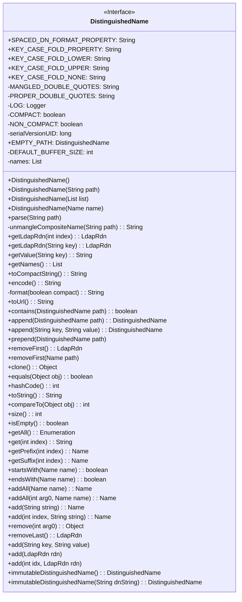

# 基础信息

|      |      |
|------|------|
| 名称 | DistinguishedName |
| 编码语言 | .java |
| 代码路径 | spring-ldap/core/src/main/java/org/springframework/ldap/core/DistinguishedName.java |
| 包名 | org.springframework.ldap.core |
| 依赖项 | ['java.util.ArrayList', 'java.util.Collections', 'java.util.Enumeration', 'java.util.Iterator', 'java.util.LinkedList', 'java.util.List', 'java.util.ListIterator', 'javax.naming.CompositeName', 'javax.naming.InvalidNameException', 'javax.naming.Name', 'javax.naming.ldap.Rdn', 'org.slf4j.Logger', 'org.slf4j.LoggerFactory', 'org.springframework.ldap.BadLdapGrammarException', 'org.springframework.ldap.UncategorizedLdapException', 'org.springframework.ldap.support.LdapUtils', 'org.springframework.ldap.support.ListComparator', 'org.springframework.util.Assert', 'org.springframework.util.ObjectUtils', 'org.springframework.util.StringUtils'] |
| 概述说明 | DistinguishedName类处理LDAP路径，支持格式化、解析、增删和比较操作。 |

# 说明

DistinguishedName类专门用于处理LDAP路径，提供了一系列功能来操作这些路径。它支持路径的格式化，使其符合特定标准；能够解析LDAP路径，提取其中的各个组成部分；还允许用户添加或删除路径中的特定元素。此外，该类还具备比较功能，可以判断两个LDAP路径是否相同或存在差异。这些操作使得DistinguishedName类在处理LDAP路径时非常灵活和高效。

# 类列表 Class Summary

| 名称   | 类型  | 说明 |
|-------|------|-------------|
| DistinguishedName | class | DistinguishedName类用于处理LDAP路径，支持格式化、解析、添加、删除和比较操作。 |

## 类 DistinguishedName

|      |      |
|------|------|
| 访问范围 | @Deprecated;public |
| 类型 | class |
| 名称 | DistinguishedName |
| 说明 | DistinguishedName类用于处理LDAP路径，支持格式化、解析、添加、删除和比较操作。 |

### UML类图

### 描述
`DistinguishedName` 类是一个用于表示LDAP（轻量级目录访问协议）中可分辨名称（DN）的类。它提供了多种方法来解析、格式化、操作和比较DN。类中包含了一些静态常量，用于控制DN的格式化方式，如是否在逗号后添加空格。`DistinguishedName` 类实现了 `Name` 接口，并提供了丰富的功能，如添加、删除、获取DN组件，以及比较和克隆DN。此外，该类还支持创建不可变的DN实例，适用于作为常量使用。

### 内部方法调用关系图

```mermaid
graph TD
    A["类DistinguishedName"]
    B["属性: List names"]
    C["构造方法: DistinguishedName()"]
    D["构造方法: DistinguishedName(String path)"]
    E["构造方法: DistinguishedName(List list)"]
    F["构造方法: DistinguishedName(Name name)"]
    G["方法: void parse(String path)"]
    H["方法: String unmangleCompositeName(String path)"]
    I["方法: LdapRdn getLdapRdn(int index)"]
    J["方法: LdapRdn getLdapRdn(String key)"]
    K["方法: String getValue(String key)"]
    L["方法: List getNames()"]
    M["方法: String toCompactString()"]
    N["方法: String encode()"]
    O["方法: String format(boolean compact)"]
    P["方法: String toUrl()"]
    Q["方法: boolean contains(DistinguishedName path)"]
    R["方法: DistinguishedName append(DistinguishedName path)"]
    S["方法: DistinguishedName append(String key, String value)"]
    T["方法: void prepend(DistinguishedName path)"]
    U["方法: LdapRdn removeFirst()"]
    V["方法: void removeFirst(Name path)"]
    W["方法: Object clone()"]
    X["方法: boolean equals(Object obj)"]
    Y["方法: int hashCode()"]
    Z["方法: String toString()"]
    AA["方法: int compareTo(Object obj)"]
    AB["方法: int size()"]
    AC["方法: boolean isEmpty()"]
    AD["方法: Enumeration getAll()"]
    AE["方法: String get(int index)"]
    AF["方法: Name getPrefix(int index)"]
    AG["方法: Name getSuffix(int index)"]
    AH["方法: boolean startsWith(Name name)"]
    AI["方法: boolean endsWith(Name name)"]
    AJ["方法: Name addAll(Name name)"]
    AK["方法: Name addAll(int arg0, Name name)"]
    AL["方法: Name add(String string)"]
    AM["方法: Name add(int index, String string)"]
    AN["方法: Object remove(int arg0)"]
    AO["方法: LdapRdn removeLast()"]
    AP["方法: void add(String key, String value)"]
    AQ["方法: void add(LdapRdn rdn)"]
    AR["方法: void add(int idx, LdapRdn rdn)"]
    AS["方法: DistinguishedName immutableDistinguishedName()"]
    AT["方法: static DistinguishedName immutableDistinguishedName(String dnString)"]

    A --> B
    A --> C
    A --> D
    A --> E
    A --> F
    A --> G
    A --> H
    A --> I
    A --> J
    A --> K
    A --> L
    A --> M
    A --> N
    A --> O
    A --> P
    A --> Q
    A --> R
    A --> S
    A --> T
    A --> U
    A --> V
    A --> W
    A --> X
    A --> Y
    A --> Z
    A --> AA
    A --> AB
    A --> AC
    A --> AD
    A --> AE
    A --> AF
    A --> AG
    A --> AH
    A --> AI
    A --> AJ
    A --> AK
    A --> AL
    A --> AM
    A --> AN
    A --> AO
    A --> AP
    A --> AQ
    A --> AR
    A --> AS
    A --> AT
```

**描述：**
`DistinguishedName` 类用于表示和处理LDAP（轻量级目录访问协议）中的可分辨名称（DN）。它提供了多种构造方法，允许从字符串、列表或其他 `Name` 对象创建DN实例。类中包含多个方法用于解析、格式化、比较和操作DN，例如 `parse` 方法用于解析LDAP路径，`format` 方法用于格式化DN，`append` 和 `prepend` 方法用于在DN中添加或移除组件。此外，类还提供了克隆、相等性比较和哈希码计算等功能。`DistinguishedName` 类的主要用途是处理LDAP路径的表示和操作，确保其符合LDAP语法规范。

### 字段列表 Field List

| 名称  | 类型  | 说明 |
|-------|-------|------|
| SPACED_DN_FORMAT_PROPERTY = "org.springframework.ldap.core.spacedDnFormat" | String | Spring LDAP核心配置项，用于设置DN格式间距。 |
| KEY_CASE_FOLD_NONE = "none" | String | 定义常量KEY_CASE_FOLD_NONE，值为"none"。 |
| NON_COMPACT = false | boolean | 定义了一个私有静态常量NON_COMPACT，值为false。 |
| KEY_CASE_FOLD_UPPER = "upper" | String | 定义常量KEY_CASE_FOLD_UPPER，值为"upper"。 |
| LOG = LoggerFactory.getLogger(DistinguishedName.class) | Logger | DistinguishedName类中定义了一个静态的日志记录器LOG。 |
| KEY_CASE_FOLD_PROPERTY = "org.springframework.ldap.core.keyCaseFold" | String | Spring LDAP核心配置项：KEY_CASE_FOLD_PROPERTY |
| names | List | 私有变量names，类型为List。 |
| DEFAULT_BUFFER_SIZE = 256 | int | 定义了一个默认缓冲区大小为256的私有静态常量。 |
| KEY_CASE_FOLD_LOWER = "lower" | String | 定义常量KEY_CASE_FOLD_LOWER，值为"lower"。 |
| PROPER_DOUBLE_QUOTES = "\\\"" | String | 定义常量字符串PROPER_DOUBLE_QUOTES，值为转义双引号。 |
| COMPACT = true | boolean | 定义静态常量COMPACT，值为true。 |
| EMPTY_PATH = new DistinguishedName(Collections.EMPTY_LIST) | DistinguishedName | 定义了一个静态不可变的空路径对象EMPTY_PATH。 |
| serialVersionUID = 3514344371999042586L | long | 声明序列化版本UID为3514344371999042586L。 |
| MANGLED_DOUBLE_QUOTES = "\\\\\"" | String | 定义常量字符串MANGLED_DOUBLE_QUOTES，值为转义双引号。 |

### 方法列表 Method List

| 名称  | 类型  | 说明 |
|-------|-------|------|
| removeFirst | LdapRdn | 该方法移除并返回列表中的第一个元素。 |
| toUrl | String | 将LDAP名称逆向拼接为URL格式字符串。 |
| getNames | List | 方法getNames返回当前对象的names列表。 |
| toCompactString | String | 该方法返回格式化后的紧凑字符串。 |
| isEmpty | boolean | 判断names列表是否为空。 |
| removeLast | LdapRdn | 该方法移除并返回LDAP RDN列表中最后一个元素。 |
| contains | boolean | 检查路径是否包含指定名称列表。 |
| clone | Object | 克隆DistinguishedName对象，复制names链表，处理克隆异常。 |
| getSuffix | Name | 获取指定索引后的名称列表，并返回新对象。 |
| add | void | 在指定索引位置插入LDAP RDN对象。 |
| removeFirst | void | 移除路径开头部分，若路径非空且匹配。 |
| hashCode | int | 重写hashCode方法，返回类名和名称的哈希码异或结果。 |
| append | DistinguishedName | 方法`append`将路径名添加到当前对象并返回自身。 |
| append | DistinguishedName | 公共方法`append`添加键值对并返回当前对象。 |
| remove | Object | 删除指定位置的LdapRdn对象并返回其编码值。 |
| get | String | 获取指定索引的LDAP编码字符串。 |
| getLdapRdn | LdapRdn | 获取指定索引的LdapRdn对象。 |
| parse | void | 解析路径为DN，处理异常后存储名称。 |
| add | Name | 方法add在指定索引处插入字符串，解析失败抛出InvalidNameException。 |
| prepend | void | 方法将路径名列表逆序插入当前列表开头。 |
| compareTo | int | 重写compareTo方法，比较两个DistinguishedName对象的names属性。 |
| add | Name | 方法add接收字符串参数，若无效则抛出InvalidNameException。 |
| add | void | 该方法将LdapRdn对象添加到names集合中。 |
| getValue | String | 该方法通过键获取LDAP RDN并返回其值。 |
| immutableDistinguishedName | DistinguishedName | 方法生成不可变的DistinguishedName对象，通过遍历并转换列表元素实现。 |
| encode | String | 方法encode返回非紧凑格式的字符串。 |
| toString | String | 重写toString方法，根据系统属性决定返回紧凑或非紧凑格式字符串。 |
| getLdapRdn | LdapRdn | 通过迭代查找与指定键匹配的LdapRdn，若未找到则抛出异常。 |
| immutableDistinguishedName | DistinguishedName | 静态方法返回不可变DistinguishedName对象。 |
| unmangleCompositeName | String | 该方法去除路径两端的引号并替换内部转义引号。 |
| equals | boolean | equals方法确保子类值相同不视为相等，比较对象类及列表内容。 |
| endsWith | boolean | 方法判断当前路径是否以指定名称结尾，检查路径长度和名称匹配。 |
| addAll | Name | 方法addAll将Name转换为DistinguishedName，若失败抛出InvalidNameException，成功则添加名称并返回自身。 |
| add | void | 方法`add`用于将键值对添加到`names`列表中，生成`LdapRdn`对象。 |
| format | String | 方法格式化LDAP路径，根据compact参数控制逗号间距，返回字符串。 |
| getPrefix | Name | 方法`getPrefix`根据索引从`names`链表中提取前`index`个元素，返回新`DistinguishedName`对象。 |
| size | int | 该方法返回当前对象的names列表的大小。 |
| addAll | Name | 方法`addAll`接收`Name`对象，抛出`InvalidNameException`，调用重载方法添加。 |
| getAll | Enumeration | 方法getAll返回枚举类型，遍历names并添加LdapRdn编码值到链表，最后返回链表枚举。 |
| startsWith | boolean | 检查名称是否以指定名称开头，返回布尔值。 |

