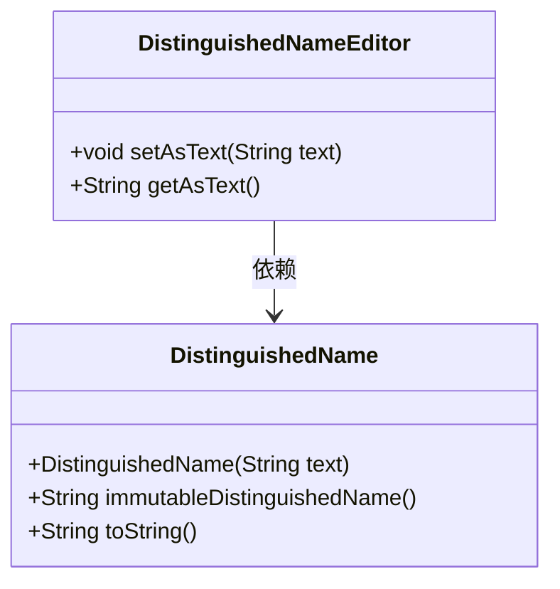
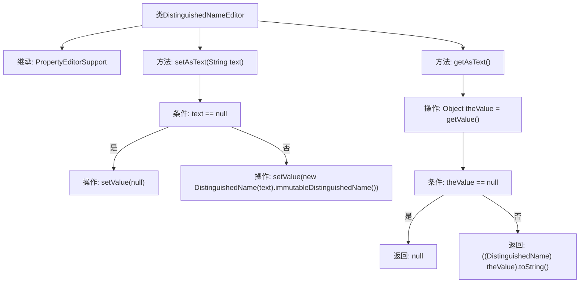

# 基础信息

|      |      |
|------|------|
| 名称 | DistinguishedNameEditor |
| 编码语言 | .java |
| 代码路径 | spring-ldap/core/src/main/java/org/springframework/ldap/core/DistinguishedNameEditor.java |
| 包名 | org.springframework.ldap.core |
| 依赖项 | ['java.beans.PropertyEditorSupport'] |
| 概述说明 | DistinguishedNameEditor类实现文本与DistinguishedName对象的双向转换。 |

# 说明

DistinguishedNameEditor类的主要功能是实现文本与DistinguishedName对象之间的相互转换。该类负责将文本格式的DistinguishedName转换为相应的对象，同时也能够将DistinguishedName对象转换回文本形式。通过这种双向转换，DistinguishedNameEditor类在处理和操作DistinguishedName数据时提供了便利，确保了数据在不同格式之间的无缝转换和一致性。

# 类列表 Class Summary

| 名称   | 类型  | 说明 |
|-------|------|-------------|
| DistinguishedNameEditor | class | DistinguishedNameEditor类实现文本与DistinguishedName对象的相互转换。 |

## 类 DistinguishedNameEditor

|      |      |
|------|------|
| 访问范围 | public |
| 类型 | class |
| 名称 | DistinguishedNameEditor |
| 说明 | DistinguishedNameEditor类实现文本与DistinguishedName对象的相互转换。 |

### UML类图

这段代码定义了一个 `DistinguishedNameEditor` 类，它继承自 `PropertyEditorSupport`。`DistinguishedNameEditor` 类有两个主要方法：`setAsText` 和 `getAsText`。`setAsText` 方法接收一个字符串参数，如果参数为 `null`，则设置值为 `null`；否则，创建一个 `DistinguishedName` 对象并调用其 `immutableDistinguishedName` 方法。`getAsText` 方法返回当前值的字符串表示，如果值为 `null`，则返回 `null`；否则，调用 `DistinguishedName` 对象的 `toString` 方法。`DistinguishedNameEditor` 类依赖于 `DistinguishedName` 类来完成其功能。

### 内部方法调用关系图

这段代码定义了一个`DistinguishedNameEditor`类，继承自`PropertyEditorSupport`。该类包含两个主要方法：`setAsText`和`getAsText`。`setAsText`方法根据输入的字符串是否为null，决定是将null值设置到属性中，还是将字符串转换为`DistinguishedName`对象并设置其不可变形式。`getAsText`方法则根据当前属性值是否为null，返回null或`DistinguishedName`对象的字符串表示。流程图清晰地展示了这两个方法的逻辑流程和条件判断。

### 字段列表 Field List

| 名称  | 类型  | 说明 |
|-------|-------|------|

### 方法列表 Method List

| 名称  | 类型  | 说明 |
|-------|-------|------|
| getAsText | String | 获取对象值并返回其字符串表示，若为空则返回null。 |
| setAsText | void | 该方法根据输入字符串设置值，若为空则设为null，否则转为不可变DistinguishedName对象。 |

