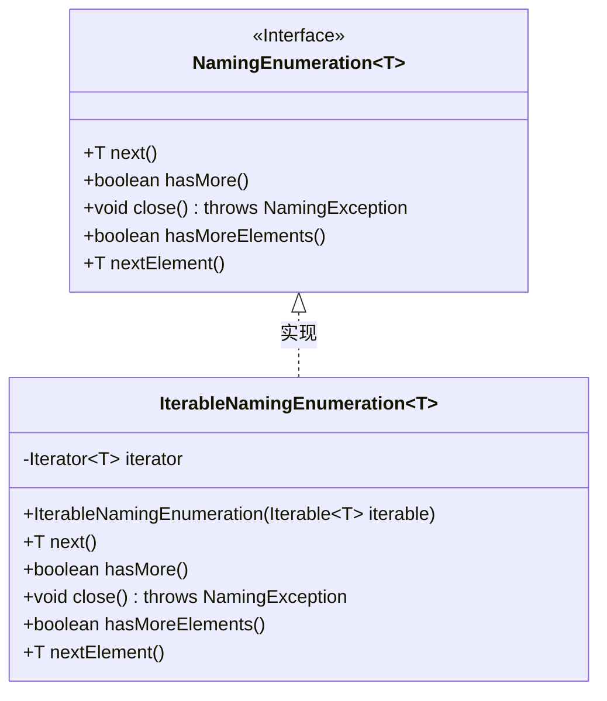
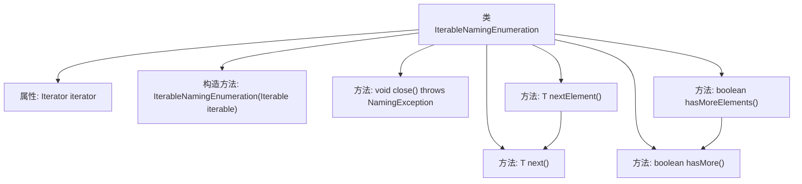

# 基础信息

|      |      |
|------|------|
| 名称 | IterableNamingEnumeration |
| 编码语言 | .java |
| 代码路径 | spring-ldap/core/src/main/java/org/springframework/ldap/core/IterableNamingEnumeration.java |
| 包名 | org.springframework.ldap.core |
| 依赖项 | ['java.util.Iterator', 'javax.naming.NamingEnumeration', 'javax.naming.NamingException'] |
| 概述说明 | IterableNamingEnumeration类封装迭代器，实现NamingEnumeration接口。 |

# 说明

IterableNamingEnumeration类实现了NamingEnumeration接口，其主要功能是封装迭代器操作。通过实现该接口，该类能够提供一种标准化的方式来枚举和操作命名元素。这种封装使得迭代器的使用更加便捷和高效，同时保持了代码的清晰性和可维护性。

# 类列表 Class Summary

| 名称   | 类型  | 说明 |
|-------|------|-------------|
| IterableNamingEnumeration | class | IterableNamingEnumeration类实现NamingEnumeration接口，封装迭代器操作。 |

## 类 IterableNamingEnumeration

|      |      |
|------|------|
| 访问范围 | final |
| 类型 | class |
| 名称 | IterableNamingEnumeration |
| 说明 | IterableNamingEnumeration类实现NamingEnumeration接口，封装迭代器操作。 |

### UML类图

**描述**：  
`IterableNamingEnumeration` 是一个泛型类，实现了 `NamingEnumeration` 接口。它通过 `Iterator` 来遍历 `Iterable` 集合中的元素，并提供了 `next`、`hasMore`、`close`、`hasMoreElements` 和 `nextElement` 等方法。这些方法允许用户按顺序访问集合中的元素，并检查是否还有更多元素可供访问。`close` 方法虽然不执行任何操作，但为了符合接口要求，仍需要实现。

### 内部方法调用关系图

这段代码定义了一个名为 `IterableNamingEnumeration` 的类，它实现了 `NamingEnumeration` 接口。该类通过一个 `Iterator` 对象来遍历 `Iterable` 集合。主要方法包括 `next()` 和 `hasMore()`，分别用于获取下一个元素和检查是否还有更多元素。此外，`hasMoreElements()` 和 `nextElement()` 方法分别调用了 `hasMore()` 和 `next()` 方法。`close()` 方法虽然被重写，但未实现任何功能。该类的设计目的是将 `Iterable` 转换为 `NamingEnumeration` 接口的实现。

### 字段列表 Field List

| 名称  | 类型  | 说明 |
|-------|-------|------|
| iterator | Iterator<T> | 私有迭代器用于遍历元素。 |

### 方法列表 Method List

| 名称  | 类型  | 说明 |
|-------|-------|------|
| close | void | 重写close方法，可能抛出NamingException异常。 |
| nextElement | T | 重写nextElement方法，直接调用next方法。 |
| next | T | 重写next方法，调用迭代器的next方法返回元素。 |
| hasMore | boolean | 该方法检查迭代器是否有更多元素。 |
| hasMoreElements | boolean | 重写hasMoreElements方法，调用hasMore()返回布尔值。 |

