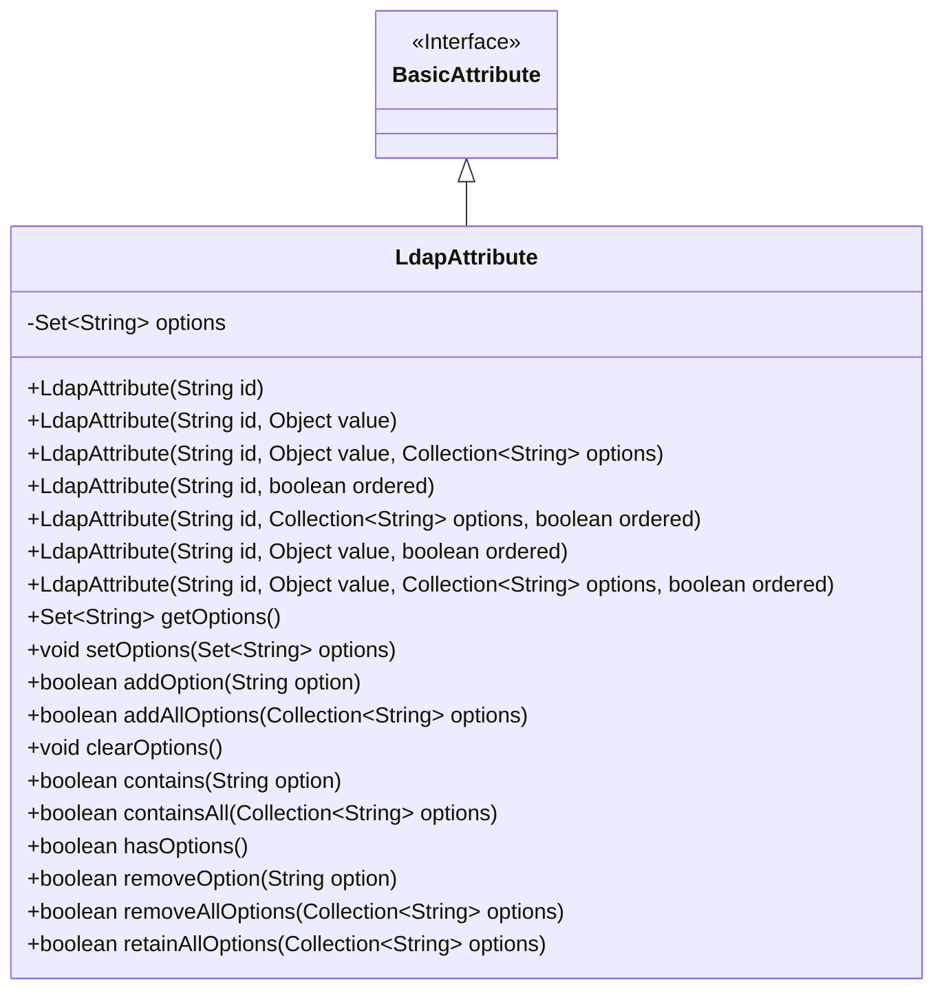

# 基础信息

|      |      |
|------|------|
| 名称 | LdapAttribute |
| 编码语言 | .java |
| 代码路径 | spring-ldap/core/src/main/java/org/springframework/ldap/core/LdapAttribute.java |
| 包名 | org.springframework.ldap.core |
| 依赖项 | ['java.util.Collection', 'java.util.HashSet', 'java.util.Set', 'javax.naming.directory.BasicAttribute'] |
| 概述说明 | LdapAttribute类扩展BasicAttribute，支持无序/有序属性，具备选项管理功能。 |

# 说明

LdapAttribute类继承自BasicAttribute，具备处理无序和有序属性的能力，并提供了管理这些属性的选项功能。

# 类列表 Class Summary

| 名称   | 类型  | 说明 |
|-------|------|-------------|
| LdapAttribute | class | LdapAttribute类扩展BasicAttribute，支持无序/有序属性，提供选项管理功能。 |

## 类 LdapAttribute

|      |      |
|------|------|
| 访问范围 | public |
| 类型 | class |
| 名称 | LdapAttribute |
| 说明 | LdapAttribute类扩展BasicAttribute，支持无序/有序属性，提供选项管理功能。 |

### UML类图

类图描述：
`LdapAttribute` 类继承自 `BasicAttribute` 接口，提供了多种构造方法来初始化属性，并管理一组选项。该类包含了对选项的增删改查操作，如添加、删除、清除、检查存在性等。`LdapAttribute` 类通过 `Set<String>` 来存储选项，并提供了多种方法来操作这些选项，确保灵活性和可扩展性。

### 内部方法调用关系图

```mermaid
graph TD
    A["类LdapAttribute"]
    B["属性: Set<String> options"]
    C["构造方法: LdapAttribute(String id)"]
    D["构造方法: LdapAttribute(String id, Object value)"]
    E["构造方法: LdapAttribute(String id, Object value, Collection<String> options)"]
    F["构造方法: LdapAttribute(String id, boolean ordered)"]
    G["构造方法: LdapAttribute(String id, Collection<String> options, boolean ordered)"]
    H["构造方法: LdapAttribute(String id, Object value, boolean ordered)"]
    I["构造方法: LdapAttribute(String id, Object value, Collection<String> options, boolean ordered)"]
    J["方法: Set<String> getOptions()"]
    K["方法: void setOptions(Set<String> options)"]
    L["方法: boolean addOption(String option)"]
    M["方法: boolean addAllOptions(Collection<String> options)"]
    N["方法: void clearOptions()"]
    O["方法: boolean contains(String option)"]
    P["方法: boolean containsAll(Collection<String> options)"]
    Q["方法: boolean hasOptions()"]
    R["方法: boolean removeOption(String option)"]
    S["方法: boolean removeAllOptions(Collection<String> options)"]
    T["方法: boolean retainAllOptions(Collection<String> options)"]

    A --> B
    A --> C
    A --> D
    A --> E
    A --> F
    A --> G
    A --> H
    A --> I
    A --> J
    A --> K
    A --> L
    A --> M
    A --> N
    A --> O
    A --> P
    A --> Q
    A --> R
    A --> S
    A --> T
```

这段代码定义了一个名为`LdapAttribute`的类，该类继承自`BasicAttribute`。`LdapAttribute`类主要用于管理LDAP属性的选项，提供了多种构造方法和操作选项的方法。构造方法允许根据不同的参数组合创建`LdapAttribute`对象，而方法则提供了对选项的增删改查功能。通过这些方法，可以方便地管理属性选项，如添加、删除、检查存在性等。

### 字段列表 Field List

| 名称  | 类型  | 说明 |
|-------|-------|------|
| serialVersionUID = -5263905906016179429L | long | 定义私有静态常量序列化版本UID。 |
| options = new HashSet<>() | Set<String> | 定义一个受保护的字符串集合变量options。 |

### 方法列表 Method List

| 名称  | 类型  | 说明 |
|-------|-------|------|
| containsAll | boolean | 检查当前集合是否包含指定集合的所有元素。 |
| clearOptions | void | 该方法用于清空选项列表。 |
| contains | boolean | 检查选项列表中是否包含指定选项。 |
| retainAllOptions | boolean | 方法retainAllOptions保留集合中与指定集合相同的元素。 |
| removeOption | boolean | 方法removeOption移除指定选项并返回布尔值。 |
| addOption | boolean | 方法addOption将选项添加到集合中并返回操作结果。 |
| removeAllOptions | boolean | 该方法移除集合中所有指定选项并返回是否成功。 |
| getOptions | Set<String> | 方法返回当前对象的选项集合。 |
| setOptions | void | 该方法用于设置选项集合，接收字符串集合参数并赋值给类成员变量。 |
| hasOptions | boolean | 检查选项列表是否为空，返回布尔值。 |
| addAllOptions | boolean | 方法`addAllOptions`将集合`options`的所有元素添加到当前集合中。 |

