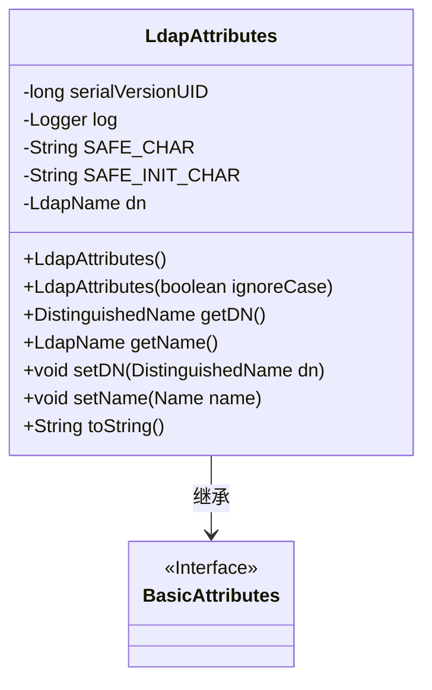
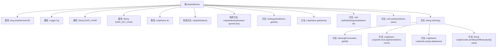

# 基础信息

|      |      |
|------|------|
| 名称 | LdapAttributes |
| 编码语言 | .java |
| 代码路径 | spring-ldap/core/src/main/java/org/springframework/ldap/core/LdapAttributes.java |
| 包名 | org.springframework.ldap.core |
| 依赖项 | ['java.net.URI', 'javax.naming.Name', 'javax.naming.NamingEnumeration', 'javax.naming.NamingException', 'javax.naming.directory.Attribute', 'javax.naming.directory.BasicAttributes', 'javax.naming.ldap.LdapName', 'org.slf4j.Logger', 'org.slf4j.LoggerFactory', 'org.springframework.ldap.support.LdapEncoder', 'org.springframework.ldap.support.LdapUtils'] |
| 概述说明 | LdapAttributes类管理LDAP属性，支持DN、名称操作及LDIF格式转换。 |

# 说明

LdapAttributes类用于处理LDAP属性，提供了构造函数来初始化对象，并包含获取和设置DN（Distinguished Name）以及名称的方法。此外，该类还支持将LDAP属性转换为LDIF格式的字符串表示，便于在LDAP操作中使用。

# 类列表 Class Summary

| 名称   | 类型  | 说明 |
|-------|------|-------------|
| LdapAttributes | class | LdapAttributes类处理LDAP属性，包含构造函数、获取/设置DN和名称的方法，以及转换为LDIF格式的字符串表示。 |

## 类 LdapAttributes

|      |      |
|------|------|
| 访问范围 | public |
| 类型 | class |
| 名称 | LdapAttributes |
| 说明 | LdapAttributes类处理LDAP属性，包含构造函数、获取/设置DN和名称的方法，以及转换为LDIF格式的字符串表示。 |

### UML类图

**描述：**  
`LdapAttributes` 类继承自 `BasicAttributes` 接口，用于处理与LDAP（轻量级目录访问协议）相关的属性。该类包含多个私有常量用于字符过滤，以及一个 `LdapName` 类型的成员变量 `dn`，用于存储对象的唯一标识名。类中提供了多个构造函数、获取和设置 `dn` 的方法，以及一个 `toString` 方法，用于将对象转换为符合RFC2849 LDIF规范的字符串格式。`toString` 方法在处理属性时，会根据值的类型进行不同的格式化，并处理可能的异常情况。

### 内部方法调用关系图

这段代码定义了一个名为 `LdapAttributes` 的类，该类继承自 `BasicAttributes`，用于处理LDAP（轻量级目录访问协议）属性。类中包含多个构造方法和成员方法，用于获取和设置LDAP对象的识别名（DN），并将对象转换为LDIF格式的字符串。代码还包含了对异常的处理，确保在格式化属性输出时能够捕获并记录错误。流程图展示了类的属性和方法之间的调用关系，帮助理解代码的结构和功能。

### 字段列表 Field List

| 名称  | 类型  | 说明 |
|-------|-------|------|
| dn = LdapUtils.emptyLdapName() | LdapName | 初始化空LDAP名称对象dn。 |
| serialVersionUID = 97903297123869138L | long | 定义了一个私有静态常量serialVersionUID，用于序列化版本控制。 |
| log = LoggerFactory.getLogger(LdapAttributes.class) | Logger | LdapAttributes类中初始化了日志记录器log。 |
| SAFE_INIT_CHAR = "[\\p{ASCII}&&[^ \\x00\\x0A\\x0D\\x3A\\x3C]]" | String | SAFE_INIT_CHAR定义安全初始字符集，排除特定控制字符和符号。 |
| SAFE_CHAR = "[\\p{ASCII}&&[^\\x00\\x0A\\x0D]]" | String | 定义安全字符为正则表达式，排除空字符、换行和回车。 |

### 方法列表 Method List

| 名称  | 类型  | 说明 |
|-------|-------|------|
| setDN | void | 设置DN属性为LDAP名称对象。 |
| getDN | DistinguishedName | 获取当前对象的 DistinguishedName 实例。 |
| getName | LdapName | 该方法返回基于当前dn属性的新LdapName对象。 |
| toString | String | 将LDAP对象属性转换为字符串，处理不同数据类型并捕获异常。 |
| setName | void | 该方法将传入的Name对象转换为LdapName并赋值给dn。 |

