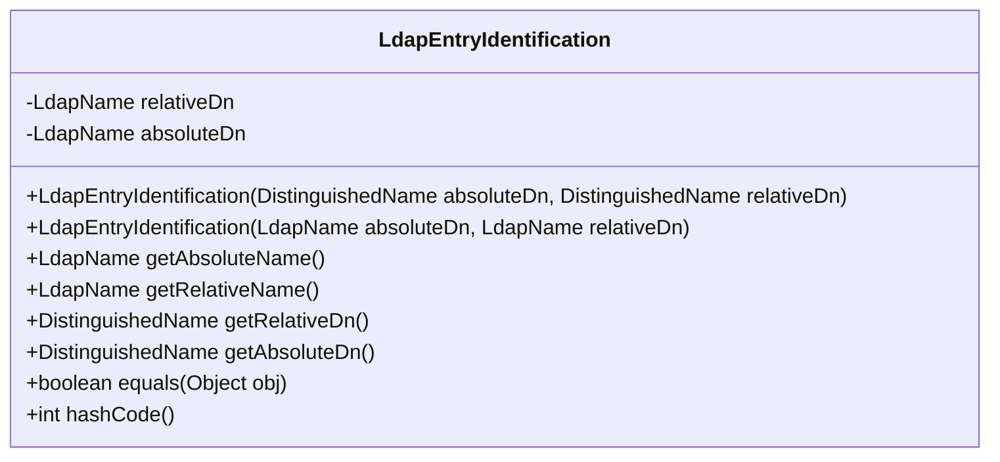
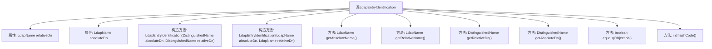

# 基础信息

|      |      |
|------|------|
| 名称 | LdapEntryIdentification |
| 编码语言 | .java |
| 代码路径 | spring-ldap/core/src/main/java/org/springframework/ldap/core/LdapEntryIdentification.java |
| 包名 | org.springframework.ldap.core |
| 依赖项 | ['javax.naming.directory.DirContext', 'javax.naming.ldap.LdapName', 'org.springframework.ldap.support.LdapUtils', 'org.springframework.util.Assert'] |
| 概述说明 | LdapEntryIdentification类存储LDAP条目DN，提供获取和比较功能。 |

# 说明

LdapEntryIdentification类用于存储LDAP条目的绝对和相对可分辨名称（DN），并提供获取和比较这些DN的功能。该类的主要作用是管理和操作LDAP条目的标识信息，确保能够准确识别和比较不同的LDAP条目。

# 类列表 Class Summary

| 名称   | 类型  | 说明 |
|-------|------|-------------|
| LdapEntryIdentification | class | LdapEntryIdentification类用于存储LDAP条目的绝对和相对DN，提供获取和比较功能。 |

## 类 LdapEntryIdentification

|      |      |
|------|------|
| 访问范围 | public |
| 类型 | class |
| 名称 | LdapEntryIdentification |
| 说明 | LdapEntryIdentification类用于存储LDAP条目的绝对和相对DN，提供获取和比较功能。 |

### UML类图

### 描述
`LdapEntryIdentification` 类用于表示LDAP（轻量级目录访问协议）条目的标识信息。它包含两个主要属性：`relativeDn`（相对DN）和`absoluteDn`（绝对DN）。类提供了两个构造函数，分别接受`DistinguishedName`和`LdapName`类型的参数，并且提供了获取这两个DN的方法。此外，类还重写了`equals`和`hashCode`方法，用于比较两个`LdapEntryIdentification`对象的相等性。部分方法已被标记为`@Deprecated`，建议使用新的方法来替代。

### 内部方法调用关系图

这段代码定义了一个`LdapEntryIdentification`类，用于处理LDAP条目的标识。类中包含两个构造方法，分别接受`DistinguishedName`和`LdapName`类型的参数，并提供了多个方法来获取绝对和相对DN（Distinguished Name）。此外，类还重写了`equals`和`hashCode`方法，用于比较两个`LdapEntryIdentification`对象的相等性和计算哈希值。代码中还包含了一些已弃用的方法，建议使用新方法替代。

### 字段列表 Field List

| 名称  | 类型  | 说明 |
|-------|-------|------|
| absoluteDn | LdapName | 私有不可变的绝对DN LdapName对象。 |
| relativeDn | LdapName | 私有不可变的LdapName类型变量relativeDn。 |

### 方法列表 Method List

| 名称  | 类型  | 说明 |
|-------|-------|------|
| getRelativeDn | DistinguishedName | 该方法已弃用，返回相对专有名称副本。 |
| getRelativeName | LdapName | 方法返回基于相对DN的LdapName对象。 |
| equals | boolean | 比较对象类型及DN值是否相等。 |
| getAbsoluteDn | DistinguishedName | 已弃用方法：获取绝对DN，返回新DistinguishedName对象。 |
| hashCode | int | hashCode方法返回absoluteDn和relativeDn哈希值的异或结果。 |
| getAbsoluteName | LdapName | 方法返回绝对LDAP名称，使用LdapUtils创建新LDAP名称。 |

