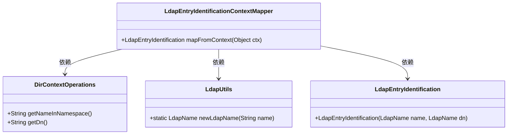
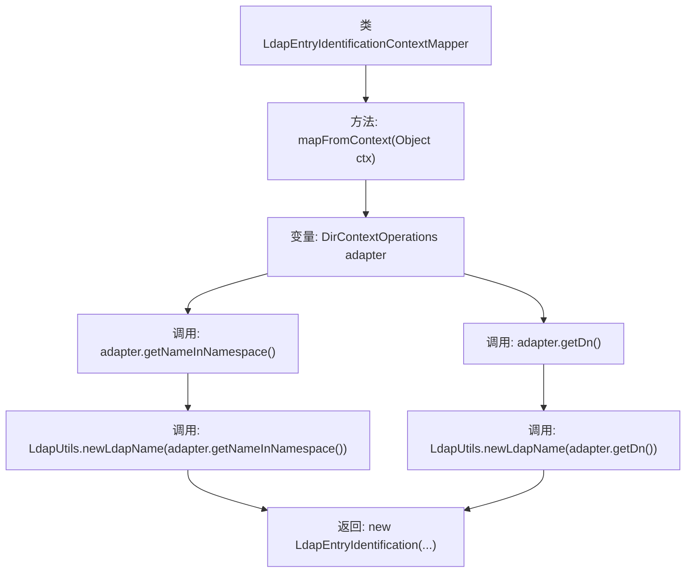

# 基础信息

|      |      |
|------|------|
| 名称 | LdapEntryIdentificationContextMapper |
| 编码语言 | .java |
| 代码路径 | spring-ldap/core/src/main/java/org/springframework/ldap/core/LdapEntryIdentificationContextMapper.java |
| 包名 | org.springframework.ldap.core |
| 依赖项 | ['org.springframework.ldap.support.LdapUtils'] |
| 概述说明 | LdapEntryIdentificationContextMapper将DirContextOperations映射为LdapEntryIdentification。 |

# 说明

LdapEntryIdentificationContextMapper实现了ContextMapper接口，其主要功能是将DirContextOperations对象映射为LdapEntryIdentification对象。通过这种映射，可以将LDAP目录上下文操作的结果转换为特定标识对象，便于后续处理和使用。该实现有助于在LDAP操作中提取和封装关键信息，提升代码的可读性和可维护性。

# 类列表 Class Summary

| 名称   | 类型  | 说明 |
|-------|------|-------------|
| LdapEntryIdentificationContextMapper | class | LdapEntryIdentificationContextMapper实现ContextMapper，将DirContextOperations映射为LdapEntryIdentification。 |

## 类 LdapEntryIdentificationContextMapper

|      |      |
|------|------|
| 访问范围 | public |
| 类型 | class |
| 名称 | LdapEntryIdentificationContextMapper |
| 说明 | LdapEntryIdentificationContextMapper实现ContextMapper，将DirContextOperations映射为LdapEntryIdentification。 |

### UML类图

这段代码定义了一个 `LdapEntryIdentificationContextMapper` 类，它实现了 `ContextMapper` 接口，用于将 `DirContextOperations` 对象映射为 `LdapEntryIdentification` 对象。`mapFromContext` 方法从 `DirContextOperations` 中提取名称和 DN（Distinguished Name），并使用 `LdapUtils` 工具类将其转换为 `LdapName` 对象，最终构造并返回 `LdapEntryIdentification` 对象。类图展示了 `LdapEntryIdentificationContextMapper` 与 `DirContextOperations`、`LdapUtils` 和 `LdapEntryIdentification` 之间的依赖关系。

### 内部方法调用关系图

这段代码定义了一个类 `LdapEntryIdentificationContextMapper`，它实现了 `ContextMapper<LdapEntryIdentification>` 接口。类中的 `mapFromContext` 方法接收一个 `Object` 类型的参数 `ctx`，并将其转换为 `DirContextOperations` 类型的对象 `adapter`。然后，该方法通过调用 `adapter.getNameInNamespace()` 和 `adapter.getDn()` 获取名称和 DN，并使用 `LdapUtils.newLdapName` 方法将它们转换为 `LdapName` 对象。最后，方法返回一个新的 `LdapEntryIdentification` 对象，该对象包含这两个 `LdapName` 对象。

### 字段列表 Field List

| 名称  | 类型  | 说明 |
|-------|-------|------|

### 方法列表 Method List

| 名称  | 类型  | 说明 |
|-------|-------|------|
| mapFromContext | LdapEntryIdentification | 将上下文对象转换为LdapEntryIdentification实例。 |

