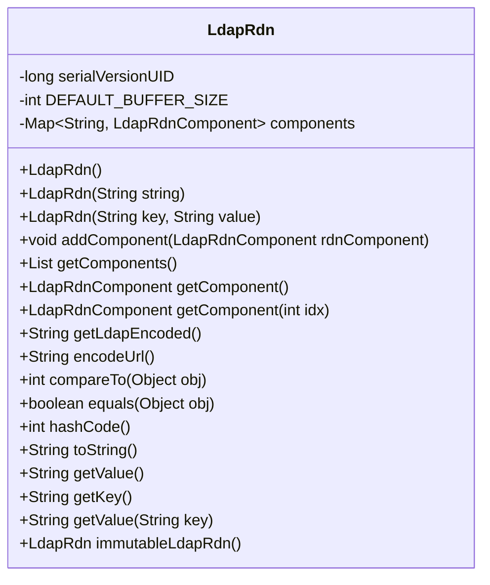

# 基础信息

|      |      |
|------|------|
| 名称 | LdapRdn |
| 编码语言 | .java |
| 代码路径 | spring-ldap/core/src/main/java/org/springframework/ldap/core/LdapRdn.java |
| 包名 | org.springframework.ldap.core |
| 依赖项 | ['java.io.Serializable', 'java.util.ArrayList', 'java.util.Collections', 'java.util.HashSet', 'java.util.Iterator', 'java.util.LinkedHashMap', 'java.util.List', 'java.util.Map', 'java.util.Set', 'org.springframework.ldap.BadLdapGrammarException', 'org.springframework.util.ObjectUtils'] |
| 概述说明 | LdapRdn类处理LDAP相对专有名称，支持解析、管理和编码操作。 |

# 说明

LdapRdn类专门用于处理LDAP相对专有名称，提供了解析、组件管理和编码操作的功能。该类能够有效地解析LDAP相对专有名称，管理其各个组件，并支持对名称进行编码操作，确保在LDAP环境中的准确性和一致性。

# 类列表 Class Summary

| 名称   | 类型  | 说明 |
|-------|------|-------------|
| LdapRdn | class | LdapRdn类用于处理LDAP相对专有名称，支持解析、组件管理和编码操作。 |

## 类 LdapRdn

|      |      |
|------|------|
| 访问范围 | @Deprecated;public |
| 类型 | class |
| 名称 | LdapRdn |
| 说明 | LdapRdn类用于处理LDAP相对专有名称，支持解析、组件管理和编码操作。 |

### UML类图

**描述：**  
`LdapRdn` 类用于表示 LDAP 中的相对标识名（RDN），提供了多种构造方法和操作组件的方法。它支持从字符串解析 RDN、添加组件、获取组件、编码为 LDAP 或 URL 格式、比较和判断相等等功能。类内部使用 `LinkedHashMap` 存储 `LdapRdnComponent` 组件，确保顺序性。该类还提供了创建不可变副本的方法，以确保数据的安全性和一致性。

### 内部方法调用关系图

```mermaid
graph TD
    A["类LdapRdn"]
    B["属性: Map<String, LdapRdnComponent> components"]
    C["构造方法: LdapRdn()"]
    D["构造方法: LdapRdn(String string)"]
    E["构造方法: LdapRdn(String key, String value)"]
    F["方法: addComponent(LdapRdnComponent rdnComponent)"]
    G["方法: getComponents()"]
    H["方法: getComponent()"]
    I["方法: getComponent(int idx)"]
    J["方法: getLdapEncoded()"]
    K["方法: encodeUrl()"]
    L["方法: compareTo(Object obj)"]
    M["方法: equals(Object obj)"]
    N["方法: hashCode()"]
    O["方法: toString()"]
    P["方法: getValue()"]
    Q["方法: getKey()"]
    R["方法: getValue(String key)"]
    S["方法: immutableLdapRdn()"]

    A --> B
    A --> C
    A --> D
    A --> E
    A --> F
    A --> G
    A --> H
    A --> I
    A --> J
    A --> K
    A --> L
    A --> M
    A --> N
    A --> O
    A --> P
    A --> Q
    A --> R
    A --> S
```

这段代码定义了一个名为`LdapRdn`的类，用于处理LDAP（轻量级目录访问协议）中的相对可分辨名称（RDN）。该类包含多个构造方法和方法，用于解析、构建、操作和比较RDN。主要功能包括解析字符串生成RDN、添加和获取RDN组件、生成LDAP编码的字符串、比较和判断RDN的相等性等。类中的`components`属性用于存储RDN的各个组件，类的方法则提供了对这些组件的操作和访问。

### 字段列表 Field List

| 名称  | 类型  | 说明 |
|-------|-------|------|
| serialVersionUID = 5681397547245228750L | long | 定义序列化版本UID为5681397547245228750L。 |
| DEFAULT_BUFFER_SIZE = 100 | int | 定义默认缓冲区大小为100的私有静态常量。 |
| components = new LinkedHashMap<>() | Map<String, LdapRdnComponent> | 私有LinkedHashMap存储字符串与LdapRdnComponent的映射。 |

### 方法列表 Method List

| 名称  | 类型  | 说明 |
|-------|-------|------|
| getValue | String | 该方法返回组件值。 |
| getKey | String | 获取组件键值的方法。 |
| getComponents | List | 该方法返回组件列表的副本。 |
| toString | String | 该方法返回对象的LDAP编码字符串。 |
| getComponent | LdapRdnComponent | 获取LDAP RDN组件的指定索引元素，超出范围抛出异常。 |
| hashCode | int | 该方法通过类名和组件集合的哈希码异或运算生成唯一哈希值。 |
| encodeUrl | String | 方法将组件编码为URL格式，用加号连接各组件。 |
| getComponent | LdapRdnComponent | 获取LDAP RDN组件的首个值，若无组件则抛出异常。 |
| getValue | String | 通过迭代查找与指定键匹配的组件并返回值，未找到则抛出异常。 |
| compareTo | int | 比较两个LdapRdn对象，先比组件数量，再逐项比较组件内容。 |
| immutableLdapRdn | LdapRdn | 该方法创建并返回一个不可变的LdapRdn对象，包含不可修改的RDN组件映射。 |
| equals | boolean | 判断两个LdapRdn对象是否相等，需满足类相同、组件数量一致且各组件内容相同。 |
| addComponent | void | 方法`addComponent`将`LdapRdnComponent`对象按键值存入`components`集合。 |
| getLdapEncoded | String | 方法getLdapEncoded检查组件数量，若为空抛出异常，否则将组件编码拼接返回。 |

