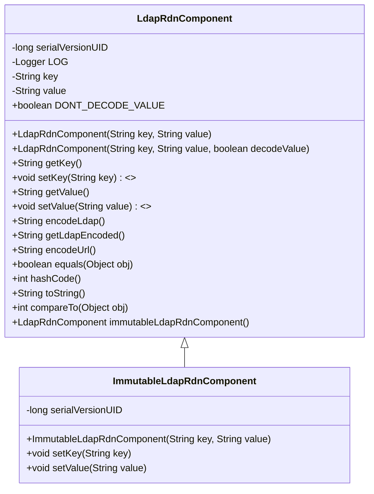
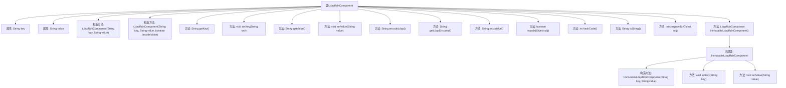

# 基础信息

|      |      |
|------|------|
| 名称 | LdapRdnComponent |
| 编码语言 | .java |
| 代码路径 | spring-ldap/core/src/main/java/org/springframework/ldap/core/LdapRdnComponent.java |
| 包名 | org.springframework.ldap.core |
| 依赖项 | ['java.io.Serializable', 'java.net.URI', 'java.net.URISyntaxException', 'java.util.Locale', 'org.slf4j.Logger', 'org.slf4j.LoggerFactory', 'org.springframework.ldap.support.LdapEncoder', 'org.springframework.util.Assert', 'org.springframework.util.StringUtils'] |
| 概述说明 | LdapRdnComponent类处理LDAP属性键值对，支持编码、解码及创建不可变实例。 |

# 说明

LdapRdnComponent类专门用于处理LDAP属性键值对，提供编码和解码功能，并支持创建不可变实例，确保数据在操作过程中的安全性和一致性。

# 类列表 Class Summary

| 名称   | 类型  | 说明 |
|-------|------|-------------|
| LdapRdnComponent | class | LdapRdnComponent类用于处理LDAP属性键值对，支持编码、解码及不可变实例创建。 |

## 类 LdapRdnComponent

|      |      |
|------|------|
| 访问范围 | @Deprecated;public |
| 类型 | class |
| 名称 | LdapRdnComponent |
| 说明 | LdapRdnComponent类用于处理LDAP属性键值对，支持编码、解码及不可变实例创建。 |

### UML类图

**描述：**  
`LdapRdnComponent` 类用于表示LDAP（轻量级目录访问协议）中的RDN（相对可分辨名称）组件。它包含键（key）和值（value）两个主要属性，并提供了构造方法、获取和设置属性的方法，以及编码、比较和转换为字符串的功能。`ImmutableLdapRdnComponent` 是 `LdapRdnComponent` 的不可变版本，继承自 `LdapRdnComponent`，并重写了设置键和值的方法，使其在调用时抛出 `UnsupportedOperationException`，确保实例的不可变性。

### 内部方法调用关系图

这段代码定义了一个名为 `LdapRdnComponent` 的类，用于处理LDAP（轻量级目录访问协议）中的RDN（相对可分辨名称）组件。类中包含多个构造方法和方法，用于处理键值对的编码、解码、比较、哈希计算等操作。此外，还包含一个内部类 `ImmutableLdapRdnComponent`，用于创建不可变的RDN组件实例。代码通过处理系统属性来控制键的大小写，并提供了多种编码方式，如LDAP编码和URL编码。

### 字段列表 Field List

| 名称  | 类型  | 说明 |
|-------|-------|------|
| serialVersionUID = -3296747972616243038L | long | 定义私有静态常量序列化版本ID。 |
| value | String | 声明一个私有字符串变量value。 |
| key | String | 定义了一个私有字符串变量key。 |
| DONT_DECODE_VALUE = false | boolean | 该代码定义了一个不可修改的布尔常量，值为false。 |
| LOG = LoggerFactory.getLogger(LdapRdnComponent.class) | Logger | LdapRdnComponent类中定义了一个静态的日志记录器LOG。 |

### 方法列表 Method List

| 名称  | 类型  | 说明 |
|-------|-------|------|
| getLdapEncoded | String | 方法返回LDAP编码结果。 |
| toString | String | 重写toString方法，返回ldap编码结果。 |
| encodeLdap | String | 该方法编码LDAP键值对，返回字符串。 |
| encodeUrl | String | 使用URI类对URL值进行编码，返回键值对格式。 |
| immutableLdapRdnComponent | LdapRdnComponent | 方法返回不可变的LdapRdnComponent实例。 |
| compareTo | int | 比较LdapRdnComponent对象的key和value，忽略大小写。 |
| hashCode | int | 重写hashCode方法，返回key和value大写的哈希值异或结果。 |
| setKey | void | 废弃方法：setKey，要求非空键值并赋值。 |
| equals | boolean | 重写equals方法，比较LdapRdnComponent的key和value，忽略大小写。 |
| getKey | String | 方法getKey返回当前对象的key属性值。 |
| setValue | void | 已弃用方法：setValue，检查非空后赋值。 |
| getValue | String | 方法返回当前对象的value属性值。 |

