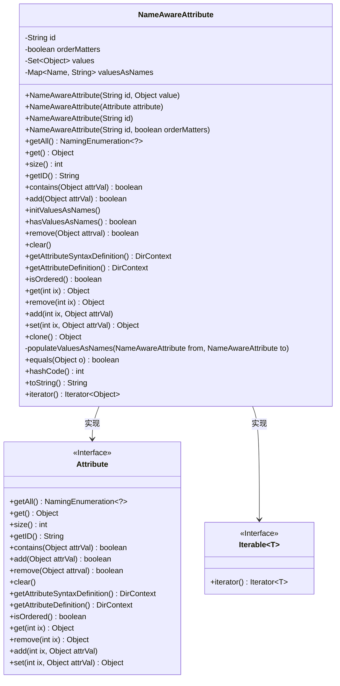

# 基础信息

|      |      |
|------|------|
| 名称 | NameAwareAttribute |
| 编码语言 | .java |
| 代码路径 | spring-ldap/core/src/main/java/org/springframework/ldap/core/NameAwareAttribute.java |
| 包名 | org.springframework.ldap.core |
| 依赖项 | ['java.util.HashMap', 'java.util.Iterator', 'java.util.LinkedHashSet', 'java.util.Map', 'java.util.NoSuchElementException', 'java.util.Set', 'javax.naming.Name', 'javax.naming.NamingEnumeration', 'javax.naming.NamingException', 'javax.naming.directory.Attribute', 'javax.naming.directory.DirContext', 'javax.naming.ldap.LdapName', 'org.springframework.ldap.InvalidNameException', 'org.springframework.ldap.support.LdapUtils', 'org.springframework.util.CollectionUtils', 'org.springframework.util.ObjectUtils'] |
| 概述说明 | NameAwareAttribute类实现Attribute接口，管理属性值和名称映射，支持有序无序操作。 |

# 说明

NameAwareAttribute类实现了Attribute接口，主要用于管理属性值及其与名称之间的映射关系。该类支持对属性进行有序和无序的操作，提供了灵活的方式来处理属性数据的存储和访问。通过该实现，可以有效地管理和维护属性值及其对应的名称，确保数据的一致性和可操作性。

# 类列表 Class Summary

| 名称   | 类型  | 说明 |
|-------|------|-------------|
| NameAwareAttribute | class | NameAwareAttribute类实现Attribute接口，管理属性值和名称映射，支持有序和无序操作。 |

## 类 NameAwareAttribute

|      |      |
|------|------|
| 访问范围 | public final |
| 类型 | class |
| 名称 | NameAwareAttribute |
| 说明 | NameAwareAttribute类实现Attribute接口，管理属性值和名称映射，支持有序和无序操作。 |

### UML类图

**类图描述：**
`NameAwareAttribute` 类实现了 `Attribute` 和 `Iterable<Object>` 接口，用于管理具有名称感知的属性和值集合。该类包含多个构造方法，支持从不同来源初始化属性，并提供了对属性值的增删改查操作。`NameAwareAttribute` 还支持对属性值进行名称映射，确保名称的语法正确性。此外，该类还实现了 `equals`、`hashCode` 和 `toString` 方法，以便进行对象的比较和字符串表示。

### 内部方法调用关系图

```mermaid
graph TD
    A["类NameAwareAttribute"]
    B["属性: String id"]
    C["属性: boolean orderMatters"]
    D["属性: Set<Object> values"]
    E["属性: Map<Name, String> valuesAsNames"]
    F["构造方法: NameAwareAttribute(String id, Object value)"]
    G["构造方法: NameAwareAttribute(Attribute attribute)"]
    H["构造方法: NameAwareAttribute(String id)"]
    I["构造方法: NameAwareAttribute(String id, boolean orderMatters)"]
    J["方法: NamingEnumeration<?> getAll()"]
    K["方法: Object get()"]
    L["方法: int size()"]
    M["方法: String getID()"]
    N["方法: boolean contains(Object attrVal)"]
    O["方法: boolean add(Object attrVal)"]
    P["方法: void initValuesAsNames()"]
    Q["方法: boolean hasValuesAsNames()"]
    R["方法: boolean remove(Object attrval)"]
    S["方法: void clear()"]
    T["方法: DirContext getAttributeSyntaxDefinition()"]
    U["方法: DirContext getAttributeDefinition()"]
    V["方法: boolean isOrdered()"]
    W["方法: Object get(int ix)"]
    X["方法: Object remove(int ix)"]
    Y["方法: void add(int ix, Object attrVal)"]
    Z["方法: Object set(int ix, Object attrVal)"]
    AA["方法: Object clone()"]
    AB["方法: void populateValuesAsNames(NameAwareAttribute from, NameAwareAttribute to)"]
    AC["方法: boolean equals(Object o)"]
    AD["方法: int hashCode()"]
    AE["方法: String toString()"]
    AF["方法: Iterator<Object> iterator()"]

    A --> B
    A --> C
    A --> D
    A --> E
    A --> F
    A --> G
    A --> H
    A --> I
    A --> J
    A --> K
    A --> L
    A --> M
    A --> N
    A --> O
    A --> P
    A --> Q
    A --> R
    A --> S
    A --> T
    A --> U
    A --> V
    A --> W
    A --> X
    A --> Y
    A --> Z
    A --> AA
    A --> AB
    A --> AC
    A --> AD
    A --> AE
    A --> AF
```

该流程图展示了`NameAwareAttribute`类的结构及其方法调用关系。`NameAwareAttribute`类实现了`Attribute`和`Iterable<Object>`接口，包含多个构造方法和公共方法，用于管理属性值和名称的映射关系。类中的方法涵盖了从属性值的添加、删除、查询到迭代器的实现，以及对象的克隆和比较等功能。流程图清晰地展示了类中各个方法之间的调用关系，帮助理解类的整体设计和工作流程。

### 字段列表 Field List

| 名称  | 类型  | 说明 |
|-------|-------|------|
| id | String | 定义了一个私有的不可变字符串变量id。 |
| values = new LinkedHashSet<>() | Set<Object> | 声明一个私有的LinkedHashSet对象集合。 |
| valuesAsNames = new HashMap<>() | Map<Name, String> | 创建一个名为valuesAsNames的私有HashMap，键为Name类型，值为String类型。 |
| orderMatters | boolean | 私有布尔变量orderMatters表示顺序是否重要。 |

### 方法列表 Method List

| 名称  | 类型  | 说明 |
|-------|-------|------|
| getAttributeSyntaxDefinition | DirContext | 该方法抛出未支持操作异常。 |
| size | int | 重写size方法，返回values列表的大小。 |
| set | Object | 该方法抛出UnsupportedOperationException异常。 |
| getAll | NamingEnumeration<?> | 重写方法getAll，返回IterableNamingEnumeration实例。 |
| add | void | 重写add方法，抛出不支持操作异常。 |
| clone | Object | 该方法重写clone，返回NameAwareAttribute的新实例。 |
| get | Object | 重写get方法，若values为空返回null，否则返回首个元素。 |
| toString | String | 重写toString方法，返回对象属性格式化字符串。 |
| getAttributeDefinition | DirContext | 方法`getAttributeDefinition`抛出`UnsupportedOperationException`异常。 |
| populateValuesAsNames | void | 将NameAwareAttribute对象的名称值复制到目标对象。 |
| iterator | Iterator<Object> | 重写iterator方法，返回values的迭代器。 |
| clear | void | 该方法清除了values集合中的所有元素。 |
| isOrdered | boolean | 方法isOrdered返回orderMatters的值，判断顺序是否重要。 |
| getID | String | 重写getID方法，返回当前对象的id属性。 |
| get | Object | 方法通过迭代器获取指定索引值，索引越界时抛出异常。 |
| contains | boolean | 方法`contains`检查`attrVal`是否存在于`values`中。 |
| add | boolean | 重写add方法，处理Name类型对象，更新valuesAsNames和values集合。 |
| hashCode | int | 重写hashCode方法，基于id和values计算哈希值。 |
| remove | boolean | 方法移除指定对象，若为Name类型则处理名称，否则直接移除值。 |
| initValuesAsNames | void | 方法initValuesAsNames将值转换为名称映射，处理字符串和LdapName类型，否则抛出异常。 |
| equals | boolean | 重写equals方法，比较对象ID、值集合大小、顺序及值内容，确保对象相等性判断准确。 |
| remove | Object | 方法remove通过迭代器删除指定索引元素，处理字符串类型时移除对应名称，异常时抛出IndexOutOfBoundsException。 |
| hasValuesAsNames | boolean | 检查valuesAsNames是否非空。 |

