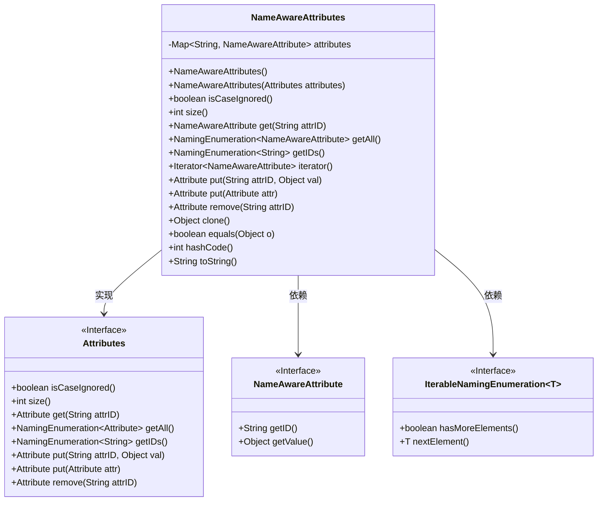

# 基础信息

|      |      |
|------|------|
| 名称 | NameAwareAttributes |
| 编码语言 | .java |
| 代码路径 | spring-ldap/core/src/main/java/org/springframework/ldap/core/NameAwareAttributes.java |
| 包名 | org.springframework.ldap.core |
| 依赖项 | ['java.util.HashMap', 'java.util.Iterator', 'java.util.Locale', 'java.util.Map', 'javax.naming.NamingEnumeration', 'javax.naming.directory.Attribute', 'javax.naming.directory.Attributes', 'org.springframework.lang.NonNull', 'org.springframework.util.Assert'] |
| 概述说明 | NameAwareAttributes类实现Attributes接口，管理属性映射，支持忽略大小写、克隆和迭代。 |

# 说明

NameAwareAttributes类实现了Attributes接口，用于管理属性映射。该类支持大小写忽略的属性访问，确保在处理属性时不受大小写影响。此外，NameAwareAttributes类提供了克隆功能，允许创建该类的副本，以便在不影响原始对象的情况下进行操作。同时，该类还支持迭代功能，便于遍历和操作所有属性。这些功能使得NameAwareAttributes类在处理属性映射时更加灵活和高效。

# 类列表 Class Summary

| 名称   | 类型  | 说明 |
|-------|------|-------------|
| NameAwareAttributes | class | NameAwareAttributes类实现Attributes接口，管理属性映射，支持大小写忽略、克隆、迭代等功能。 |

## 类 NameAwareAttributes

|      |      |
|------|------|
| 访问范围 | public final |
| 类型 | class |
| 名称 | NameAwareAttributes |
| 说明 | NameAwareAttributes类实现Attributes接口，管理属性映射，支持大小写忽略、克隆、迭代等功能。 |

### UML类图

这段代码定义了一个名为 `NameAwareAttributes` 的类，该类实现了 `Attributes` 接口和 `Iterable<NameAwareAttribute>` 接口。`NameAwareAttributes` 类主要用于管理一组 `NameAwareAttribute` 对象，提供了对这些属性的增删改查操作。类中使用了 `Map` 来存储属性，并提供了多种方法来操作这些属性，如 `put`、`get`、`remove` 等。此外，类还实现了 `clone`、`equals`、`hashCode` 和 `toString` 方法，以便于对象的复制、比较和字符串表示。

### 内部方法调用关系图

```mermaid
graph TD
    A["类NameAwareAttributes"]
    B["属性: Map<String, NameAwareAttribute> attributes"]
    C["构造方法: NameAwareAttributes()"]
    D["构造方法: NameAwareAttributes(Attributes attributes)"]
    E["方法: boolean isCaseIgnored()"]
    F["方法: int size()"]
    G["方法: NameAwareAttribute get(String attrID)"]
    H["方法: NamingEnumeration<NameAwareAttribute> getAll()"]
    I["方法: NamingEnumeration<String> getIDs()"]
    J["方法: Iterator<NameAwareAttribute> iterator()"]
    K["方法: Attribute put(String attrID, Object val)"]
    L["方法: Attribute put(Attribute attr)"]
    M["方法: Attribute remove(String attrID)"]
    N["方法: Object clone()"]
    O["方法: boolean equals(Object o)"]
    P["方法: int hashCode()"]
    Q["方法: String toString()"]

    A --> B
    A --> C
    A --> D
    A --> E
    A --> F
    A --> G
    A --> H
    A --> I
    A --> J
    A --> K
    A --> L
    A --> M
    A --> N
    A --> O
    A --> P
    A --> Q
```

这段代码定义了一个名为 `NameAwareAttributes` 的类，该类实现了 `Attributes` 和 `Iterable<NameAwareAttribute>` 接口。类中包含一个 `Map` 类型的属性 `attributes`，用于存储 `NameAwareAttribute` 对象。类提供了多个方法，包括构造方法、属性操作方法（如 `get`、`put`、`remove`）、迭代器方法、以及常见的对象方法（如 `equals`、`hashCode`、`toString`）。流程图展示了类的结构及其方法之间的调用关系。

### 字段列表 Field List

| 名称  | 类型  | 说明 |
|-------|-------|------|
| attributes = new HashMap<>() | Map<String, NameAwareAttribute> | 使用HashMap存储字符串与NameAwareAttribute对象的映射。 |

### 方法列表 Method List

| 名称  | 类型  | 说明 |
|-------|-------|------|
| isCaseIgnored | boolean | 该方法返回true，表示忽略大小写。 |
| iterator | Iterator<NameAwareAttribute> | 方法返回attributes集合的迭代器。 |
| get | NameAwareAttribute | 重写get方法，验证attrID非空后返回对应属性。 |
| equals | boolean | 重写equals方法，比较对象属性和类是否相同。 |
| size | int | 重写size方法，返回attributes集合的大小。 |
| toString | String | 重写toString方法，返回NameAwareAttribute及其属性。 |
| getAll | NamingEnumeration<NameAwareAttribute> | 重写方法`getAll`，返回属性值的迭代枚举。 |
| remove | Attribute | 该方法用于移除指定ID的属性，确保ID非空并忽略大小写。 |
| clone | Object | 重写clone方法，返回NameAwareAttributes新实例。 |
| put | Attribute | 重写put方法，验证attrID非空后创建新属性并存入attributes映射。 |
| hashCode | int | 重写hashCode方法，返回属性哈希值或0。 |
| getIDs | NamingEnumeration<String> | 重写getIDs方法，返回属性键集的枚举。 |
| put | Attribute | 重写put方法，确保属性非空并转换为NameAwareAttribute后存储。 |

