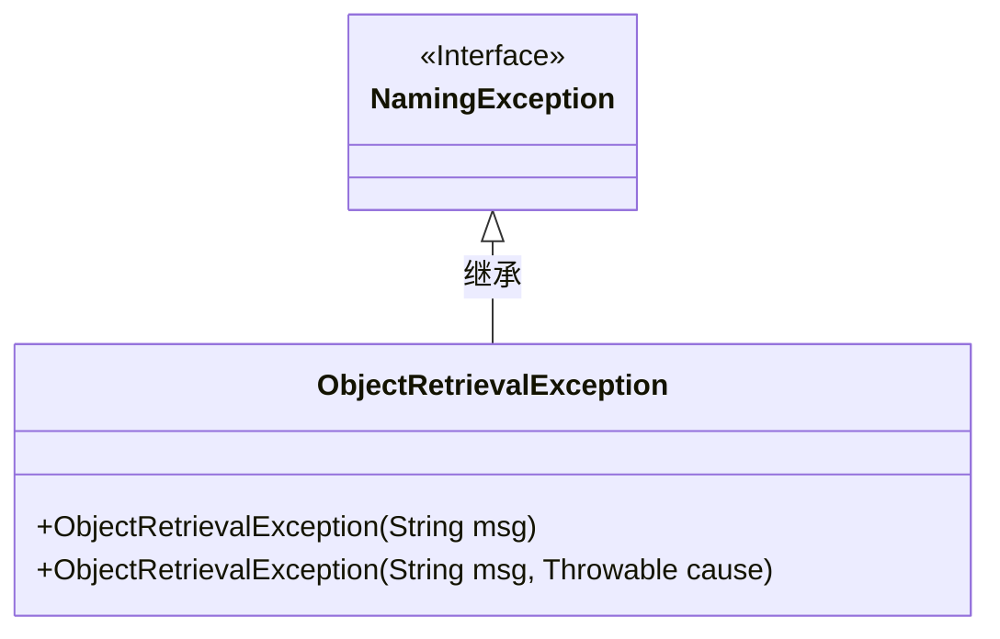
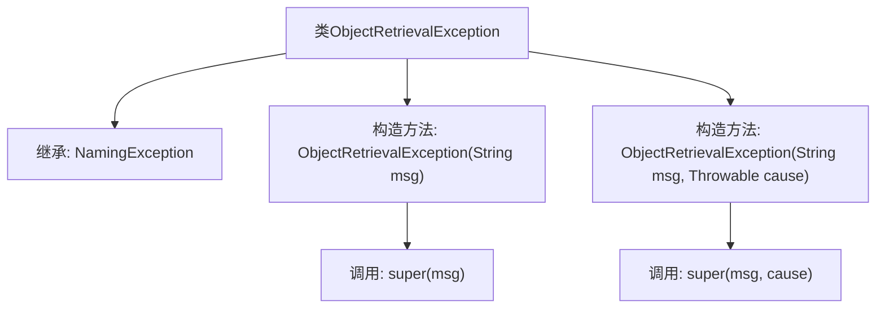

# 基础信息

|      |      |
|------|------|
| 名称 | ObjectRetrievalException |
| 编码语言 | .java |
| 代码路径 | spring-ldap/core/src/main/java/org/springframework/ldap/core/ObjectRetrievalException.java |
| 包名 | org.springframework.ldap.core |
| 依赖项 | ['org.springframework.ldap.NamingException'] |
| 概述说明 | ObjectRetrievalException继承NamingException，支持消息和原因的构造方法。 |

# 说明

ObjectRetrievalException是一个继承自NamingException的异常类，主要用于处理对象检索过程中的错误。该类提供了两个构造方法，一个允许传入自定义的错误消息，另一个则允许同时传入错误消息和导致该异常的根本原因。通过这些构造方法，开发者可以更精确地描述和传递异常信息，便于后续的调试和处理。

# 类列表 Class Summary

| 名称   | 类型  | 说明 |
|-------|------|-------------|
| ObjectRetrievalException | class | ObjectRetrievalException继承NamingException，提供带消息和原因构造方法。 |

## 类 ObjectRetrievalException

|      |      |
|------|------|
| 访问范围 | public |
| 类型 | class |
| 名称 | ObjectRetrievalException |
| 说明 | ObjectRetrievalException继承NamingException，提供带消息和原因构造方法。 |

### UML类图

这段代码定义了一个名为 `ObjectRetrievalException` 的异常类，它继承自 `NamingException` 接口。`ObjectRetrievalException` 类提供了两个构造函数：一个接受一个字符串参数 `msg`，用于传递异常信息；另一个接受两个参数 `msg` 和 `cause`，其中 `cause` 是一个 `Throwable` 对象，用于传递异常的根原因。这个类主要用于在对象检索过程中捕获和处理异常。

### 内部方法调用关系图

这段代码定义了一个名为 `ObjectRetrievalException` 的类，该类继承自 `NamingException`。它包含两个构造方法，分别用于创建带有详细消息的异常对象和带有详细消息及根本原因的异常对象。每个构造方法都调用了父类的相应构造方法来完成初始化。流程图清晰地展示了类的继承关系和构造方法的调用链。

### 字段列表 Field List

| 名称  | 类型  | 说明 |
|-------|-------|------|

### 方法列表 Method List

| 名称  | 类型  | 说明 |
|-------|-------|------|

