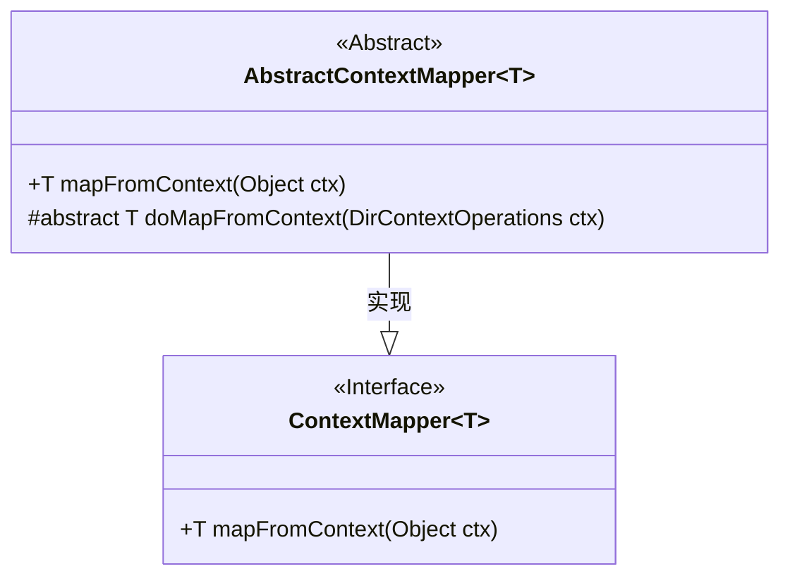
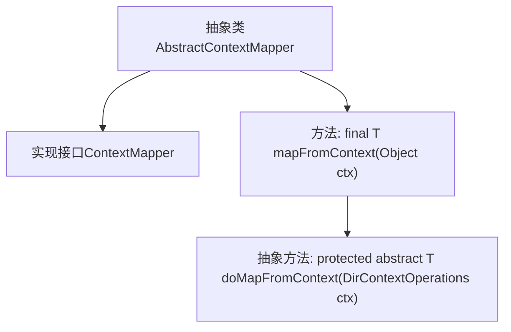

# 基础信息

|      |      |
|------|------|
| 名称 | AbstractContextMapper |
| 编码语言 | .java |
| 代码路径 | spring-ldap/core/src/main/java/org/springframework/ldap/core/support/AbstractContextMapper.java |
| 包名 | org.springframework.ldap.core.support |
| 依赖项 | ['org.springframework.ldap.core.ContextMapper', 'org.springframework.ldap.core.DirContextOperations'] |
| 概述说明 | AbstractContextMapper实现ContextMapper接口，提供DirContextOperations到对象的映射方法。 |

# 说明

抽象类AbstractContextMapper实现了ContextMapper接口，其主要功能是将DirContextOperations对象映射到其他对象。该类提供了通用的映射方法，为具体的映射实现提供了基础框架，简化了从DirContextOperations到目标对象的转换过程。通过继承AbstractContextMapper，开发者可以专注于特定对象的映射逻辑，而不必重新实现通用的映射功能。

# 类列表 Class Summary

| 名称   | 类型  | 说明 |
|-------|------|-------------|
| AbstractContextMapper | class | 抽象类AbstractContextMapper实现ContextMapper接口，提供从DirContextOperations映射到对象的方法。 |

## 类 AbstractContextMapper

|      |      |
|------|------|
| 访问范围 | public abstract |
| 类型 | class |
| 名称 | AbstractContextMapper |
| 说明 | 抽象类AbstractContextMapper实现ContextMapper接口，提供从DirContextOperations映射到对象的方法。 |

### UML类图

这段代码定义了一个抽象类 `AbstractContextMapper<T>`，它实现了 `ContextMapper<T>` 接口。`AbstractContextMapper` 提供了一个具体的 `mapFromContext` 方法，该方法将传入的 `Object` 类型参数强制转换为 `DirContextOperations` 类型，并调用抽象方法 `doMapFromContext` 进行进一步处理。`doMapFromContext` 是一个抽象方法，由子类实现具体的映射逻辑。这种设计模式允许子类专注于具体的映射逻辑，而父类处理通用的类型转换和异常处理。

### 内部方法调用关系图

这段代码定义了一个抽象类 `AbstractContextMapper<T>`，它实现了 `ContextMapper<T>` 接口。类中包含一个 `final` 方法 `mapFromContext`，该方法将传入的 `Object` 类型参数强制转换为 `DirContextOperations` 类型，并调用抽象方法 `doMapFromContext` 进行进一步处理。`doMapFromContext` 是一个抽象方法，需要子类实现，用于将 `DirContextOperations` 实例映射为特定类型的对象。代码通过抽象方法的设计，允许子类自定义映射逻辑，同时确保 `mapFromContext` 方法的不可重写性。

### 字段列表 Field List

| 名称  | 类型  | 说明 |
|-------|-------|------|

### 方法列表 Method List

| 名称  | 类型  | 说明 |
|-------|-------|------|
| doMapFromContext | T | 该方法从上下文中提取并映射数据到类型T。 |
| mapFromContext | T | 重写方法mapFromContext，调用doMapFromContext处理ctx。 |

