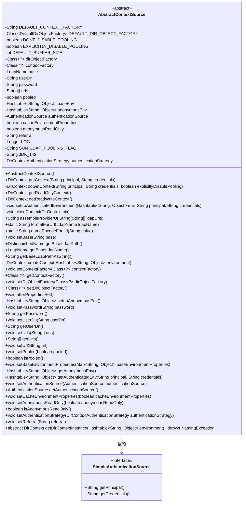

# 基础信息

|      |      |
|------|------|
| 名称 | AbstractContextSource |
| 编码语言 | .java |
| 代码路径 | spring-ldap/core/src/main/java/org/springframework/ldap/core/support/AbstractContextSource.java |
| 包名 | org.springframework.ldap.core.support |
| 依赖项 | ['java.net.URI', 'java.net.URISyntaxException', 'java.util.Hashtable', 'java.util.ListIterator', 'java.util.Map', 'javax.naming.Context', 'javax.naming.NamingEnumeration', 'javax.naming.NamingException', 'javax.naming.directory.Attribute', 'javax.naming.directory.Attributes', 'javax.naming.directory.DirContext', 'javax.naming.ldap.LdapName', 'javax.naming.ldap.Rdn', 'org.slf4j.Logger', 'org.slf4j.LoggerFactory', 'org.springframework.beans.factory.InitializingBean', 'org.springframework.ldap.UncategorizedLdapException', 'org.springframework.ldap.core.AuthenticationSource', 'org.springframework.ldap.core.ContextSource', 'org.springframework.ldap.core.DistinguishedName', 'org.springframework.ldap.support.LdapEncoder', 'org.springframework.ldap.support.LdapUtils', 'org.springframework.util.ObjectUtils', 'org.springframework.util.StringUtils'] |
| 概述说明 | AbstractContextSource实现LDAP管理，支持认证、连接池和匿名访问。 |

# 说明

AbstractContextSource实现LDAP上下文管理，提供认证功能，支持连接池管理，并允许匿名访问。

# 类列表 Class Summary

| 名称   | 类型  | 说明 |
|-------|------|-------------|
| AbstractContextSource | class | AbstractContextSource实现LDAP上下文管理，支持认证、连接池和匿名访问。 |

## 类 AbstractContextSource

|      |      |
|------|------|
| 访问范围 | public abstract |
| 类型 | class |
| 名称 | AbstractContextSource |
| 说明 | AbstractContextSource实现LDAP上下文管理，支持认证、连接池和匿名访问。 |

### UML类图

### 描述
`AbstractContextSource` 是一个抽象类，实现了 `BaseLdapPathContextSource` 和 `InitializingBean` 接口，用于管理与 LDAP 服务器的连接。它包含了多个私有成员变量和方法，用于配置和管理 LDAP 上下文。`SimpleAuthenticationSource` 是一个内部类，实现了 `AuthenticationSource` 接口，用于提供用户凭证。类图展示了 `AbstractContextSource` 的结构及其与 `SimpleAuthenticationSource` 的依赖关系。

### 内部方法调用关系图

**描述：**
`AbstractContextSource` 是一个抽象类，用于管理与LDAP服务器的连接和上下文。它包含多个属性和方法，用于配置和管理LDAP连接、认证策略、环境属性等。类中的方法包括获取上下文、设置环境属性、处理认证、关闭上下文等。该类还定义了一个内部类 `SimpleAuthenticationSource`，用于处理简单的认证逻辑。整体设计旨在提供灵活的LDAP连接管理，支持多种认证方式和环境配置。

### 字段列表 Field List

| 名称  | 类型  | 说明 |
|-------|-------|------|
| urls | String[] | 包含私有字符串数组变量urls。 |
| contextFactory | Class<?> | 私有类变量contextFactory用于存储类对象。 |
| referral = null | String | 私有字符串变量referral初始化为null。 |
| userDn = "" | String | 已弃用的用户DN字符串变量。 |
| EXPLICITLY_DISABLE_POOLING = true | boolean | 显式禁用池化功能为真。 |
| base = LdapUtils.emptyLdapName() | LdapName | 定义私有LDAP名称变量base并初始化为空。 |
| DEFAULT_DIR_OBJECT_FACTORY = DefaultDirObjectFactory.class | Class<DefaultDirObjectFactory> | 定义私有静态常量DEFAULT_DIR_OBJECT_FACTORY为DefaultDirObjectFactory类。 |
| pooled = false | boolean | 私有布尔变量pooled初始值为false。 |
| anonymousEnv | Hashtable<String, Object> | 匿名环境使用的私有哈希表存储键值对。 |
| authenticationSource | AuthenticationSource | 声明私有认证源对象authenticationSource。 |
| password = "" | String | 废弃的密码字段，默认值为空字符串。 |
| DEFAULT_CONTEXT_FACTORY = "com.sun.jndi.ldap.LdapCtxFactory" | String | 默认LDAP上下文工厂类为com.sun.jndi.ldap.LdapCtxFactory。 |
| JDK_142 = "1.4.2" | String | 定义常量JDK_142，值为1.4.2。 |
| LOG = LoggerFactory.getLogger(AbstractContextSource.class) | Logger | AbstractContextSource类中定义了一个私有静态日志记录器LOG。 |
| DEFAULT_BUFFER_SIZE = 1024 | int | 定义默认缓冲区大小为1024的私有静态常量。 |
| authenticationStrategy = new SimpleDirContextAuthenticationStrategy() | DirContextAuthenticationStrategy | 使用SimpleDirContextAuthenticationStrategy进行身份验证策略配置。 |
| DONT_DISABLE_POOLING = false | boolean | 该代码定义了一个静态不可变布尔变量，值为false。 |
| dirObjectFactory = DEFAULT_DIR_OBJECT_FACTORY | Class<?> | 私有类变量dirObjectFactory默认初始化为DEFAULT_DIR_OBJECT_FACTORY。 |
| SUN_LDAP_POOLING_FLAG = "com.sun.jndi.ldap.connect.pool" | String | SUN_LDAP_POOLING_FLAG用于控制LDAP连接池。 |
| anonymousReadOnly = false | boolean | 私有布尔变量anonymousReadOnly默认值为false。 |
| baseEnv = new Hashtable<>() | Hashtable<String, Object> | 创建了一个名为baseEnv的私有哈希表，用于存储字符串和对象的键值对。 |
| cacheEnvironmentProperties = true | boolean | 缓存环境属性设置为启用状态。 |

### 方法列表 Method List

| 名称  | 类型  | 说明 |
|-------|-------|------|
| setUserDn | void | 设置用户DN的方法。 |
| setContextFactory | void | 设置上下文工厂类。 |
| getPassword | String | 该方法返回当前对象的密码字符串。 |
| setUrl | void | 设置单个URL到字符串数组。 |
| createContext | DirContext | 创建LDAP上下文，处理异常并记录日志。 |
| getDirObjectFactory | Class<?> | 获取当前目录对象工厂类的方法。 |
| setupAuthenticatedEnvironment | void | 设置认证环境，处理异常并转换LDAP错误。 |
| getBaseLdapName | LdapName | 重写方法返回克隆的LdapName对象。 |
| setDirObjectFactory | void | 设置目录对象工厂类的实例。 |
| isPooled | boolean | 方法isPooled返回pooled布尔值。 |
| getContextFactory | Class<?> | 获取当前上下文工厂类的实例。 |
| getUrls | String[] | 该方法返回当前对象的URL数组的副本。 |
| getAuthenticationSource | AuthenticationSource | 获取认证源的方法，返回当前认证源对象。 |
| setAnonymousReadOnly | void | 设置匿名只读状态的公共方法。 |
| getUserDn | String | 该方法返回用户DN字符串。 |
| getBaseLdapPathAsString | String | 重写方法返回LDAP基础路径的字符串形式。 |
| isAnonymousReadOnly | boolean | 方法返回匿名只读状态布尔值。 |
| setPooled | void | 设置pooled属性的方法，参数为布尔值pooled。 |
| setBaseEnvironmentProperties | void | 设置基础环境属性，使用Hashtable存储传入的Map。 |
| closeContext | void | 关闭DirContext对象，捕获并记录异常。 |
| getAuthenticatedEnv | Hashtable<String, Object> | 方法`getAuthenticatedEnv`重建认证环境，并返回包含认证信息的哈希表。 |
| setReferral | void | 设置推荐信息的公共方法。 |
| setPassword | void | 设置密码的方法，将传入的字符串赋值给类成员变量password。 |
| setAuthenticationSource | void | 设置认证源的方法，用于指定认证来源。 |
| getAnonymousEnv | Hashtable<String, Object> | 方法`getAnonymousEnv`根据缓存标志返回匿名环境或设置新环境。 |
| getDirContextInstance | DirContext | 获取DirContext实例的方法，需传入环境参数，可能抛出NamingException。 |
| setBase | void | 设置LDAP基础路径，若输入非空则新建，否则设为空。 |
| setUrls | void | 该方法用于设置URL数组，克隆传入数组以避免外部修改。 |
| assembleProviderUrlString | String | 方法拼接LDAP URL字符串，处理基础路径格式，返回结果。 |
| getReadWriteContext | DirContext | 获取读写上下文的方法，返回基于认证源的主体和凭证的上下文，不禁用池化。 |
| getBaseLdapPath | DistinguishedName | 重写getBaseLdapPath方法，返回基于this.base的DistinguishedName对象。 |
| setCacheEnvironmentProperties | void | 设置缓存环境属性的方法，用于控制是否缓存环境属性。 |
| getContext | DirContext | 该方法用于身份验证，并明确禁用连接池以防密码更改。 |
| nameEncodeForUrl | String | 静态方法将字符串编码为URL格式，处理异常抛出未分类LDAP异常。 |
| formatForUrl | String | 将LDAP名称格式化为URL字符串，支持多属性和多值编码。 |
| doGetContext | DirContext | 该方法获取认证环境，禁用池化后创建上下文，处理并返回上下文，异常时关闭并转换异常。 |
| afterPropertiesSet | void | 检查URL、contextFactory、authenticationSource等属性，确保设置正确，处理默认值和异常情况。 |
| setupAnonymousEnv | Hashtable<String, Object> | 方法配置匿名环境，根据pooled设置LDAP池，初始化上下文工厂，添加URL、对象工厂、引用和基础路径信息。 |
| getReadOnlyContext | DirContext | 获取只读上下文，若未匿名则验证用户信息，否则创建匿名上下文。 |
| setAuthenticationStrategy | void | 设置认证策略方法，接受认证策略参数并赋值。 |

