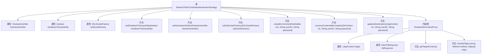

# 基础信息

|      |      |
|------|------|
| 名称 | AbstractTlsDirContextAuthenticationStrategy |
| 编码语言 | .java |
| 代码路径 | spring-ldap/core/src/main/java/org/springframework/ldap/core/support/AbstractTlsDirContextAuthenticationStrategy.java |
| 包名 | org.springframework.ldap.core.support |
| 依赖项 | ['java.io.IOException', 'java.lang.reflect.InvocationHandler', 'java.lang.reflect.InvocationTargetException', 'java.lang.reflect.Method', 'java.lang.reflect.Proxy', 'java.util.Hashtable', 'javax.naming.NamingException', 'javax.naming.directory.DirContext', 'javax.naming.ldap.LdapContext', 'javax.naming.ldap.StartTlsRequest', 'javax.naming.ldap.StartTlsResponse', 'javax.net.ssl.HostnameVerifier', 'javax.net.ssl.SSLSocketFactory', 'org.springframework.ldap.UncategorizedLdapException', 'org.springframework.ldap.core.DirContextProxy', 'org.springframework.ldap.support.LdapUtils'] |
| 概述说明 | 抽象类实现TLS认证，支持主机名验证、优雅关闭和SSL工厂配置。 |

# 说明

该抽象类实现了TLS认证策略，提供了主机名验证功能，确保连接的主机名与证书匹配。它还支持优雅关闭机制，确保在关闭连接时不会中断正在进行的数据传输。此外，该类允许配置SSL工厂，以便自定义SSL/TLS设置，满足不同安全需求。这些功能共同增强了TLS认证的灵活性和安全性。

# 类列表 Class Summary

| 名称   | 类型  | 说明 |
|-------|------|-------------|
| AbstractTlsDirContextAuthenticationStrategy | class | 抽象类实现TLS认证策略，支持主机名验证、优雅关闭和SSL工厂配置。 |


## 类 AbstractTlsDirContextAuthenticationStrategy

|      |      |
|------|------|
| 访问范围 | public abstract |
| 类型 | class |
| 名称 | AbstractTlsDirContextAuthenticationStrategy |
| 说明 | 抽象类实现TLS认证策略，支持主机名验证、优雅关闭和SSL工厂配置。 |


### UML类图

```mermaid
classDiagram
    class AbstractTlsDirContextAuthenticationStrategy {
        -HostnameVerifier hostnameVerifier
        -boolean shutdownTlsGracefully
        -SSLSocketFactory sslSocketFactory
        +void setShutdownTlsGracefully(boolean shutdownTlsGracefully)
        +void setHostnameVerifier(HostnameVerifier hostnameVerifier)
        +void setSslSocketFactory(SSLSocketFactory sslSocketFactory)
        +void setupEnvironment(Hashtable~String, Object~ env, String userDn, String password)
        +DirContext processContextAfterCreation(DirContext ctx, String userDn, String password) throws NamingException
        #abstract void applyAuthentication(LdapContext ctx, String userDn, String password) throws NamingException
    }

    class TlsAwareDirContextProxy {
        -LdapContext target
        -StartTlsResponse tlsResponse
        +DirContext getTargetContext()
        +Object invoke(Object proxy, Method method, Object[] args) throws Throwable
    }

    interface DirContextAuthenticationStrategy {
        <<Interface>>
        +void setupEnvironment(Hashtable~String, Object~ env, String userDn, String password)
        +DirContext processContextAfterCreation(DirContext ctx, String userDn, String password) throws NamingException
    }

    interface DirContextProxy {
        <<Interface>>
        +DirContext getTargetContext()
    }

    AbstractTlsDirContextAuthenticationStrategy --> DirContextAuthenticationStrategy : 实现
    TlsAwareDirContextProxy --> DirContextProxy : 实现
    AbstractTlsDirContextAuthenticationStrategy --> TlsAwareDirContextProxy : 依赖
```

这段代码定义了一个抽象类 `AbstractTlsDirContextAuthenticationStrategy`，它实现了 `DirContextAuthenticationStrategy` 接口，用于处理 LDAP 上下文的 TLS 认证。类中包含了一些配置属性，如 `hostnameVerifier`、`shutdownTlsGracefully` 和 `sslSocketFactory`，并通过 `processContextAfterCreation` 方法处理 TLS 协商和认证。`TlsAwareDirContextProxy` 是一个内部类，实现了 `DirContextProxy` 接口，用于在关闭上下文时优雅地关闭 TLS 连接。整体设计允许灵活配置 TLS 认证策略，并提供了对 LDAP 上下文的代理支持。


### 内部方法调用关系图



这段代码定义了一个抽象类 `AbstractTlsDirContextAuthenticationStrategy`，用于处理LDAP上下文中的TLS认证策略。类中包含多个属性用于配置TLS连接的行为，如 `hostnameVerifier`、`shutdownTlsGracefully` 和 `sslSocketFactory`。类中定义了多个方法用于设置这些属性，并提供了 `processContextAfterCreation` 方法来处理TLS连接的创建和认证过程。此外，类中还包含一个内部类 `TlsAwareDirContextProxy`，用于代理LDAP上下文的关闭操作，确保TLS连接能够优雅地关闭。

### 字段列表 Field List

| 名称  | 类型  | 说明 |
|-------|-------|------|
| sslSocketFactory | SSLSocketFactory | 私有SSLSocketFactory对象用于安全通信。 |
| hostnameVerifier | HostnameVerifier | 定义了一个私有的HostnameVerifier类型变量hostnameVerifier。 |
| shutdownTlsGracefully = false | boolean | 该代码定义了一个私有布尔变量shutdownTlsGracefully，初始值为false。 |

### 方法列表 Method List

| 名称  | 类型  | 说明 |
|-------|-------|------|
| setShutdownTlsGracefully | void | 设置TLS优雅关闭功能。 |
| setSslSocketFactory | void | 设置SSL套接字工厂方法，用于指定SSL连接工厂。 |
| applyAuthentication | void | 抽象方法用于LDAP认证，需提供上下文、用户DN和密码。 |
| processContextAfterCreation | DirContext | 处理LDAP上下文，支持TLS加密及认证，可优雅关闭TLS连接。 |
| setupEnvironment | void | 方法setupEnvironment用于设置环境，当前实现无需操作，认证在TLS协商后进行。 |
| setHostnameVerifier | void | 设置主机名验证器方法，用于指定自定义的主机名验证器。 |


