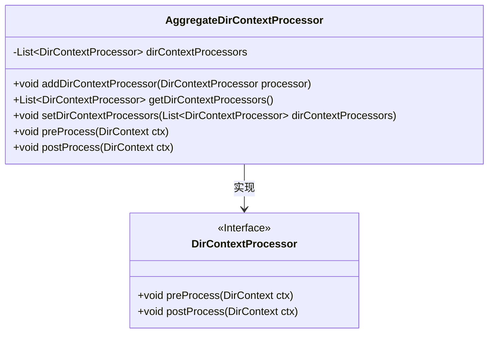
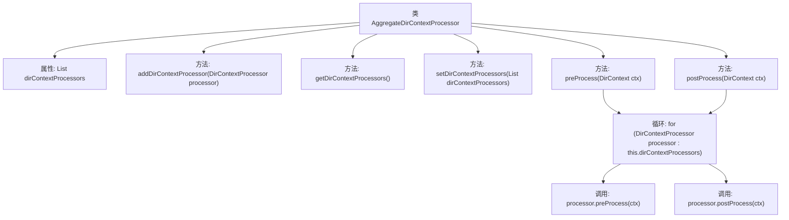

# 基础信息

|      |      |
|------|------|
| 名称 | AggregateDirContextProcessor |
| 编码语言 | .java |
| 代码路径 | spring-ldap/core/src/main/java/org/springframework/ldap/core/support/AggregateDirContextProcessor.java |
| 包名 | org.springframework.ldap.core.support |
| 依赖项 | ['java.util.ArrayList', 'java.util.LinkedList', 'java.util.List', 'javax.naming.NamingException', 'javax.naming.directory.DirContext', 'org.springframework.ldap.core.DirContextProcessor'] |
| 概述说明 | AggregateDirContextProcessor管理多个处理器实例，支持添加、获取和执行前后处理操作。 |

# 说明

AggregateDirContextProcessor负责管理多个DirContextProcessor实例，具备添加、获取和设置处理器列表的功能。它能够执行预处理和后处理操作，确保在处理过程中对多个处理器进行统一管理和协调，从而提升整体处理效率和灵活性。

# 类列表 Class Summary

| 名称   | 类型  | 说明 |
|-------|------|-------------|
| AggregateDirContextProcessor | class | AggregateDirContextProcessor管理多个DirContextProcessor实例，支持添加、获取和设置处理器列表，并执行预处理和后处理操作。 |

## 类 AggregateDirContextProcessor

|      |      |
|------|------|
| 访问范围 | public |
| 类型 | class |
| 名称 | AggregateDirContextProcessor |
| 说明 | AggregateDirContextProcessor管理多个DirContextProcessor实例，支持添加、获取和设置处理器列表，并执行预处理和后处理操作。 |

### UML类图

这段代码定义了一个 `AggregateDirContextProcessor` 类，它实现了 `DirContextProcessor` 接口。`AggregateDirContextProcessor` 类管理一个 `DirContextProcessor` 对象的列表，并提供了添加、获取和设置这些对象的方法。它还实现了 `preProcess` 和 `postProcess` 方法，这些方法会依次调用列表中每个 `DirContextProcessor` 对象的相应方法。通过这种方式，`AggregateDirContextProcessor` 可以对多个 `DirContextProcessor` 进行统一管理，简化了代码的复杂性。

### 内部方法调用关系图

该流程图展示了`AggregateDirContextProcessor`类的结构及其方法调用关系。该类包含一个`List<DirContextProcessor>`类型的属性`dirContextProcessors`，用于存储多个`DirContextProcessor`实例。类中提供了添加、获取和设置`DirContextProcessor`列表的方法，以及`preProcess`和`postProcess`方法，这两个方法会遍历`dirContextProcessors`列表，并依次调用每个`DirContextProcessor`实例的`preProcess`和`postProcess`方法。

### 字段列表 Field List

| 名称  | 类型  | 说明 |
|-------|-------|------|
| dirContextProcessors = new LinkedList<>() | List<DirContextProcessor> | 声明并初始化一个私有的链表，用于存储目录上下文处理器。 |

### 方法列表 Method List

| 名称  | 类型  | 说明 |
|-------|-------|------|
| getDirContextProcessors | List<DirContextProcessor> | 获取目录上下文处理器列表的方法。 |
| setDirContextProcessors | void | 设置目录上下文处理器列表并初始化。 |
| postProcess | void | 该方法遍历并调用所有DirContextProcessor实例的postProcess方法处理DirContext对象。 |
| addDirContextProcessor | void | 方法`addDirContextProcessor`用于将`DirContextProcessor`实例添加到当前上下文中。 |
| preProcess | void | 该方法遍历所有DirContextProcessor并调用其preProcess方法处理DirContext。 |

