# 基础信息

|      |      |
|------|------|
| 名称 | BaseLdapPathBeanPostProcessor |
| 编码语言 | .java |
| 代码路径 | spring-ldap/core/src/main/java/org/springframework/ldap/core/support/BaseLdapPathBeanPostProcessor.java |
| 包名 | org.springframework.ldap.core.support |
| 依赖项 | ['java.util.Collection', 'javax.naming.ldap.LdapName', 'org.springframework.beans.factory.NoSuchBeanDefinitionException', 'org.springframework.beans.factory.config.BeanPostProcessor', 'org.springframework.context.ApplicationContext', 'org.springframework.context.ApplicationContextAware', 'org.springframework.core.Ordered', 'org.springframework.ldap.core.DistinguishedName', 'org.springframework.ldap.support.LdapUtils', 'org.springframework.util.StringUtils'] |
| 概述说明 | BaseLdapPathBeanPostProcessor初始化Bean，注入LDAP基础路径，支持多路径源配置。 |

# 说明

BaseLdapPathBeanPostProcessor负责在Bean初始化阶段进行处理，主要功能是注入LDAP基础路径。该处理器支持多种路径源配置，能够灵活适应不同的LDAP路径来源，确保在Bean初始化时正确配置和注入所需的LDAP基础路径信息。

# 类列表 Class Summary

| 名称   | 类型  | 说明 |
|-------|------|-------------|
| BaseLdapPathBeanPostProcessor | class | BaseLdapPathBeanPostProcessor处理Bean初始化，注入LDAP基础路径，支持多种路径源配置。 |


## 类 BaseLdapPathBeanPostProcessor

|      |      |
|------|------|
| 访问范围 | public |
| 类型 | class |
| 名称 | BaseLdapPathBeanPostProcessor |
| 说明 | BaseLdapPathBeanPostProcessor处理Bean初始化，注入LDAP基础路径，支持多种路径源配置。 |


### UML类图

```mermaid
classDiagram
    class BaseLdapPathBeanPostProcessor {
        -ApplicationContext applicationContext
        -LdapName basePath
        -String baseLdapPathSourceName
        -int order
        +Object postProcessBeforeInitialization(Object bean, String beanName)
        +Object postProcessAfterInitialization(Object bean, String beanName)
        +void setApplicationContext(ApplicationContext applicationContext)
        +void setBasePath(DistinguishedName basePath)
        +void setBasePath(String basePath)
        +void setBaseLdapPathSourceName(String contextSourceName)
        +void setOrder(int order)
        +int getOrder()
        -BaseLdapPathSource getBaseLdapPathSourceFromApplicationContext()
    }

    interface BeanPostProcessor {
        <<Interface>>
        +Object postProcessBeforeInitialization(Object bean, String beanName)
        +Object postProcessAfterInitialization(Object bean, String beanName)
    }

    interface ApplicationContextAware {
        <<Interface>>
        +void setApplicationContext(ApplicationContext applicationContext)
    }

    interface Ordered {
        <<Interface>>
        +int getOrder()
    }

    interface BaseLdapNameAware {
        <<Interface>>
        +void setBaseLdapPath(LdapName basePath)
    }

    interface BaseLdapPathAware {
        <<Interface>>
        +void setBaseLdapPath(DistinguishedName basePath)
    }

    interface BaseLdapPathSource {
        <<Interface>>
        +LdapName getBaseLdapName()
        +DistinguishedName getBaseLdapPath()
    }

    class AbstractContextSource {
        <<Abstract>>
    }

    BaseLdapPathBeanPostProcessor --> BeanPostProcessor : 实现
    BaseLdapPathBeanPostProcessor --> ApplicationContextAware : 实现
    BaseLdapPathBeanPostProcessor --> Ordered : 实现
    BaseLdapPathBeanPostProcessor --> BaseLdapPathSource : 依赖
    BaseLdapPathSource <|-- AbstractContextSource : 继承
    BaseLdapPathBeanPostProcessor --> BaseLdapNameAware : 依赖
    BaseLdapPathBeanPostProcessor --> BaseLdapPathAware : 依赖
```

**描述：**  
`BaseLdapPathBeanPostProcessor` 类实现了 `BeanPostProcessor`、`ApplicationContextAware` 和 `Ordered` 接口，用于在 Spring 容器中对 Bean 进行初始化前后的处理。它依赖于 `BaseLdapPathSource` 接口来获取 LDAP 基础路径，并通过 `BaseLdapNameAware` 和 `BaseLdapPathAware` 接口将路径注入到相应的 Bean 中。`AbstractContextSource` 是 `BaseLdapPathSource` 的一个抽象实现，用于提供上下文源的基础功能。


### 内部方法调用关系图

```mermaid
graph TD
    A["类BaseLdapPathBeanPostProcessor"]
    B["属性: ApplicationContext applicationContext"]
    C["属性: LdapName basePath"]
    D["属性: String baseLdapPathSourceName"]
    E["属性: int order = Ordered.LOWEST_PRECEDENCE"]
    F["方法: Object postProcessBeforeInitialization(Object bean, String beanName)"]
    G["方法: BaseLdapPathSource getBaseLdapPathSourceFromApplicationContext()"]
    H["方法: Object postProcessAfterInitialization(Object bean, String beanName)"]
    I["方法: void setApplicationContext(ApplicationContext applicationContext)"]
    J["方法: void setBasePath(DistinguishedName basePath)"]
    K["方法: void setBasePath(String basePath)"]
    L["方法: void setBaseLdapPathSourceName(String contextSourceName)"]
    M["方法: void setOrder(int order)"]
    N["方法: int getOrder()"]

    A --> B
    A --> C
    A --> D
    A --> E
    A --> F
    A --> G
    A --> H
    A --> I
    A --> J
    A --> K
    A --> L
    A --> M
    A --> N
```



该流程图描述了`BaseLdapPathBeanPostProcessor`类的结构和主要方法。该类实现了`BeanPostProcessor`、`ApplicationContextAware`和`Ordered`接口，负责在Spring容器中对Bean进行初始化前后的处理。主要方法包括`postProcessBeforeInitialization`、`getBaseLdapPathSourceFromApplicationContext`、`postProcessAfterInitialization`等，用于处理与LDAP路径相关的Bean初始化逻辑。此外，该类还提供了设置和获取LDAP路径、上下文源名称和顺序的方法。

### 字段列表 Field List

| 名称  | 类型  | 说明 |
|-------|-------|------|
| applicationContext | ApplicationContext | 私有成员变量applicationContext，类型为ApplicationContext。 |
| order = Ordered.LOWEST_PRECEDENCE | int | 私有整型变量order初始化为最低优先级。 |
| baseLdapPathSourceName | String | 源LDAP路径名称的私有字符串变量。 |
| basePath | LdapName | 私有变量basePath，类型为LdapName。 |

### 方法列表 Method List

| 名称  | 类型  | 说明 |
|-------|-------|------|
| setBasePath | void | 设置基础路径为LDAP格式。 |
| setApplicationContext | void | 重写方法以设置应用上下文。 |
| getOrder | int | 获取当前对象的顺序值。 |
| setOrder | void | 设置对象的order属性为指定值。 |
| postProcessBeforeInitialization | Object | 该方法在初始化前处理bean，根据类型设置LDAP路径。 |
| setBasePath | void | 设置基础路径为LDAP格式。 |
| postProcessAfterInitialization | Object | 重写方法，初始化后处理，返回原始bean。 |
| setBaseLdapPathSourceName | void | 设置LDAP路径源名称的方法。 |
| getBaseLdapPathSourceFromApplicationContext | BaseLdapPathSource | 从应用上下文中获取BaseLdapPathSource实例，优先按名称查找，未指定时自动匹配唯一实例或AbstractContextSource类型。 |


