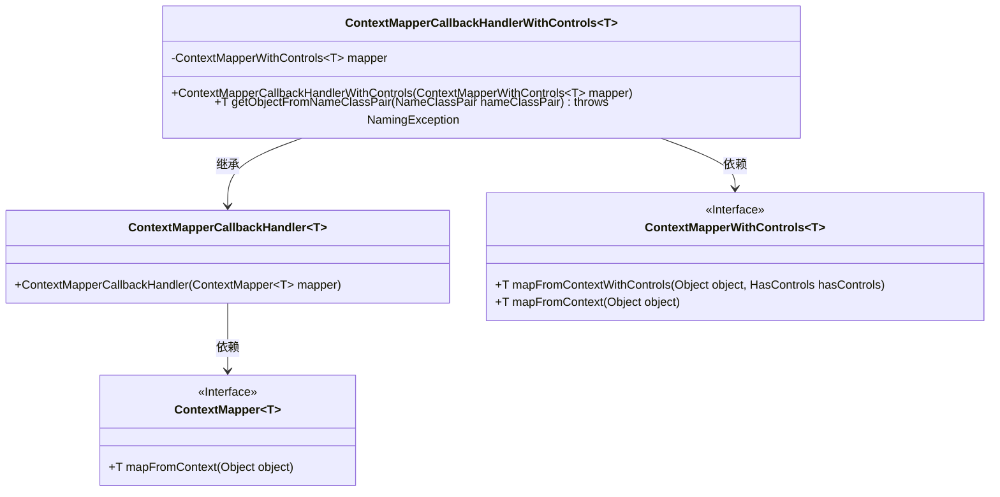
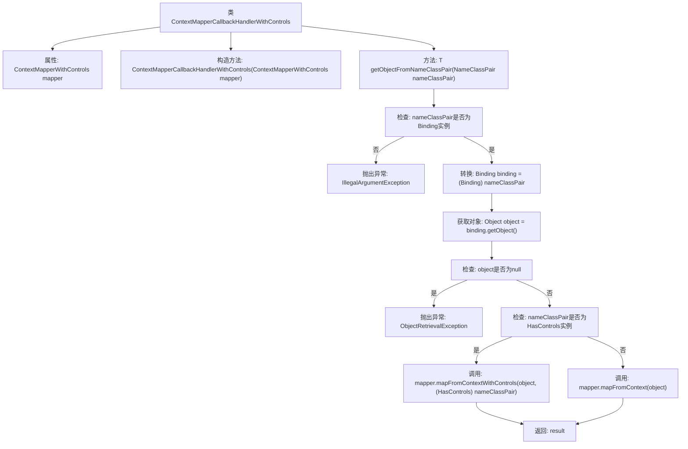

# 基础信息

|      |      |
|------|------|
| 名称 | ContextMapperCallbackHandlerWithControls |
| 编码语言 | .java |
| 代码路径 | spring-ldap/core/src/main/java/org/springframework/ldap/core/support/ContextMapperCallbackHandlerWithControls.java |
| 包名 | org.springframework.ldap.core.support |
| 依赖项 | ['javax.naming.Binding', 'javax.naming.NameClassPair', 'javax.naming.NamingException', 'javax.naming.ldap.HasControls', 'org.springframework.ldap.core.ContextMapperCallbackHandler', 'org.springframework.ldap.core.ObjectRetrievalException'] |
| 概述说明 | ContextMapperCallbackHandlerWithControls类扩展父类，处理NameClassPair对象映射。 |

# 说明

ContextMapperCallbackHandlerWithControls类继承自ContextMapperCallbackHandler，专门用于处理NameClassPair对象的映射任务。该类在原有功能基础上，增加了对映射过程的控制和管理，确保对象映射的准确性和高效性。通过扩展父类功能，它提供了更精细的操作方式，适用于需要复杂映射处理的场景。

# 类列表 Class Summary

| 名称   | 类型  | 说明 |
|-------|------|-------------|
| ContextMapperCallbackHandlerWithControls | class | ContextMapperCallbackHandlerWithControls类扩展ContextMapperCallbackHandler，处理NameClassPair对象映射。 |

## 类 ContextMapperCallbackHandlerWithControls

|      |      |
|------|------|
| 访问范围 | public |
| 类型 | class |
| 名称 | ContextMapperCallbackHandlerWithControls |
| 说明 | ContextMapperCallbackHandlerWithControls类扩展ContextMapperCallbackHandler，处理NameClassPair对象映射。 |

### UML类图

类图描述：
`ContextMapperCallbackHandlerWithControls` 继承自 `ContextMapperCallbackHandler`，并依赖于 `ContextMapperWithControls` 接口。`ContextMapperCallbackHandler` 依赖于 `ContextMapper` 接口。`ContextMapperCallbackHandlerWithControls` 类通过构造函数接收 `ContextMapperWithControls` 实例，并在 `getObjectFromNameClassPair` 方法中根据输入对象类型调用不同的映射方法。`ContextMapperWithControls` 接口扩展了 `ContextMapper` 接口，增加了带控制信息的映射方法。

### 内部方法调用关系图

这段代码定义了一个泛型类 `ContextMapperCallbackHandlerWithControls<T>`，它继承自 `ContextMapperCallbackHandler<T>`。该类通过构造函数初始化一个 `ContextMapperWithControls<T>` 类型的 `mapper` 属性，并提供了一个方法 `getObjectFromNameClassPair`，该方法从 `NameClassPair` 对象中提取并映射对象。方法首先检查 `NameClassPair` 是否为 `Binding` 实例，然后获取并检查对象是否为空，最后根据 `NameClassPair` 是否实现 `HasControls` 接口，调用不同的映射方法并返回结果。

### 字段列表 Field List

| 名称  | 类型  | 说明 |
|-------|-------|------|
| mapper = null | ContextMapperWithControls<T> | 定义了一个类型为ContextMapperWithControls<T>的私有变量mapper，初始值为null。 |

### 方法列表 Method List

| 名称  | 类型  | 说明 |
|-------|-------|------|
| getObjectFromNameClassPair | T | 从NameClassPair获取对象，验证类型并映射返回结果。 |

