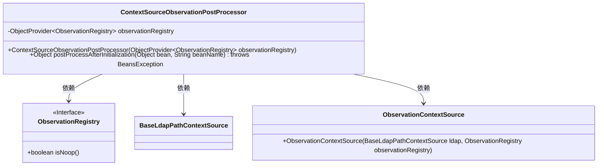
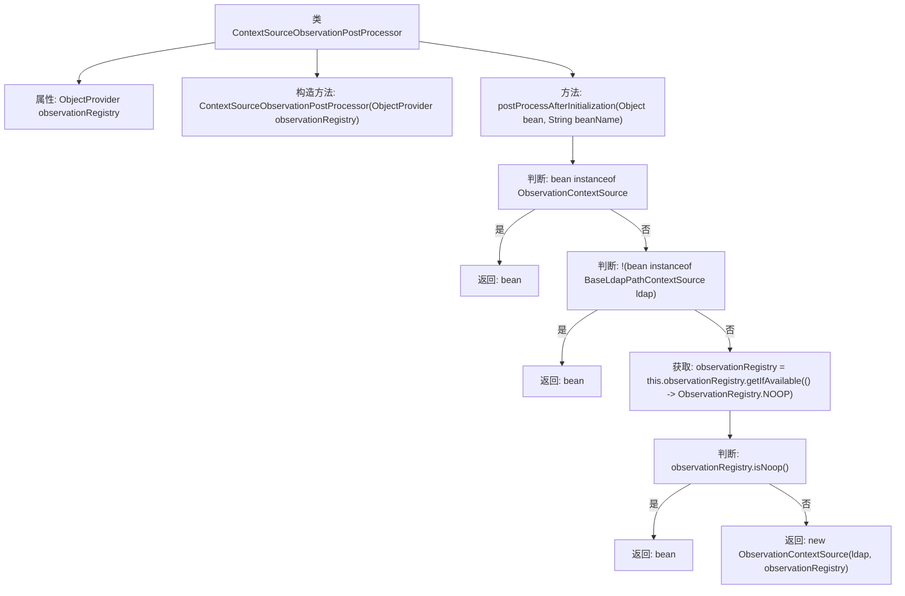

# 基础信息

|      |      |
|------|------|
| 名称 | ContextSourceObservationPostProcessor |
| 编码语言 | .java |
| 代码路径 | spring-ldap/core/src/main/java/org/springframework/ldap/core/support/ContextSourceObservationPostProcessor.java |
| 包名 | org.springframework.ldap.core.support |
| 依赖项 | ['io.micrometer.observation.ObservationRegistry', 'org.springframework.beans.BeansException', 'org.springframework.beans.factory.ObjectProvider', 'org.springframework.beans.factory.config.BeanPostProcessor', 'org.springframework.ldap.core.ContextSource'] |
| 概述说明 | 处理Bean初始化，为符合条件Bean添加ObservationContextSource。 |

# 说明

ContextSourceObservationPostProcessor负责处理Bean的初始化过程，其主要功能是为满足特定条件的Bean添加ObservationContextSource。该处理器在Bean生命周期的初始化阶段介入，确保符合条件的Bean能够具备ObservationContextSource，从而支持后续的观察和监控操作。这一过程有助于在应用运行时对Bean的状态和行为进行跟踪和分析，提升系统的可观测性和调试能力。

# 类列表 Class Summary

| 名称   | 类型  | 说明 |
|-------|------|-------------|
| ContextSourceObservationPostProcessor | class | ContextSourceObservationPostProcessor处理Bean初始化，为符合条件的Bean添加ObservationContextSource。 |

## 类 ContextSourceObservationPostProcessor

|      |      |
|------|------|
| 访问范围 | public final |
| 类型 | class |
| 名称 | ContextSourceObservationPostProcessor |
| 说明 | ContextSourceObservationPostProcessor处理Bean初始化，为符合条件的Bean添加ObservationContextSource。 |

### UML类图

**描述：**
`ContextSourceObservationPostProcessor` 是一个实现了 `BeanPostProcessor` 接口的类，用于在 Spring 容器中对 bean 进行后处理。它通过 `ObjectProvider` 获取 `ObservationRegistry` 实例，并在 `postProcessAfterInitialization` 方法中检查 bean 是否为 `ObservationContextSource` 或 `BaseLdapPathContextSource` 类型。如果是 `BaseLdapPathContextSource` 类型且 `ObservationRegistry` 可用，则将其包装为 `ObservationContextSource` 返回。否则，直接返回原 bean。

### 内部方法调用关系图

这段代码定义了一个`ContextSourceObservationPostProcessor`类，实现了`BeanPostProcessor`接口。该类的主要作用是在Bean初始化后对其进行处理。如果Bean是`ObservationContextSource`类型，直接返回；如果不是`BaseLdapPathContextSource`类型，也直接返回。如果获取到的`ObservationRegistry`是`NOOP`，同样返回原Bean。否则，创建一个新的`ObservationContextSource`实例并返回。该流程图清晰地展示了代码的处理逻辑和决策路径。

### 字段列表 Field List

| 名称  | 类型  | 说明 |
|-------|-------|------|
| observationRegistry | ObjectProvider<ObservationRegistry> | 私有对象提供者用于获取ObservationRegistry实例。 |

### 方法列表 Method List

| 名称  | 类型  | 说明 |
|-------|-------|------|
| postProcessAfterInitialization | Object | 在初始化后处理bean，若为特定类型则返回，否则创建观察上下文。 |

