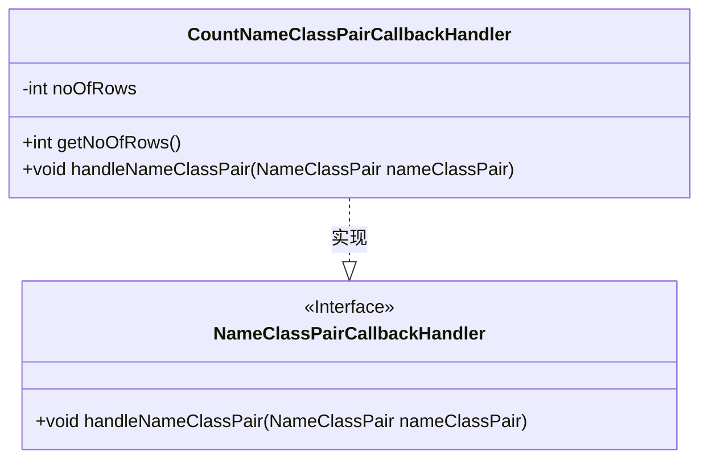
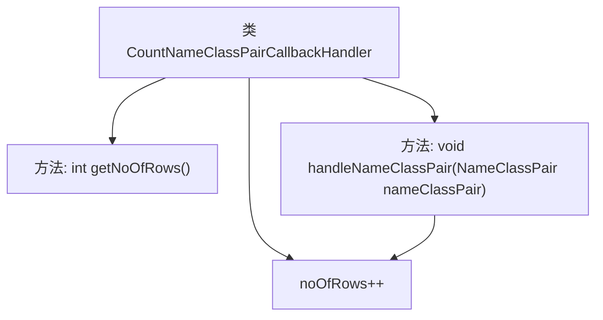

# 基础信息

|      |      |
|------|------|
| 名称 | CountNameClassPairCallbackHandler |
| 编码语言 | .java |
| 代码路径 | spring-ldap/core/src/main/java/org/springframework/ldap/core/support/CountNameClassPairCallbackHandler.java |
| 包名 | org.springframework.ldap.core.support |
| 依赖项 | ['javax.naming.NameClassPair', 'org.springframework.ldap.core.NameClassPairCallbackHandler'] |
| 概述说明 | 实现回调类以统计搜索结果行数。 |

# 说明

实现回调处理类，用于统计搜索操作返回的行数。该类的核心功能是在每次搜索操作完成后，自动记录并统计返回的结果行数，以便后续分析或优化搜索性能。通过这种方式，可以实时监控搜索结果的规模，帮助开发者了解查询效率和数据量变化。此类设计简洁高效，适用于需要精确统计行数的应用场景。

# 类列表 Class Summary

| 名称   | 类型  | 说明 |
|-------|------|-------------|
| CountNameClassPairCallbackHandler | class | 实现回调处理类，统计搜索返回的行数。 |

## 类 CountNameClassPairCallbackHandler

|      |      |
|------|------|
| 访问范围 | public |
| 类型 | class |
| 名称 | CountNameClassPairCallbackHandler |
| 说明 | 实现回调处理类，统计搜索返回的行数。 |

### UML类图

**描述：**  
`CountNameClassPairCallbackHandler` 类实现了 `NameClassPairCallbackHandler` 接口，用于处理 `NameClassPair` 对象。该类包含一个私有成员 `noOfRows`，用于记录处理的条目数量。通过 `getNoOfRows` 方法可以获取已处理的条目数量，而 `handleNameClassPair` 方法则用于处理每个 `NameClassPair` 对象并递增 `noOfRows`。该类主要用于统计搜索结果中的条目数量。

### 内部方法调用关系图

这段代码定义了一个名为 `CountNameClassPairCallbackHandler` 的类，该类实现了 `NameClassPairCallbackHandler` 接口。类中包含一个私有属性 `noOfRows`，用于记录处理的行数。`getNoOfRows` 方法用于返回当前处理的行数，而 `handleNameClassPair` 方法则会在每次处理一个 `NameClassPair` 对象时递增 `noOfRows` 的值。流程图展示了类的结构及其方法的调用关系。

### 字段列表 Field List

| 名称  | 类型  | 说明 |
|-------|-------|------|
| noOfRows = 0 | int | 定义私有整型变量noOfRows并初始化为0。 |

### 方法列表 Method List

| 名称  | 类型  | 说明 |
|-------|-------|------|
| getNoOfRows | int | 该方法返回当前对象的行数。 |
| handleNameClassPair | void | 方法增加行数计数。 |

