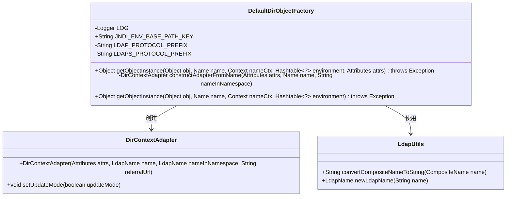
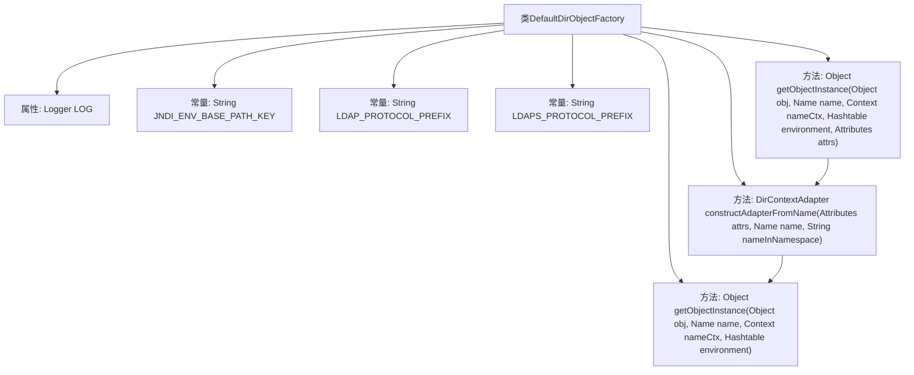

# 基础信息

|      |      |
|------|------|
| 名称 | DefaultDirObjectFactory |
| 编码语言 | .java |
| 代码路径 | spring-ldap/core/src/main/java/org/springframework/ldap/core/support/DefaultDirObjectFactory.java |
| 包名 | org.springframework.ldap.core.support |
| 依赖项 | ['java.net.URI', 'java.net.URISyntaxException', 'java.util.Hashtable', 'javax.naming.CompositeName', 'javax.naming.Context', 'javax.naming.Name', 'javax.naming.directory.Attributes', 'javax.naming.spi.DirObjectFactory', 'org.slf4j.Logger', 'org.slf4j.LoggerFactory', 'org.springframework.ldap.core.DirContextAdapter', 'org.springframework.ldap.support.LdapUtils', 'org.springframework.util.StringUtils'] |
| 概述说明 | DefaultDirObjectFactory实现DirObjectFactory接口，处理LDAP实例化与上下文适配器构建。 |

# 说明

DefaultDirObjectFactory实现了DirObjectFactory接口，主要负责LDAP对象的实例化以及上下文适配器的构建。该工厂类支持对协议前缀的处理，并能够将引用信息进行有效分离，确保在LDAP操作中能够正确处理和适配不同类型的对象和上下文。

# 类列表 Class Summary

| 名称   | 类型  | 说明 |
|-------|------|-------------|
| DefaultDirObjectFactory | class | DefaultDirObjectFactory实现DirObjectFactory接口，处理LDAP对象实例化和上下文适配器构建，支持协议前缀处理和引用信息分离。 |

## 类 DefaultDirObjectFactory

|      |      |
|------|------|
| 访问范围 | public |
| 类型 | class |
| 名称 | DefaultDirObjectFactory |
| 说明 | DefaultDirObjectFactory实现DirObjectFactory接口，处理LDAP对象实例化和上下文适配器构建，支持协议前缀处理和引用信息分离。 |

### UML类图

### 描述
`DefaultDirObjectFactory` 是一个实现 `DirObjectFactory` 接口的类，用于从LDAP上下文中获取对象实例。它包含一个私有日志记录器 `LOG` 和几个常量字符串。`getObjectInstance` 方法用于处理对象实例的创建，并在处理完成后关闭上下文。`constructAdapterFromName` 方法用于根据提供的参数构造 `DirContextAdapter` 实例。`DirContextAdapter` 是一个用于表示LDAP上下文的类，`LdapUtils` 提供了处理LDAP名称的实用方法。

### 内部方法调用关系图

这段代码描述了一个名为 `DefaultDirObjectFactory` 的类，该类实现了 `DirObjectFactory` 接口。主要功能是通过 `getObjectInstance` 方法获取对象实例，并在处理过程中调用 `constructAdapterFromName` 方法构造 `DirContextAdapter` 对象。代码中处理了 LDAP 协议相关的逻辑，并在必要时清理资源。流程图展示了类的结构及其方法之间的调用关系。

### 字段列表 Field List

| 名称  | 类型  | 说明 |
|-------|-------|------|
| LOG = LoggerFactory.getLogger(DefaultDirObjectFactory.class) | Logger | 定义日志记录器，用于DefaultDirObjectFactory类的日志输出。 |
| JNDI_ENV_BASE_PATH_KEY = "org.springframework.ldap.base.path" | String | JNDI环境基础路径键为Spring LDAP基础路径。 |
| LDAPS_PROTOCOL_PREFIX = "ldaps://" | String | 定义私有静态常量LDAPS_PROTOCOL_PREFIX，值为"ldaps://"。 |
| LDAP_PROTOCOL_PREFIX = "ldap://" | String | LDAP协议前缀为ldap:// |

### 方法列表 Method List

| 名称  | 类型  | 说明 |
|-------|-------|------|
| getObjectInstance | Object | 重写方法，获取对象实例并处理上下文关闭。 |
| constructAdapterFromName | DirContextAdapter | 根据输入名称类型处理LDAP协议信息，生成DirContextAdapter对象并返回。 |
| getObjectInstance | Object | 重写getObjectInstance方法，返回null，处理对象实例化。 |

