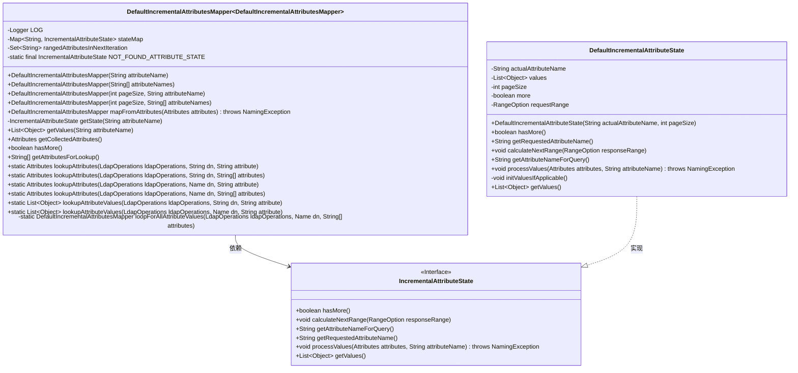

# 基础信息

|      |      |
|------|------|
| 名称 | DefaultIncrementalAttributesMapper |
| 编码语言 | .java |
| 代码路径 | spring-ldap/core/src/main/java/org/springframework/ldap/core/support/DefaultIncrementalAttributesMapper.java |
| 包名 | org.springframework.ldap.core.support |
| 依赖项 | ['java.util.ArrayList', 'java.util.Collections', 'java.util.HashSet', 'java.util.LinkedHashMap', 'java.util.LinkedHashSet', 'java.util.LinkedList', 'java.util.List', 'java.util.Map', 'java.util.Set', 'javax.naming.Name', 'javax.naming.NamingEnumeration', 'javax.naming.NamingException', 'javax.naming.directory.Attribute', 'javax.naming.directory.Attributes', 'javax.naming.directory.BasicAttribute', 'javax.naming.directory.BasicAttributes', 'org.slf4j.Logger', 'org.slf4j.LoggerFactory', 'org.springframework.ldap.core.IncrementalAttributesMapper', 'org.springframework.ldap.core.LdapOperations', 'org.springframework.ldap.support.LdapUtils'] |
| 概述说明 | DefaultIncrementalAttributesMapper类管理增量属性映射，支持分页和多值处理。 |

# 说明

DefaultIncrementalAttributesMapper类是一个用于管理增量属性映射的工具，主要功能包括支持分页查询和处理多值属性。该类的设计旨在高效地管理和操作属性映射，确保在处理大量数据时能够实现分页查询，同时支持多值属性的处理，从而提升系统的灵活性和性能。

# 类列表 Class Summary

| 名称   | 类型  | 说明 |
|-------|------|-------------|
| DefaultIncrementalAttributesMapper | class | DefaultIncrementalAttributesMapper类用于管理增量属性映射，支持分页查询和处理多值属性。 |

## 类 DefaultIncrementalAttributesMapper

|      |      |
|------|------|
| 访问范围 | public |
| 类型 | class |
| 名称 | DefaultIncrementalAttributesMapper |
| 说明 | DefaultIncrementalAttributesMapper类用于管理增量属性映射，支持分页查询和处理多值属性。 |

### UML类图

### 描述
`DefaultIncrementalAttributesMapper` 类用于管理增量属性映射，支持通过范围查询逐步获取属性值。它依赖于 `IncrementalAttributeState` 接口来跟踪每个属性的状态，并通过 `DefaultIncrementalAttributeState` 类实现该接口。该类提供了多种构造方法，支持单个或多个属性的映射，并提供了方法来处理属性值、检查是否还有更多数据以及获取查询所需的属性列表。`loopForAllAttributeValues` 方法用于循环获取所有属性值。

### 内部方法调用关系图

```mermaid
graph TD
    A["类DefaultIncrementalAttributesMapper"]
    B["属性: Logger LOG"]
    C["属性: Map<String, IncrementalAttributeState> stateMap"]
    D["属性: Set<String> rangedAttributesInNextIteration"]
    E["常量: IncrementalAttributeState NOT_FOUND_ATTRIBUTE_STATE"]
    F["构造方法: DefaultIncrementalAttributesMapper(String attributeName)"]
    G["构造方法: DefaultIncrementalAttributesMapper(String[] attributeNames)"]
    H["构造方法: DefaultIncrementalAttributesMapper(int pageSize, String attributeName)"]
    I["构造方法: DefaultIncrementalAttributesMapper(int pageSize, String[] attributeNames)"]
    J["方法: mapFromAttributes(Attributes attributes)"]
    K["方法: getState(String attributeName)"]
    L["方法: getValues(String attributeName)"]
    M["方法: getCollectedAttributes()"]
    N["方法: hasMore()"]
    O["方法: getAttributesForLookup()"]
    P["静态方法: lookupAttributes(LdapOperations ldapOperations, String dn, String attribute)"]
    Q["静态方法: lookupAttributes(LdapOperations ldapOperations, String dn, String[] attributes)"]
    R["静态方法: lookupAttributes(LdapOperations ldapOperations, Name dn, String attribute)"]
    S["静态方法: lookupAttributes(LdapOperations ldapOperations, Name dn, String[] attributes)"]
    T["静态方法: lookupAttributeValues(LdapOperations ldapOperations, String dn, String attribute)"]
    U["静态方法: lookupAttributeValues(LdapOperations ldapOperations, Name dn, String attribute)"]
    V["静态方法: loopForAllAttributeValues(LdapOperations ldapOperations, Name dn, String[] attributes)"]
    W["内部类: DefaultIncrementalAttributeState"]
    X["接口: IncrementalAttributeState"]

    A --> B
    A --> C
    A --> D
    A --> E
    A --> F
    A --> G
    A --> H
    A --> I
    A --> J
    A --> K
    A --> L
    A --> M
    A --> N
    A --> O
    A -.-> P
    A -.-> Q
    A -.-> R
    A -.-> S
    A -.-> T
    A -.-> U
    A -.-> V
    A --> W
    A --> X
```

这段代码定义了一个名为 `DefaultIncrementalAttributesMapper` 的类，用于管理和映射增量属性状态。它通过 `IncrementalAttributeState` 接口和内部类 `DefaultIncrementalAttributeState` 来跟踪属性的状态，并提供了多种构造方法和静态方法来处理属性的查找和映射。代码还包含了日志记录和异常处理机制，确保在属性未找到或处理过程中出现问题时能够正确响应。

### 字段列表 Field List

| 名称  | 类型  | 说明 |
|-------|-------|------|
| stateMap = new LinkedHashMap<>() | Map<String, IncrementalAttributeState> | 私有LinkedHashMap存储字符串到增量属性状态的映射。 |
| rangedAttributesInNextIteration = new LinkedHashSet<>() | Set<String> | 初始化一个用于存储下一次迭代范围属性的有序集合。 |
| LOG = LoggerFactory.getLogger(DefaultIncrementalAttributesMapper.class) | Logger | 在类中定义了一个私有的静态日志记录器实例。 |
| NOT_FOUND_ATTRIBUTE_STATE = new IncrementalAttributeState() {		@Override		public String getRequestedAttributeName() {			throw new UnsupportedOperationException("This method should never be called");		}		@Override		public boolean hasMore() {			return false;		}		@Override		public void calculateNextRange(RangeOption responseRange) {			// Nothing to do here		}		@Override		public String getAttributeNameForQuery() {			throw new UnsupportedOperationException("This method should never be called");		}		@Override		public void processValues(Attributes attributes, String attributeName) throws NamingException {			// Nothing to do here		}		@Override		public List<Object> getValues() {			return null;		}	} | IncrementalAttributeState | NOT_FOUND_ATTRIBUTE_STATE是一个默认的IncrementalAttributeState实例，所有方法均不执行操作或抛出异常。 |

### 方法列表 Method List

| 名称  | 类型  | 说明 |
|-------|-------|------|
| lookupAttributes | Attributes | 静态方法通过LDAP操作和DN查找指定属性。 |
| lookupAttributes | Attributes | 静态方法通过LDAP操作和DN查找指定属性。 |
| getCollectedAttributes | Attributes | 方法收集并返回状态映射中的所有属性及其值。 |
| getAttributesForLookup | String[] | 重写方法，返回下一迭代的属性查询名称数组。 |
| getState | IncrementalAttributeState | 获取属性状态，未找到时记录警告并返回默认状态。 |
| loopForAllAttributeValues | DefaultIncrementalAttributesMapper | 通过LDAP操作循环获取所有属性值并返回映射器。 |
| getValues | List<Object> | 重写方法，获取指定属性名的值列表。 |
| lookupAttributes | Attributes | 静态方法通过LDAP操作查找指定DN的属性值并返回收集结果。 |
| mapFromAttributes | DefaultIncrementalAttributesMapper | 方法映射属性，处理无范围和有范围属性，更新状态并返回映射器。 |
| lookupAttributes | Attributes | 静态方法通过LDAP操作和名称查找指定属性。 |
| lookupAttributeValues | List<Object> | 查找LDAP属性值，若为空则返回空列表。 |
| lookupAttributeValues | List<Object> | LDAP查找属性值静态方法，传入操作对象、DN和属性名。 |
| hasMore | boolean | 检查是否有更多属性，返回布尔值。 |

