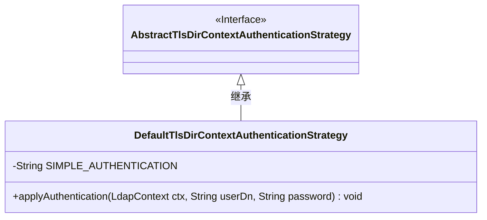
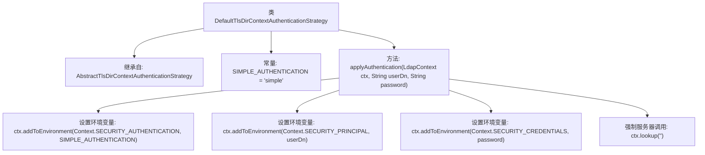

# 基础信息

|      |      |
|------|------|
| 名称 | DefaultTlsDirContextAuthenticationStrategy |
| 编码语言 | .java |
| 代码路径 | spring-ldap/core/src/main/java/org/springframework/ldap/core/support/DefaultTlsDirContextAuthenticationStrategy.java |
| 包名 | org.springframework.ldap.core.support |
| 依赖项 | ['javax.naming.Context', 'javax.naming.NamingException', 'javax.naming.ldap.LdapContext'] |
| 概述说明 | DefaultTlsDirContextAuthenticationStrategy类实现简单LDAP认证。 |

# 说明

DefaultTlsDirContextAuthenticationStrategy类是一个用于实现简单LDAP认证的工具。它通过TLS协议与LDAP服务器进行安全通信，确保认证过程中的数据传输安全。该类的主要功能是处理用户凭据的验证，通过与LDAP服务器的交互来确认用户身份的有效性。它简化了LDAP认证的流程，提供了一种标准化的方法来处理认证请求，适用于需要与LDAP服务器进行安全通信的应用场景。

# 类列表 Class Summary

| 名称   | 类型  | 说明 |
|-------|------|-------------|
| DefaultTlsDirContextAuthenticationStrategy | class | DefaultTlsDirContextAuthenticationStrategy类实现简单LDAP认证。 |

## 类 DefaultTlsDirContextAuthenticationStrategy

|      |      |
|------|------|
| 访问范围 | public |
| 类型 | class |
| 名称 | DefaultTlsDirContextAuthenticationStrategy |
| 说明 | DefaultTlsDirContextAuthenticationStrategy类实现简单LDAP认证。 |

### UML类图

这段代码定义了一个 `DefaultTlsDirContextAuthenticationStrategy` 类，它继承自 `AbstractTlsDirContextAuthenticationStrategy` 接口。该类包含一个私有常量 `SIMPLE_AUTHENTICATION` 和一个公有方法 `applyAuthentication`，用于在 `LdapContext` 中应用简单的身份验证策略。方法通过设置环境变量来配置身份验证方式，并强制进行一次服务器调用以确保环境更新。

### 内部方法调用关系图

这段代码描述了一个名为 `DefaultTlsDirContextAuthenticationStrategy` 的类，该类继承自 `AbstractTlsDirContextAuthenticationStrategy`。它包含一个 `applyAuthentication` 方法，用于设置 LDAP 上下文的环境变量，包括认证方式、用户 DN 和密码，并通过调用 `lookup` 方法强制服务器进行验证。该流程确保了 LDAP 认证的正确性和安全性。

### 字段列表 Field List

| 名称  | 类型  | 说明 |
|-------|-------|------|
| SIMPLE_AUTHENTICATION = "simple" | String | 定义一个私有的静态常量字符串SIMPLE_AUTHENTICATION，值为"simple"。 |

### 方法列表 Method List

| 名称  | 类型  | 说明 |
|-------|-------|------|
| applyAuthentication | void | LDAP认证设置，更新环境并强制服务器调用。 |

