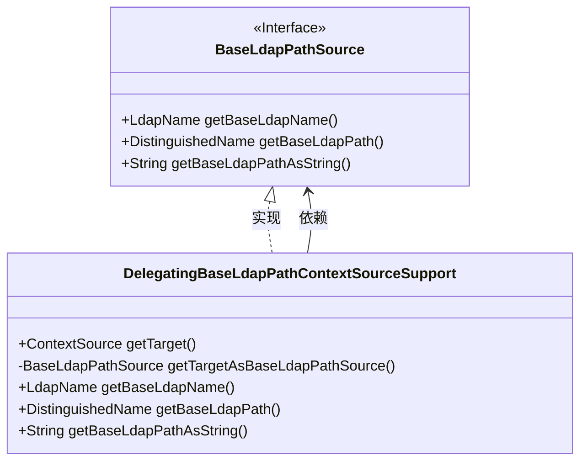
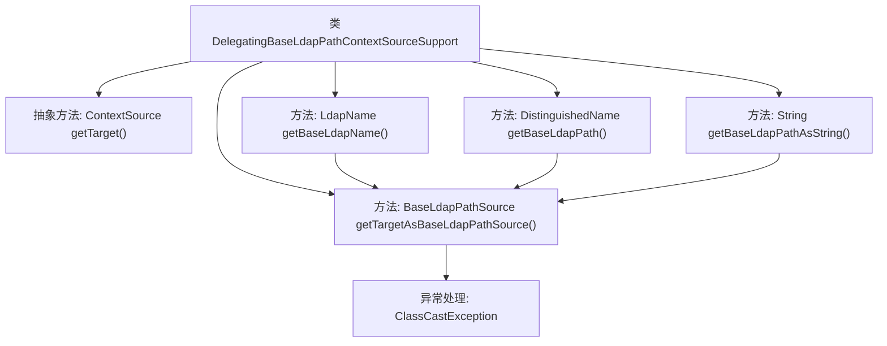

# 基础信息

|      |      |
|------|------|
| 名称 | DelegatingBaseLdapPathContextSourceSupport |
| 编码语言 | .java |
| 代码路径 | spring-ldap/core/src/main/java/org/springframework/ldap/core/support/DelegatingBaseLdapPathContextSourceSupport.java |
| 包名 | org.springframework.ldap.core.support |
| 依赖项 | ['javax.naming.ldap.LdapName', 'org.springframework.ldap.core.ContextSource', 'org.springframework.ldap.core.DistinguishedName'] |
| 概述说明 | 抽象类通过ContextSource获取LDAP路径信息。 |

# 说明

抽象类实现了LDAP路径源功能，通过目标ContextSource获取路径信息。该抽象类提供了一种机制，用于从LDAP服务器中提取路径数据，具体实现依赖于ContextSource对象来连接和查询LDAP服务器。这种设计允许开发者通过继承该抽象类并实现具体逻辑，灵活地获取和处理LDAP路径信息，同时保持了代码的可扩展性和可维护性。

# 类列表 Class Summary

| 名称   | 类型  | 说明 |
|-------|------|-------------|
| DelegatingBaseLdapPathContextSourceSupport | class | 抽象类实现LDAP路径源，通过目标ContextSource获取路径信息。 |

## 类 DelegatingBaseLdapPathContextSourceSupport

|      |      |
|------|------|
| 访问范围 | public abstract |
| 类型 | class |
| 名称 | DelegatingBaseLdapPathContextSourceSupport |
| 说明 | 抽象类实现LDAP路径源，通过目标ContextSource获取路径信息。 |

### UML类图

这段代码定义了一个抽象类 `DelegatingBaseLdapPathContextSourceSupport`，它实现了 `BaseLdapPathSource` 接口。该类的主要功能是通过 `getTarget` 方法获取目标 `ContextSource`，并将其转换为 `BaseLdapPathSource` 类型，以便调用 `getBaseLdapName`、`getBaseLdapPath` 和 `getBaseLdapPathAsString` 方法。如果目标 `ContextSource` 无法转换为 `BaseLdapPathSource`，则会抛出 `UnsupportedOperationException`。该类的作用是提供对 LDAP 路径操作的支持，并确保目标 `ContextSource` 实现了 `BaseLdapPathSource` 接口。

### 内部方法调用关系图

这段代码定义了一个抽象类 `DelegatingBaseLdapPathContextSourceSupport`，它实现了 `BaseLdapPathSource` 接口。类中包含一个抽象方法 `getTarget()` 用于获取目标 `ContextSource`，并通过 `getTargetAsBaseLdapPathSource()` 方法将其转换为 `BaseLdapPathSource` 类型。如果转换失败，抛出 `ClassCastException` 异常。类中还实现了三个方法 `getBaseLdapName()`、`getBaseLdapPath()` 和 `getBaseLdapPathAsString()`，它们都依赖于 `getTargetAsBaseLdapPathSource()` 方法来实现功能。

### 字段列表 Field List

| 名称  | 类型  | 说明 |
|-------|-------|------|

### 方法列表 Method List

| 名称  | 类型  | 说明 |
|-------|-------|------|
| getTarget | ContextSource | 获取受保护的目标上下文源。 |
| getBaseLdapPath | DistinguishedName | 重写方法获取基础LDAP路径。 |
| getBaseLdapName | LdapName | 重写getBaseLdapName方法，返回目标路径源的BaseLdapName。 |
| getTargetAsBaseLdapPathSource | BaseLdapPathSource | 获取目标对象并转换为BaseLdapPathSource，若失败则抛出异常。 |
| getBaseLdapPathAsString | String | 重写方法返回目标LDAP路径的字符串表示。 |

