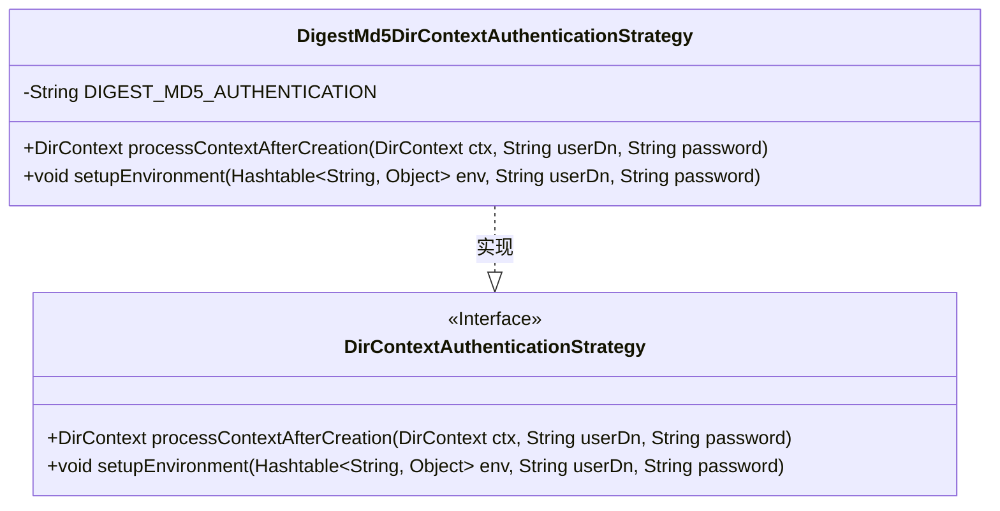
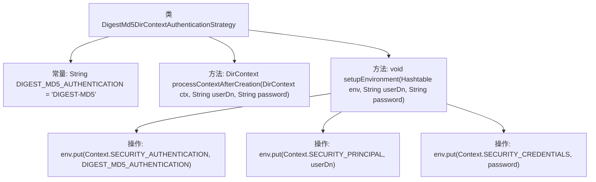

# 基础信息

|      |      |
|------|------|
| 名称 | DigestMd5DirContextAuthenticationStrategy |
| 编码语言 | .java |
| 代码路径 | spring-ldap/core/src/main/java/org/springframework/ldap/core/support/DigestMd5DirContextAuthenticationStrategy.java |
| 包名 | org.springframework.ldap.core.support |
| 依赖项 | ['java.util.Hashtable', 'javax.naming.Context', 'javax.naming.directory.DirContext'] |
| 概述说明 | DigestMd5DirContextAuthenticationStrategy类负责DIGEST-MD5认证，配置环境并管理上下文。 |

# 说明

DigestMd5DirContextAuthenticationStrategy类负责实现DIGEST-MD5认证机制。该类的主要功能包括配置相关的环境参数，以及处理认证过程中的上下文信息。通过这种方式，确保认证过程能够正确执行，并且能够处理与认证相关的各种上下文数据。

# 类列表 Class Summary

| 名称   | 类型  | 说明 |
|-------|------|-------------|
| DigestMd5DirContextAuthenticationStrategy | class | DigestMd5DirContextAuthenticationStrategy类实现DIGEST-MD5认证，设置环境参数并处理上下文。 |

## 类 DigestMd5DirContextAuthenticationStrategy

|      |      |
|------|------|
| 访问范围 | public |
| 类型 | class |
| 名称 | DigestMd5DirContextAuthenticationStrategy |
| 说明 | DigestMd5DirContextAuthenticationStrategy类实现DIGEST-MD5认证，设置环境参数并处理上下文。 |

### UML类图

**描述：**  
该代码展示了 `DigestMd5DirContextAuthenticationStrategy` 类如何实现 `DirContextAuthenticationStrategy` 接口。`DigestMd5DirContextAuthenticationStrategy` 类通过 `setupEnvironment` 方法设置环境变量，使用 DIGEST-MD5 认证方式，并将用户名和密码添加到环境变量中。`processContextAfterCreation` 方法在创建上下文后处理上下文对象。类图清晰地展示了接口与实现类之间的关系。

### 内部方法调用关系图

**描述：**
该流程图展示了`DigestMd5DirContextAuthenticationStrategy`类的结构及其方法调用关系。类中包含一个常量`DIGEST_MD5_AUTHENTICATION`和两个方法：`processContextAfterCreation`和`setupEnvironment`。`setupEnvironment`方法通过三个步骤设置环境变量，分别将认证类型、用户DN和密码放入`Hashtable`中。该流程图清晰地反映了类的内部逻辑和方法的执行顺序。

### 字段列表 Field List

| 名称  | 类型  | 说明 |
|-------|-------|------|
| DIGEST_MD5_AUTHENTICATION = "DIGEST-MD5" | String | 私有常量DIGEST_MD5_AUTHENTICATION值为"DIGEST-MD5"。 |

### 方法列表 Method List

| 名称  | 类型  | 说明 |
|-------|-------|------|
| setupEnvironment | void | 设置环境变量，包括安全认证、用户主体和凭证信息。 |
| processContextAfterCreation | DirContext | 方法processContextAfterCreation返回传入的DirContext对象，不做任何修改。 |

