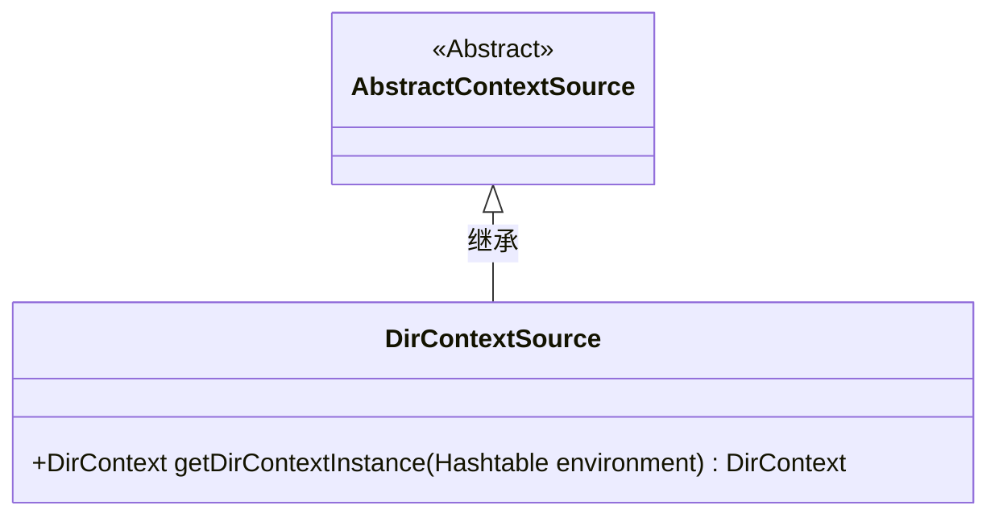
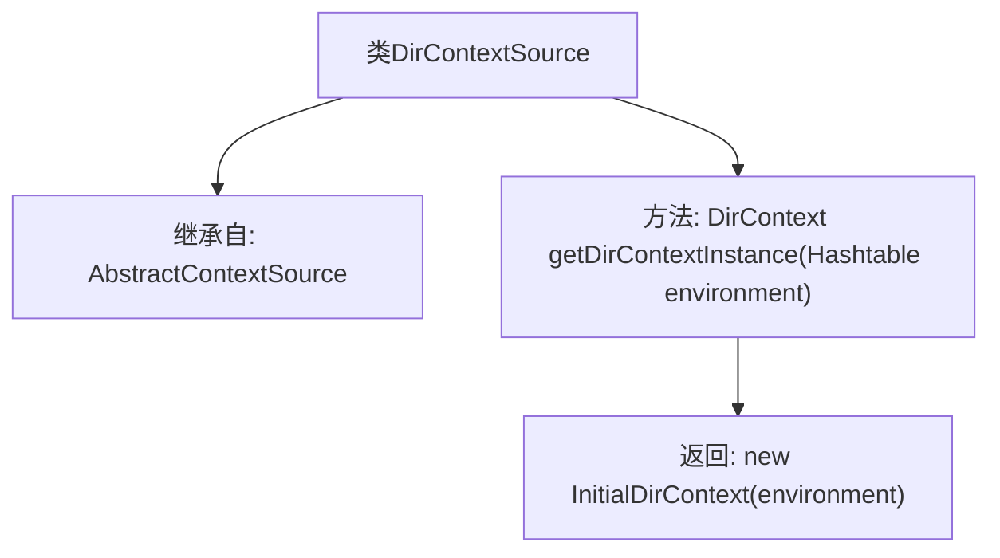

# 基础信息

|      |      |
|------|------|
| 名称 | DirContextSource |
| 编码语言 | .java |
| 代码路径 | spring-ldap/core/src/main/java/org/springframework/ldap/core/support/DirContextSource.java |
| 包名 | org.springframework.ldap.core.support |
| 依赖项 | ['java.util.Hashtable', 'javax.naming.NamingException', 'javax.naming.directory.DirContext', 'javax.naming.directory.InitialDirContext'] |
| 概述说明 | DirContextSource继承AbstractContextSource，提供创建InitialDirContext实例的方法。 |

# 说明

DirContextSource类继承自AbstractContextSource，其主要功能是提供创建InitialDirContext实例的方法。InitialDirContext是用于目录服务操作的核心类，DirContextSource通过继承AbstractContextSource，继承了父类的基本功能，并在此基础上实现了特定于目录服务的上下文创建逻辑。

# 类列表 Class Summary

| 名称   | 类型  | 说明 |
|-------|------|-------------|
| DirContextSource | class | DirContextSource类继承AbstractContextSource，提供创建InitialDirContext实例的方法。 |

## 类 DirContextSource

|      |      |
|------|------|
| 访问范围 | public |
| 类型 | class |
| 名称 | DirContextSource |
| 说明 | DirContextSource类继承AbstractContextSource，提供创建InitialDirContext实例的方法。 |

### UML类图

类图描述：
`DirContextSource` 类继承自 `AbstractContextSource` 抽象类，并实现了 `getDirContextInstance` 方法。该方法接受一个 `Hashtable` 类型的参数 `environment`，并返回一个 `DirContext` 类型的对象。`DirContextSource` 类通过继承 `AbstractContextSource` 来扩展其功能，具体表现为能够创建并返回一个新的 `InitialDirContext` 实例。

### 内部方法调用关系图

这段代码定义了一个名为 `DirContextSource` 的类，该类继承自 `AbstractContextSource`。类中包含一个名为 `getDirContextInstance` 的方法，该方法接受一个 `Hashtable` 类型的参数 `environment`，并返回一个 `InitialDirContext` 实例。该方法的主要作用是根据提供的环境参数创建一个新的 `InitialDirContext` 对象，用于处理目录上下文操作。

### 字段列表 Field List

| 名称  | 类型  | 说明 |
|-------|-------|------|

### 方法列表 Method List

| 名称  | 类型  | 说明 |
|-------|-------|------|
| getDirContextInstance | DirContext | 创建并返回一个基于环境变量的InitialDirContext实例。 |

