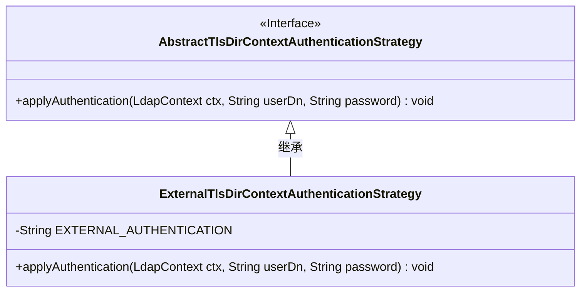
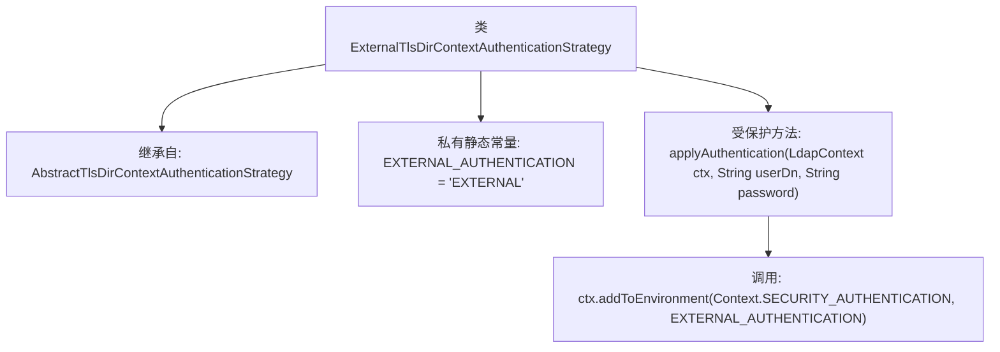

# 基础信息

|      |      |
|------|------|
| 名称 | ExternalTlsDirContextAuthenticationStrategy |
| 编码语言 | .java |
| 代码路径 | spring-ldap/core/src/main/java/org/springframework/ldap/core/support/ExternalTlsDirContextAuthenticationStrategy.java |
| 包名 | org.springframework.ldap.core.support |
| 依赖项 | ['javax.naming.Context', 'javax.naming.NamingException', 'javax.naming.ldap.LdapContext'] |
| 概述说明 | ExternalTlsDirContextAuthenticationStrategy类利用EXTERNAL认证方式完成LDAP上下文认证。 |

# 说明

ExternalTlsDirContextAuthenticationStrategy类利用EXTERNAL认证方式来实现LDAP上下文认证。该类通过外部认证机制，确保在LDAP上下文中的身份验证过程安全可靠。这种方法简化了认证流程，同时保持了高安全性，适用于需要严格身份验证的场景。

# 类列表 Class Summary

| 名称   | 类型  | 说明 |
|-------|------|-------------|
| ExternalTlsDirContextAuthenticationStrategy | class | ExternalTlsDirContextAuthenticationStrategy类通过EXTERNAL认证方式实现LDAP上下文认证。 |

## 类 ExternalTlsDirContextAuthenticationStrategy

|      |      |
|------|------|
| 访问范围 | public |
| 类型 | class |
| 名称 | ExternalTlsDirContextAuthenticationStrategy |
| 说明 | ExternalTlsDirContextAuthenticationStrategy类通过EXTERNAL认证方式实现LDAP上下文认证。 |

### UML类图

这段代码定义了一个名为 `ExternalTlsDirContextAuthenticationStrategy` 的类，它继承自 `AbstractTlsDirContextAuthenticationStrategy` 接口。`ExternalTlsDirContextAuthenticationStrategy` 类中包含一个私有常量 `EXTERNAL_AUTHENTICATION`，并且重写了 `applyAuthentication` 方法，该方法用于在 `LdapContext` 中设置外部认证方式。类图展示了继承关系，并明确标注了接口和实现类的层级关系。

### 内部方法调用关系图

这段代码定义了一个名为`ExternalTlsDirContextAuthenticationStrategy`的类，它继承自`AbstractTlsDirContextAuthenticationStrategy`。类中包含一个私有静态常量`EXTERNAL_AUTHENTICATION`，其值为`"EXTERNAL"`。类中还定义了一个受保护的方法`applyAuthentication`，该方法接受`LdapContext`、`userDn`和`password`作为参数，并在方法内部调用`ctx.addToEnvironment`，将`SECURITY_AUTHENTICATION`设置为`EXTERNAL_AUTHENTICATION`。该方法可能用于配置LDAP上下文的外部认证方式。

### 字段列表 Field List

| 名称  | 类型  | 说明 |
|-------|-------|------|
| EXTERNAL_AUTHENTICATION = "EXTERNAL" | String | 定义常量EXTERNAL_AUTHENTICATION，值为"EXTERNAL"。 |

### 方法列表 Method List

| 名称  | 类型  | 说明 |
|-------|-------|------|
| applyAuthentication | void | LDAP认证方法设置外部认证环境。 |

